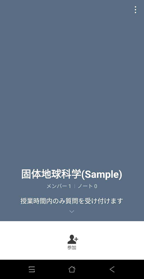
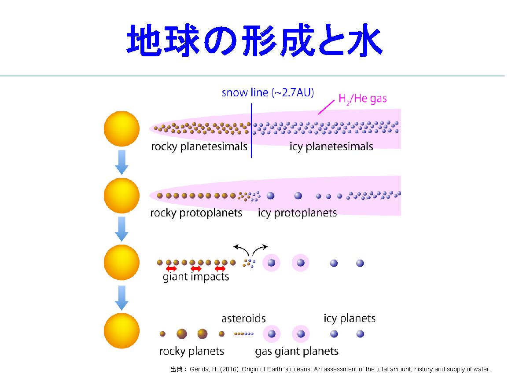
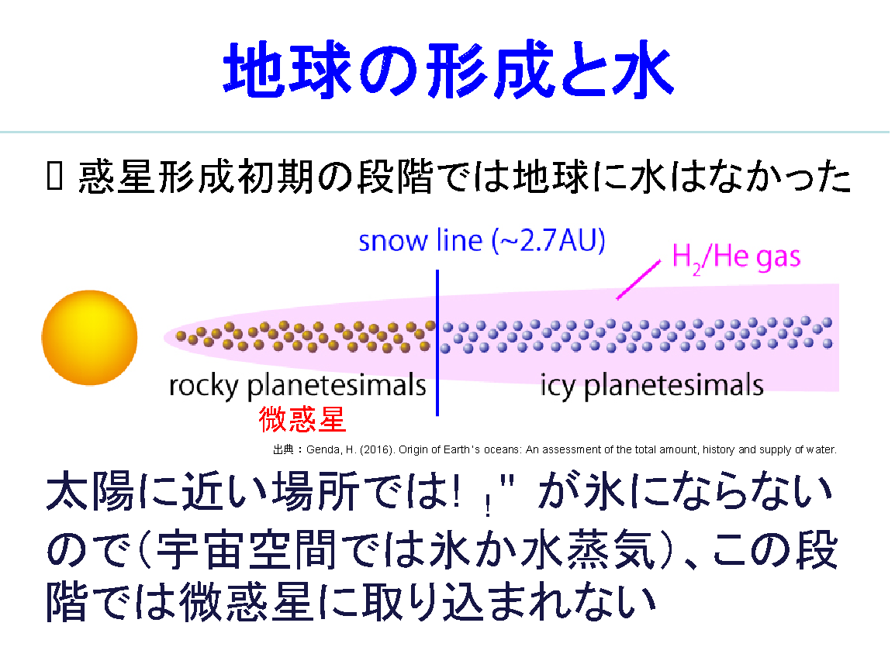
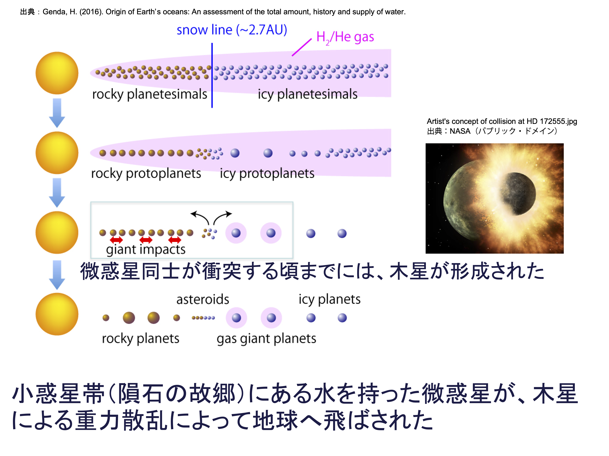
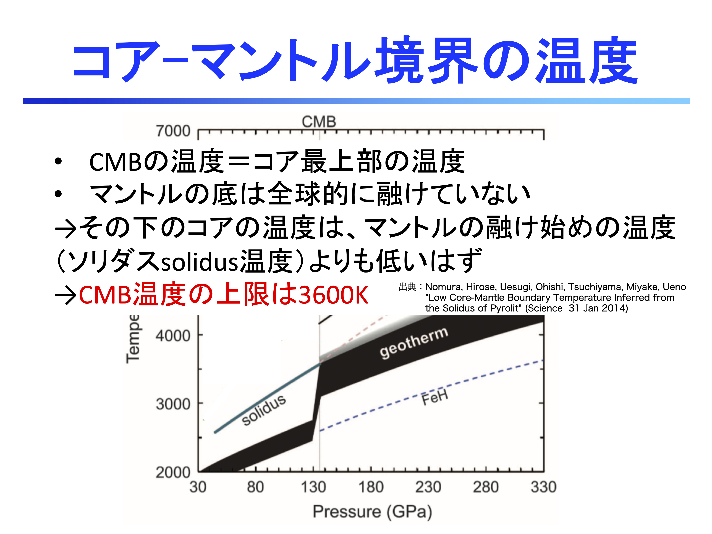

このグッドプラクティスは，2020年度<a href="/events/luncheon/2020-12-15/">オンライン授業情報交換会「第24回 TAを活かした質問の場づくり」</a>にて，廣瀬先生にご登壇いただき，内容をご紹介いただきました．学内限定でランチョンの映像を公開しておりますので，ぜひご活用ください．

## 授業の基本情報

授業名　　:　固体地球科学 
開講部局　:　理学部・理学系研究科 
対象　　　:　学部生・大学院生（3 年生 8 割、4 年生・大学院生 2 割） 
学生数　　:　約 70 名 
形態　　　:　全てリアルタイム 
利用したツール　:

- ITC-LMS：東京大学情報基盤センター学習管理システム（教材の配布、課題の提出）
- Zoom：オンライン会議システム（リアルタイム授業）
- LINE オープンチャット：コミュニケーションアプリ「LINE」の機能（学生からの質問を受け付けるために、授業時間内のみ利用。LINE のオープンチャット機能を使うと、匿名で「トークルーム」に参加し、チャットメッセージを送受信することができる。LINE のアカウントさえあれば、会員登録や新たなアプリのダウンロードをしなくても利用可能）

## 教員の基本情報

廣瀬 敬 先生 
理学系研究科 
教授

## 学生のコメント: この授業が良かった理由

**学生 A のコメント**  
質問に LINE のオープンチャットを使っていたため、匿名性があるのでより質問がしやすかったと感じた。

**学生 B のコメント**  
再放送というのがよかった。また、ラインのグループチャットによる匿名での質問も画期的だった。

## 授業をオンライン化するにあたって心がけたこと　

学生の理解度を把握することを心がけていました。対面では、学生の顔を見て、板書をしながら授業を進めていましたので、学生の雰囲気から、内容を理解しているかどうかを判断することができていました。しかし、オンラインでは通信容量の問題もあり、学生側はビデオをオフにしていたため、顔を見ることができず、理解度も把握しにくくなってしまいました。そこで、学生に「内容がわかっていない」ということを知らせてもらうために、LINE のオープンチャットを通じて、授業時間中に質問を送ってもらいました。

また、普段の授業から、学生が板書を自分の手で書き写して学ぶことを重視していました。そのため、zoom で PowerPoint の白紙ページを画面共有し、そこに授業の内容をタイピングすることで、オンラインでも板書を用いたような授業の進行を試みました。

## 工夫したところ

### LINE のオープンチャットを利用して、授業中に学生が匿名で質問できるようにする　

学生が「授業の内容が分かっていない」と教員に知らせることができるように、5 月の連休明けぐらいから LINE のオープンチャットを導入しました。オープンチャットは授業中のみオープンにしました。

普通ならば「自分だけがわかっていないのでは？」という恥ずかしさがあるため、教員に「わからないのでもう一度説明してほしい」とは伝えづらいはずです。オープンチャットは匿名なので、学生も質問をするときに恥ずかしさを感じにくく、役に立っていたと思います。

4 月・5 月は、学部がオンライン授業の補助のために、TA をつけてくれました。その TA と、「学生が本当についてきているか、わかんないよね」という話をしていたら、彼が LINE のオープンチャットを教えてくれました。はじめは試験的に導入しましたが、学生からの評判が良かったため、このシステムを引き続き使うことにして、TA にも S セメスター末まで参加してもらいました。ただし、自分は LINE を普段使っておらず、個人の LINE は授業に導入しませんでした。

オープンチャットの運用は TA に担当してもらいました。学生から送られてきた質問のうち、TA でもわかるものはその場で返信してもらい、複雑なものや、全員で共有したほうが良い話は、教員に振ってもらいました。区切りのいいタイミングで、TA がオープンチャットに送られてきた質問を読み上げ、教員が「こういうことですね」と口頭で返答をしました。口頭では、毎回 5 つ程度の質問に答えていました。

※以下、オープンチャットの画像はイメージです。実際の授業用トークルームの画像ではありません。

（LINE のオープンチャットの「トークルーム」トップページ。学生は「参加」をタップして、ハンドルネームを入力・アイコン画像を選択するだけでルームに参加できます）

（LINE のオープンチャットの「トークルーム」画面。学生は通常の LINE の「トーク」と同じインターフェイスで、TA に質問を送ることができます）

### 図版スライドと板書用スライドを併用する

授業の前に、図や写真をまとめたスライドを ITC-LMS で共有しました。授業中は zoom で板書用のスライドを画面共有し、そこに図・写真の説明をタイピングしていきました。

昨年度までは、スライドで図や写真を表示し、板書で図の説明を行っていました。地球科学では図が重要なため、図を使ったスライドは必ず作っていました。ただし、ITC-LMS は使用せず、毎回印刷して配布していました。

本年度は各スライドに少し説明を加えました。オンライン授業の開始当初は、図のスライドだけではなく、板書のかわりになるような、解説を全て書いたスライドも配っていました。ですが、全て書いてしまうと、学生はダウンロードしただけで満足してしまうと考え、途中からは PowerPoint の画面を共有して、白紙のスライドに文字を打ち込みながら解説を行いました。学生が画面を見ながら、内容を自分のノートに書き写すことを想定しました。板書は自分の手で書き写すことが重要なので、授業内で使用した解説スライドは後から共有しませんでした。

（昨年度までのスライド。図だけを載せています）

（本年度のスライド 1 枚目。昨年度のスライド 1 枚を 2 枚に分割して、図の下に説明を入れました）

（本年度のスライド 2 枚目）

（板書用スライド。事前に配布した説明書きのない図だけのスライドに、リアルタイムでその地球科学的な意味を書き込んでいきました）

### 授業の録画を当日夜に再放送する

ネットワーク環境が悪い学生のために、授業当日の 20 時から、zoom の画面共有機能を用いて、授業の録画を配信しました。再放送を希望する学生にメールを送ってもらい、要望があったときのみ実施しました。授業の再放送時には、PC から録画を配信するだけに留め、チャットでの質問対応は行いませんでした。

## 苦労したところ

### 画面に名前が表示されるため、教員からは質問がしにくい

対面授業では、学生の表情を見て理解度を把握することができましたし、眠そうな学生を指名して発言させるといった対応も行っていました。教室で 70 人程度が参加する授業をするときは、教員が学生を指名しても、教室の後方からは誰が答えているのか見えにくく、ある程度匿名性を保ったやり取りができていました。一方、オンライン授業では、回答者の名前が画面に表示され、誰が答えているのかが明確化されてしまうため、教員側からは学生に質問しづらいと感じました。
そこで、匿名性が確保される LINE オープンチャットを導入して、授業中に学生の側から質問を送ってもらいました。一方向のコミュニケーションではありますが、LINE オープンチャットを導入することで、学生の理解度がわからないという問題はある程度改善されました。

## 今後のオンライン授業に向けて

### オンライン授業は部分的に残っていくだろう

新型コロナウィルス感染症の問題がクリアになっても、オンライン授業は部分的に残ると考えています。教員側・学生側のどちらも、地理的な制約から自由になれる点は良いと思います。例えば、一コマのために駒場へと移動しなくても良くなりますから。

ただ、本当に学生がちゃんと勉強しているのか、授業が彼らの身になっているのか、心配しています。本郷の授業は専門教育なので、学生自身も手を抜くと自分が困るとわかっているから、多少の緊張感はあると思います。しかし、自分の進みたい分野と違う授業だと、学生が「単位さえ貰えればいい」というスタンスになってしまうのではないか、という懸念があります。自分の中にも、そういう人に楽な形で単位を出しているのでないか、という気持ちが残っています。もしかすると学生はちゃんと聞いてくれていて、例年以上に勉強してくれているのかもしれませんが。

### A セメスターでは期末テストを実施したい

A セメスターでは、駒場での授業のみオンラインで開講する予定です。

可能であれば、オンライン上での試験という形になっても、期末テストを実施したいと考えています。S セメスターでは公平性の問題があり、試験を行うことができませんでした。期末テストは、ノートを読み返して、授業内容を一通り自分の頭の中で整理しなおすという、大事なプロセスを含んでいます。期末レポートだと、教員の側からは、学生同士が相談していてもわかりません。個人の力を試すという意味でも、期末テストは重要だと思います。

オンラインでは、試験のカンニングを防ぐことは難しいかもしれません。ですが、そこまでの悪気がある人はもう仕方がないと思いますし、ほとんどの学生は大丈夫だと思います。カンニングは「バレたらヤバい」ので、東大生ならばリスクの管理ができるでしょう。

## 参考資料

### 本授業の概要（シラバスより）

現在の地球内部の構造（状態、構成物質、温度・圧力）、ダイナミクス（マントル流とプレート運動、核の対流と地球磁場、熱輸送）、およびそれらと地表現象（プレート運動、地震、地殻変動、地形形成、火成作用、大陸形成、造山運動）との関連性を解説する。また、地球の誕生から現在までの進化を議論する。

### 授業内容

- 序論：固体地球を概観する
- プレートテクトニクス：地球表層部の様々な変動現象を統一的に理解する上で必要なプレートテクトニクスの基本的枠組について解説する
- 海洋プレートの生成：中央海嶺における海洋プレートの生成と関連する諸現象について解説する
- 海洋プレートの沈み込み：大陸縁辺部における海洋プレートの沈み込みと関連する諸現象について解説する
- 地震波と固体地球物質および地球内部の状態：固体物質の歪、応力、弾性について概観し、地球内部の弾性波である地震波と固体地球物質の関係およびその深さ変化などを解説する
- プレート運動と地震の発生：プレート運動が引き起こす地震活動について、発散型、横ずれ型、収束型境界ごとの特徴と発生メカニズムを解説する
- マントルの構造：地球内部の化学組成とマントルの主要鉱物の変化について解説する。
- マントルのダイナミクス：高粘性流体の運動と特徴、マントル対流の機構と原動力、マントルの構造の対流運動への影響ついて解説する
- コアの構造：コアの構造を解説し、コアの組成を議論する
- コアのダイナミクス：コアの対流メカニズム、地磁気の形成と変化について議論する
- 地球内部の温度構造：マントルとコアの構造に基づき、地球内部の温度構造を推定する
- 地球内部の熱輸送と熱史：地球内部の熱の移動様式、熱流量、エネルギー源と熱収支、マントルとコアの熱史について解説する
- 地球の誕生と進化：ジャイアントインパクト、マグマオーシャン、コア-マントルの分離から始まる固体地球の形成と進化について議論する

### 具体的な授業 1 回分の流れと方法

冒頭 5 分間で、前回の復習をします。授業が毎回きりの良いところで終わるとは限りません。ですので、まずはそれぞれの図や写真が持つ文脈を整理して、学生・教員がお互いにこれまでの流れを確認します。
以降は教員が講義を行います。だいたい 20 ～ 30 分に 1 度、質疑応答の時間をとりました。LINE オープンチャットを確認していた TA が介入するという形です。質疑応答の時間が授業を区切り、良いリズムを作っていたかもしれません。

### 評価方法

通常レポート、期末レポート、出席で評価しました。

**通常レポート**

通常レポートは 5 回程度実施しました。昨年度までも、通常レポートは実施していました。課題のやり取りは ITC-LMS で行いました。

例えば「プレートテクトニクス」の回では、世界中の「震源分布」を示した図を用いて、自分でプレートを定義するという課題を出しました。具体的には、「震源分布」の図を学生に配布し、書き込みを入れたデータを送ってもらいました（直接書き込んでも、アナログで書き込んだものをスキャンしても可）。

インターネットで検索すれば、すぐにプレートの分布は出てきます。しかし、プレートの定義は曖昧さを含んでいるところがあり、主観が入り込む部分もあります。「震源分布」をもとに、主観的・客観的にプレートを定義することはどの程度可能なのか、という問題については、学生が自分で考えてみないとわかりません。地球科学の曖昧さも学んでほしいと考えて、実際に手を動かす課題を設定しました。

**期末レポート**

期末レポートは3つの課題を出して、1つの課題の分量は A4 数枚でした。

例年は期末テストを実施していましたが、今年度は期末レポートにしました。

例えば、授業の中で十分に解説した論文（※教員らが執筆した論文）と、正反対の結論の論文を両方読ませて、どうしたら結論が正反対になるのかをレポート内で考察させました。世の中にはいろんな考え方がある、というのを示す意味でも良いと思い、この課題を設定しました。
