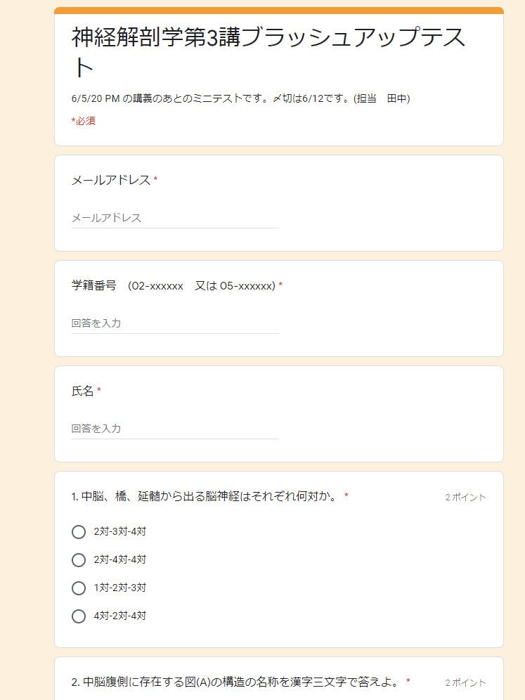

## 授業の基本情報

授業名　　:　解剖学第 3 (神経) 
開講部局　:　医学部・理学部 
対象　　　:　学部生 
学生数　　:　約 100 名 
形態　　　:　リアルタイム 
利用したツール　:

- ITC-LMS: 学習管理システム（講義資料の共有、課題提出等の管理）
- Zoom: オンライン会議システム（リアルタイム授業）
- Slido: 質問投稿 Web サービス（質疑応答）
- Google Forms: フォーム作成 Web サービス（授業後の理解度チェックテスト）

## 教員の基本情報

田中 庸介 先生 
医学系研究科 
講師 

## 学生によるコメント: この授業が良かった理由

**学生 A のコメント**

- オンライン講義に慣れていらっしゃる感じがしました。講義や質問対応、資料もよかったです。

**学生 B のコメント**

- zoom のチャット機能の他に、Slido を利用して匿名で気軽に質問できる環境を先生が整えて下さり、毎回の講義で学生から寄せられた大量の質問に先生が答えて下さったので、本来の講義内容以外にも多くのことを学べたため。
- 他大学（ユタ大学）が公開している動画を講義中に流し、先生が解説を加えることによって、対面講義・実習以上に詳細な神経解剖を学ぶことができたため。
- すべての講義資料（前述のユタ大学の動画の URL を含む）が予め学生に共有され、予習及び復習に活用できたため。

## 授業をオンライン化するにあたって心がけたこと

教科書に書いてあるような基本知識に加えて最新の脳神経科学の知見を学生に提供する、ということを対面・オンラインにかかわらず確実に行わなければならないという理念を持って臨みました。この授業では、オンラインということもあって今年から教科書を指定しましたが、教科書に載っている基本事項と発展事項に対して重要度の強弱を伝えることを意識しつつ、教科書に記載されていない最新の知見は、教科書の内容に絡めて提示するように心がけました。

また、この授業は実習ということもあって、実習として行っていたコンテンツを出来る限り効果を損なわずにオンラインに適合させるような工夫をしました。具体的には、ユタ大学で提供されている学習用動画を新たに授業用の教材として採用したり、今まで使っていた講義用の pdf 資料をオンラインに即した内容に新しく書き換えたり、というようなことを行いました。

私自身、IT 関係に明るいわけではなくオンラインという慣れない状況下で授業を行わなければならなかったので、大学総合教育研究センターなどが行っていたセミナーに参加して、そこで提供される情報や手法を積極的に取り入れるようにしたのは良かったなと思っています。

## 工夫したところ

### 主に slido を使って匿名で質問を募集し、逐一回答した

授業内で出た疑問点を解消するために、Slido を用いて毎授業質問を募集していました。今の学生にとって「匿名で質問できる」ということは非常に大事なポイントのようで、自分の名前を出すと恥ずかしくて質問できないということが起こりにくくなるので、どんどん質問が寄せられて授業が活性化する一因になったように感じました。多いときで 15−20 個の質問が寄せられる時もあったので、質問内容がごちゃごちゃにならないように、毎回の講義ごとに別のスレッドを立てて質問を募集しました。

また、講義中に取り上げられなかった質問に関しては、授業後に Slido のリプライ機能を使って一つ一つ返信していくという形で対応していました。

### 実学に結びつくような教材を活用した

オンライン授業になったことの一番のネックとして、この授業のような実習系の授業では実物を触ることが出来ないということがあります。そこでなるべく実習で学べる内容を補うような教材が必要だったので色々と探したところ、ユタ大学で提供されている神経解剖の実習用動画が大変良くできたものだったのでこれを利用することにしました。

その他にも、これまで代々受け継がれて配布していた pdf 資料をオンライン授業用に噛み砕いて書き直した新しいパワーポイントを作成したりと、なるべくオンライン授業に合うような教材を使用できるように心がけました。

### 授業後にブラッシュアップテストを実施した

授業で扱った内容を確認するためのテストを、Google Forms を利用して毎授業後に行いました。形式としては、1 問 2 点で 10 問 20 点満点のテストで、授業後 1 週間を期限として答えるものにしました。答える際には何を参照してもらってもよく、逆に色々と参照しながら問題を解くことで、重要なところを理解してもらおうという趣旨のものとして導入しました。

テストに ITC-LMS ではなく Google Forms を利用した理由については、Google Forms を以前利用したことがあったので勝手が分かっていたから、というだけで特別な理由があったわけではありません。私自身 IT にそれほど強いわけではなく、新しいものを覚えるのはそれなりに大変なので…(笑)

ブラッシュアップテストの一例

### zoom の投票機能を用いて学生とのインタラクションを増やした

学生の興味を引くために授業の開始直後に zoom の投票機能を使って、たとえば「大脳と小脳はどっちが大きいか？」というような、一般常識的なクイズを出していました。これをやっていたところ学生にすごく好評で、「まだ考えていたのに回答を締め切られてしまった！」と後で文句を言われたりするくらいに授業が盛り上がるようになりました(笑)。zoom の投票機能を使ったクイズは教員が思っている以上に学生に興味をもってもらえるコンテンツとして機能するようなので、忙しい時でも毎回必ず授業の最初に入れるようにしていました。

## 苦労したところ

### 授業をオンライン化する準備が大変だった

元々対面ありきだった実習の授業を、オンライン用に立ち上げる準備段階が最も大変でした。授業カリキュラムを組み直したり、教材を新たに作成するのにももちろん多くの時間を要しましたし、オンライン授業をするためのノウハウを得るのもかなり大変でした。ただ、大学総合教育研究センターなどのセミナーでオンライン授業の仕組みや手法を丁寧に教えていただけたおかげで、大分楽にノウハウを理解することができたと思いますし、非常に感謝しております。

また、質問対応や授業準備に毎回 5 時間程度かかっていてその部分は苦労しましたが、クラスサポーターの方が優秀で、資料のアップロードのし忘れのチェックから授業内容の客観的なチェックまでして頂き、大変助かりました。

### オンライン授業向けに導入した教材が英語版のみだった

新たに導入したユタ大学の学習用動画は、大変分かりやすい英語でしたが全編英語だったので、ランゲージプロブレムがある学生とない学生の間で授業の大変さに大きな差が生じてしまったようです。そういった差はできる限り少ないほうが望ましいとは思いますが、今後医学を学ぶ人はやはり英語でディベートが出来る必要がありますので、学生に「このくらいの英語は出来るようになっていて欲しい」というメッセージになって良かったかなと思っています。この動画教材を用いる際には、専門用語の英語が教材の動画内で出てくるたびにそのスペルと日本語訳を zoom のチャットに打ち込んで、それを授業後に pdf として共有するということもやっていました。

## 今後のオンライン授業に向けて

今回の授業の反省として、内容をオンライン授業に適合させようとするあまり、内容を噛み砕いて分かりやすくしすぎたのではないかと感じる部分もあります。答えがあるものを学ぶというのは高校までの勉強で終わりで、大学では分からないものや複雑なものと出会ったときにどう対応していくかという部分が非常に重要です。オンラインでは実物を触れない分、実物を解剖する中で「迷子になる」という経験をしにくいのでその部分をどのように学んでもらうかが、今後の課題だと思っています。

個人的には今回のコロナ対応によって Society 5.0 への道がパッと開けたような感じがしています。東京大学として先陣を切って未来の世界に足を踏み入れられたというのはすごく良いことなんじゃないかなと思っています。今後は、これまでの実存や実学、わけのわからないものとの闘いといったものが新しいプラットフォームの中でどのように息づいていくかを詰めていくフェーズになっていくはずで、私個人としてはそのことをポジティブに捉えていて、すごく楽しみです。

## 参考情報

### 本授業の概要（シラバスより）

脳神経科学はわれわれとは誰かという疑問を物質的に解明しようとする学問領域のひとつであり、日進月歩の先端的研究が行われている。本コースはその基礎となる神経解剖学を平易かつ刺激的に講じるもので、肉眼神経解剖学(脳マクロ)、神経組織学(脳ミクロ)の講義・実習を行う。神経系の構造と機能に関する基本的知識・概念を習得し、神経生理学、神経内科学、脳神経外科学、精神医学、一般臨床各科等の履修の基盤を構築することを目標とする。さらにこれに関連して、当教室で確立した統合失調症、疼痛、感覚障害、PTSD、認知症、てんかん、脳腫瘍、水頭症、神経変性疾患等のモデルとなるキネシン分子モーター欠損マウス解析研究を例として、神経細胞の分子機構におけるミクロレベルの擾乱が中枢・末梢神経系におけるマクロレベルでの機能障害をいかに惹起するかの考え方を包括的に論じる。

### 授業内容

- 脊髄、末梢神経
- 脳の概観、髄膜、血管
- 脳幹、脳神経、中脳
- 橋、延髄、その他の脳神経
- 小脳、脳室\*
- 小脳、神経系の発生\*
- 自律神経、伝導路
- 大脳皮質の組織学
- 大脳の発生、第三脳室、大脳の表面\*
- 嗅覚系、大脳の線維路\*
- 海馬・歯状回、大脳辺縁系\*
- 大脳基底核、線条体、扁桃体
- 間脳、視床上部、視床下部

\* 田中先生以外の先生がご担当

### 具体的な授業 1 回分の流れと方法

講義の形式としては集中講義で、基本的に毎日 3 限 4 限の時間帯に講義が行われます。授業時間としては 3 時間程度を目安としていました。

まず冒頭の 10 分は、zoom の投票機能を使った簡単なクイズを行うなどして学生の興味を引くようなコンテンツを取り入れるようにしていました。授業開始直後は学生の集まりがまばらだったり学生のエンジンがかかっていなかったりするので、いきなり講義を始めるのではなく割とダラダラと始めることを意識していました(笑)。

その後は 80 分程度 Powerpoint で授業内容の解説を行い、15 分の休憩を入れます。休憩後は更に 45 分程度 Powerpoint で授業内容の解説を行ったのち、残りの 45 分でユタ大学の動画視聴（20 分 ×2 本）とその解説を行いました。授業中は Slido を常に開放しておき、学生が疑問を持ったときにすぐ書き込めるようにしていました。

授業後は Google Forms を用いてブラッシュアップテストを 10 問程度、自習として解いてもらい講義内容を振り返ってもらう形にしました。

| 時間| カテゴリ| 説明|
| 10 分| 小クイズ| Zoom の投票機能を使った簡単なクイズ|
| 80 分| 講義| PowerPoint 授業内容の説明|
| 15 分| 休憩|休憩|
| 45 分| 講義| PowerPoint 授業内容の説明|
| 45 分| 講義| ユタ大学の動画（20 分 ×2）+ 解説|
| 授業後| 復習| ブラッシュアップテスト（10 問程度）|
