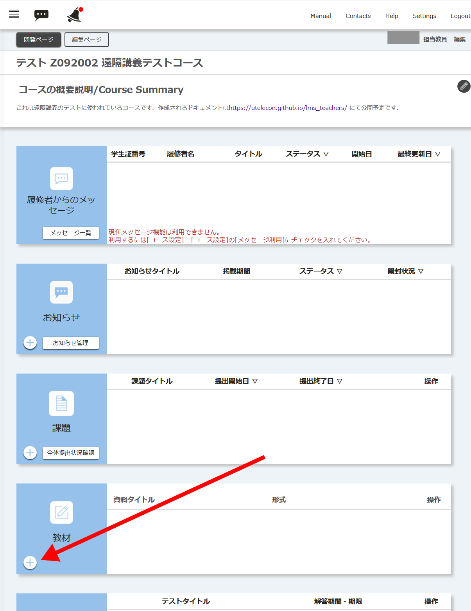
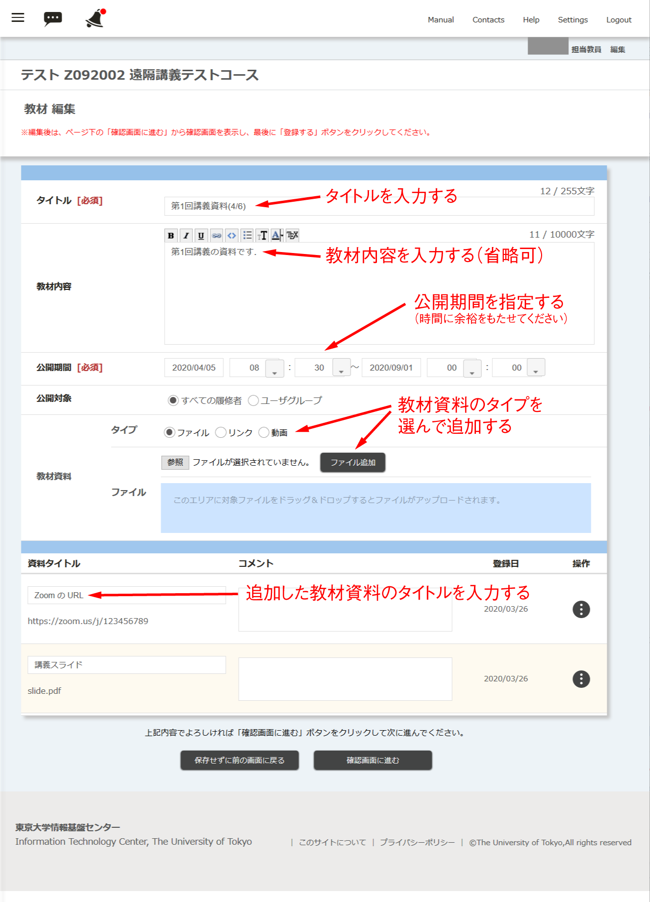
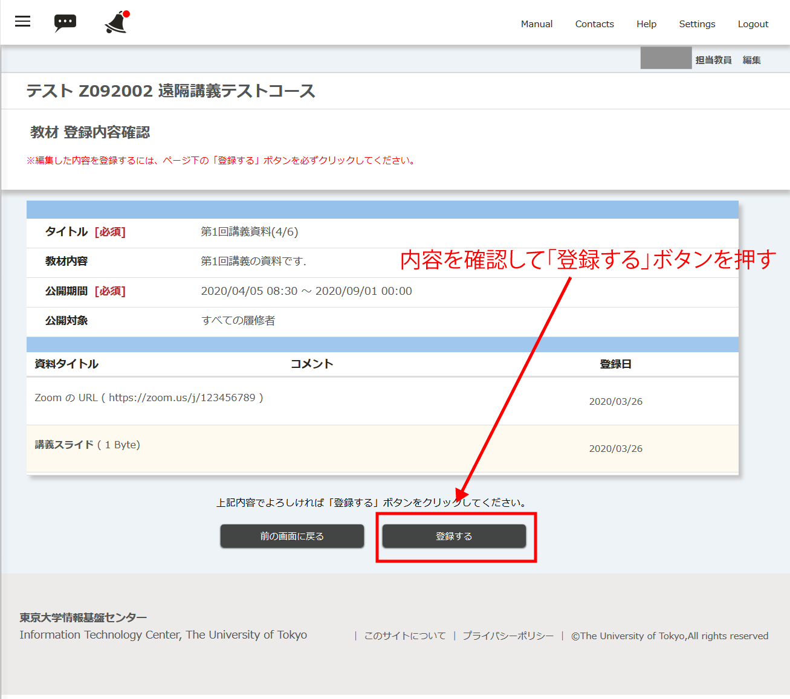

## 概要
* 「教材」には授業で使う「教材資料」を置いたり，教材内容を記載したりします．
* 「教材」の公開期間を設定することが出来ます．
    * ITC-LMSの負荷分散の観点から、授業開始時間より前に学生が事前に「教材資料」をダウンロードできるよう十分な時間を確保するようにお願いします．
* 「教材資料」のタイプとしては「ファイル」「リンク」「動画」があります．
    * Zoom の URL を事前に知らせたり、PDF ファイルへのリンクを知らせるといった使い方ができます．
    * ITC-LMSの負荷の観点から，ファイルはなるべくサイズが小さいものに限定し，サイズが大きい場合は外部サイトにおいてリンクを記載するようにしてください．動画はなるべく使わないでください．
* 「教材」1ページにつき複数の教材資料を置けます．
    * 1回の授業ごとに「教材」を作成して、その回で使うスライドや補足資料、Zoom の URL などの教材資料をまとめて置くことができます．

## 教材の作り方

1. コースの上から4つめにある「教材」の左下にある⊕ボタンを押します．
    * 新しい「教材」を作成できます．
    
    
    
    
1. 「教材 編集」のページになるので、以下の内容を記入します．
   
    * タイトル
        * 例えば「第1回講義資料(4/6)」などのように，どの回の教材か分かるようなタイトルを記載するとよいです．
    * 教材内容（省略可）
        * 教材の説明を記載します．
    * 公開期間
        * 例えば授業日前日から1学期の終了日までといった期間を指定します．
        * ITC-LMSの負荷の観点から，開始時間を授業開始時間ギリギリに設定することは避けてください．
    * 公開対象
        * 通常は「すべての履修者」のままで良いと思います．
    * 教材資料
        * タイプ（ファイル，リンク，動画）を選んでから「追加」ボタンを押してください．
        * 追加すると下の方に資料のファイル名やURLが追加されるので，その資料のタイトルを別途入力してください．
        * この操作を繰り返すことで複数の教材を追加できます．
        * 追加した教材資料を削除したい場合は，右端の「操作」のところにあるボタンを押してください．
    
    
    
    
    
1. 「確認画面に進む」のボタンを押します．

    

    

1. 「教材 登録内容確認」の画面になるので、内容を確認の上、「登録する」ボタンを押してください．

    

## 参考情報
* <a href="https://www.ecc.u-tokyo.ac.jp/itc-lms/faq.html">FAQ: よくある質問 (ITC-LMS)</a>
  * <a href="https://www.ecc.u-tokyo.ac.jp/announcement/2014/04/16_1866.html">ITC-LMS に複数ファイルをアップロードしたい (学生・教員)</a>
  * <a href="https://www.ecc.u-tokyo.ac.jp/announcement/2014/04/18_1876.html">ITC-LMS で公開している教材の公開期間を変更したい (教員)</a>
