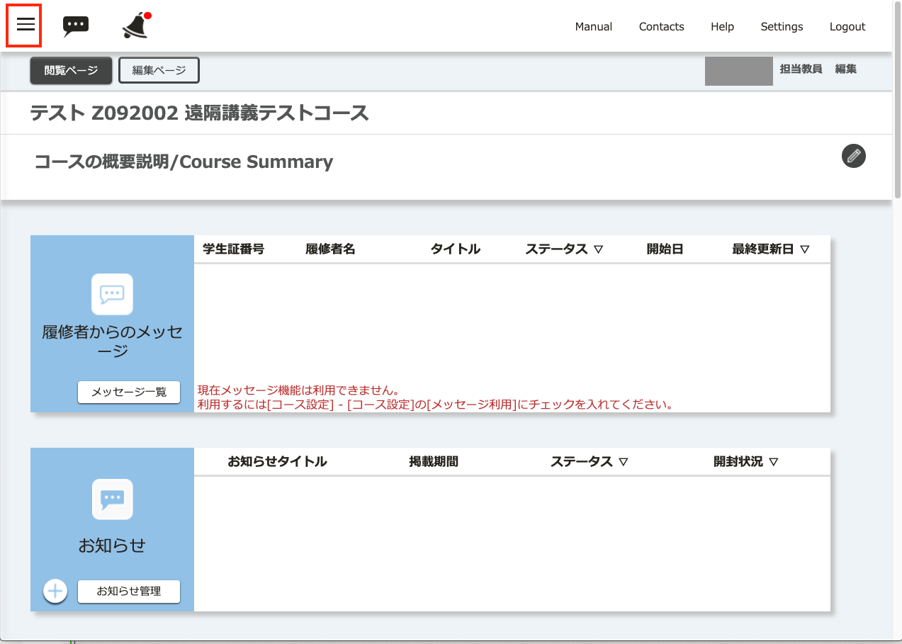
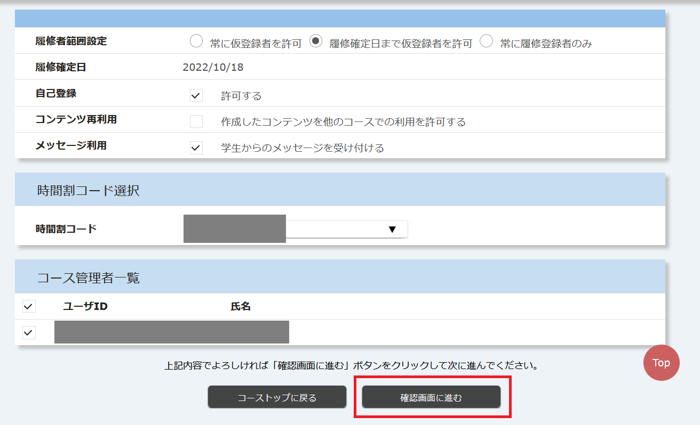
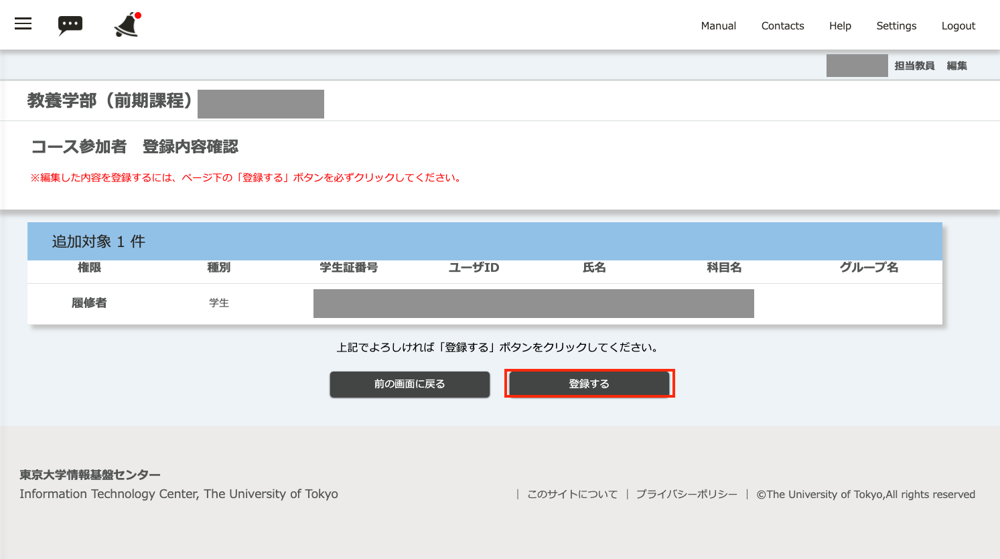

ITC-LMSではタームやセメスター単位で開講される科目のことを「コース」と呼びます．自分の担当する科目に合わせて，まずはコースの設定をします．

## コースの概要説明

学生がITC-LMS上でコース検索した時や，時間割から該当授業のコースを選択したトップ画面に表示するドキュメントを設定できます．

* 固定的に学生に伝えたいことは，ここに書くと良いでしょう．
* 例外として，オンライン授業の URL を学生に連絡する際は，原則「オンライン授業情報」欄を活用するようお願いしています．
  * 「オンライン授業情報」欄に記載することで，ITC-LMS にアクセスできなくなっても学生が他のシステムから確認しやすくなる，などの利点があります．
  * 参考：[授業URLの連絡方法（教員向け）](/faculty_members/url#use-online-class-info-in-general)

1. コースの画面で左上の三本線のアイコンを選択してメニューを出します．

2. 「コース設定」を展開して，「コースの概要説明」を選択します．

3. 「内容」に説明を書き込んで「確認画面に進む」を選択してください．テキストのみではなく，書体の変更や，箇条書き，リンクなどが指定できます．

4. 書き込んだ説明が，どのように表示されるかを確認の上で，「登録する」を選択してください．

[手順動画](https://youtu.be/Sdqtw2m1j48)

## 履修登録方法の設定，メッセージ利用

2021/12/22以降，「メッセージ利用」における「学生からのメッセージを受け付ける」を，新規登録されたコースのデフォルトにしました．学生からメッセージを受け取らない場合は，チェックを外してください．

UTASで科目に本登録した学生は該当するコースに自動的に登録されますが，必修の科目以外はUTAS上での本登録は開講後しばらくしてからになります．そのため，はじめの数回の授業で使えるようにするためには，そのように設定する必要があります．

1. コースの画面で左上の三本線のアイコンを選択してメニューを出します．

2. 「コース設定」を展開して，「コース設定」を選択します．

3. 下の画面は典型的な設定になります．主な項目の説明をします．
  * 履修者範囲設定は「履修登録者+仮登録者」としています．UTAS上で「お気に入り」に該当科目をした学生が「仮登録者」として，このコースに参加できます．「履修登録者のみ」とするとUTAS上で本登録をしていない学生はこのコースに参加できません．
  * 自己登録を「許可する」としています．UTAS上で登録しなくても，学生はコース検索でこのコースを見つけて自己登録すると「仮登録者」になり，コースに参加できます．第1回の授業の当日にUTASに「お気に入り」登録をした学生を受講させるには，「許可する」としておくと，学生本人が登録可能になります．

  * 「履修確定以降」を「「履修者範囲設定」を自動的に「履修者登録者のみ」に変更する」とすると，UTAS上で履修が確定した時点で，「履修者範囲設定」が自動的に「履修登録者のみ」になります．なお，あとから，「履修登録者+仮登録者」に戻すことはできます．
  * 「メッセージ利用」を「学生からのメッセージを受け付ける」とすると，履修している学生からのメッセージ(質問等)を受け付けて応答することができます．オンライン授業では対面授業と違って，学生が教室で教員と直接連絡を取る機会がないので，なんらかの連絡手段を用意する必要がありますが，この機能を使うと，メールアドレスを伝えずに1対1で連絡を取ることができます．
4. 「確認画面に進む」を選択します．

5. 「登録する」を選択します．

<!-- 
コース設定 -> コース設定で編集する
「履修者範囲設定」，「自己登録」，「履修確定以降」，「メッセージ利用」についてお勧め設定と，変更するとどうなるかの説明をする
-->

## 教員による参加者登録
UTASに登録されていないが，科目を共同で担当している教員，TAは担当教員によるコース参加者登録が必要になります．また，UTASに科目を登録していない時点で，担当教員が学生をコースに参加させることができます．

1. コースの画面で左上の三本線のアイコンを選択してメニューを出します．

2. 「コース設定」を展開して，「コース参加者登録」を選択します．

3. 「コース参加者登録」の画面で「学生検索」か「教員検索」を選択します．

4. 「学生検索」を選ぶと「学生証番号」か「氏名」で検索できます．氏名を入力して検索してみます．

5. 該当する学生が表示されるので，該当する学生 (同姓同名に注意) のチェックボックスを選択し，「権限指定」を「担当教員」，「TA」，「履修者」の中から選び「指定」を選択します

6. 該当する学生が表示されるので，該当する学生 (同姓同名に注意) のチェックボックスを選択し，「権限指定」を「担当教員」，「TA」，「履修者」の中から選び「指定」を選択します

7. 「確認画面に進む」を選択します

8. 「登録する」を選択します

[手順動画](https://youtu.be/TYCXBRzPpAA)

* 教員の検索のときは「学生証番号」の代わりに「共通ID」で検索できます．
* Excelのファイルを使っての一括登録の機能もあります．
* 教員の検索をして，同じ氏名で，数字10桁以外の「ユーザID」が表示されることがあります．これは旧ITC-LMSのコンテンツを参照するために残っているもので，ログインできないので，その教員にコース参加して欲しい場合は，数字10桁のユーザIDの方を登録してください．
* 学生や教員の検索機能は，本当に必要な時以外は使わないようにしてください．

<!-- 
コース参加者登録で何ができるか．TAや他の担当教員の登録．
自己登録を許さない場合での手動登録などの説明
-->

## 参考情報
* <a href="https://www.ecc.u-tokyo.ac.jp/itc-lms/faq.html">FAQ: よくある質問 (ITC-LMS)</a>
  * <a href="https://www.ecc.u-tokyo.ac.jp/announcement/2015/08/11_2065.html">ITC-LMS の「履修者範囲設定」とは何ですか？（教員）</a>
  * <a href="https://www.ecc.u-tokyo.ac.jp/announcement/2014/04/16_1870.html">ITC-LMS の自己登録を不許可としたい (教員)</a>
  * <a href="https://www.ecc.u-tokyo.ac.jp/announcement/2015/03/10_2012.html">ITC-LMS のコースに教員・学生を追加したい（教員）</a>
  * <a href="https://www.ecc.u-tokyo.ac.jp/announcement/2015/08/11_2066.html">ITC-LMSの「仮登録」とは何ですか？</a>
  * <a href="https://www.ecc.u-tokyo.ac.jp/announcement/2014/04/16_1863.html">ITC-LMS と学務システム（UTAS）の履修者自動登録について</a>
