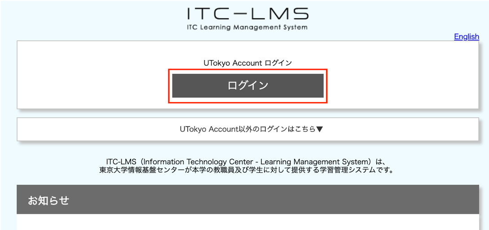

ここでは ITC-LMS のログイン方法を説明します．ログインの方法は教職員も学生も同じです．

 1.<a href="https://itc-lms.ecc.u-tokyo.ac.jp/login" target="_blank">https://itc-lms.ecc.u-tokyo.ac.jp/login</a> にブラウザでアクセスし，`ログイン`ボタンを押してください． 

 2.以下の画面が表示されたら, 共通ID（職員証がある場合は右下にある18桁の数字の下10桁）とパスワードを入力し, `サインイン`ボタンを押してください. 

[手順動画](https://youtu.be/xAur5zar5Sc)
## 参考情報
* <a href="https://www.ecc.u-tokyo.ac.jp/itc-lms/faq.html">FAQ: よくある質問 (ITC-LMS)</a>
