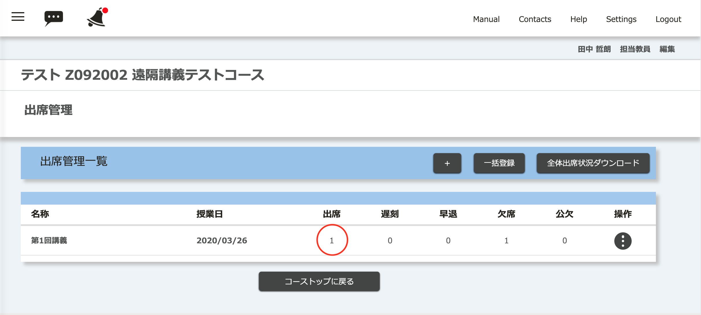
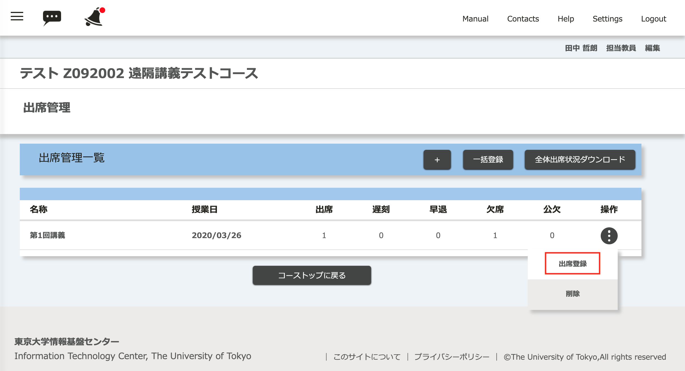
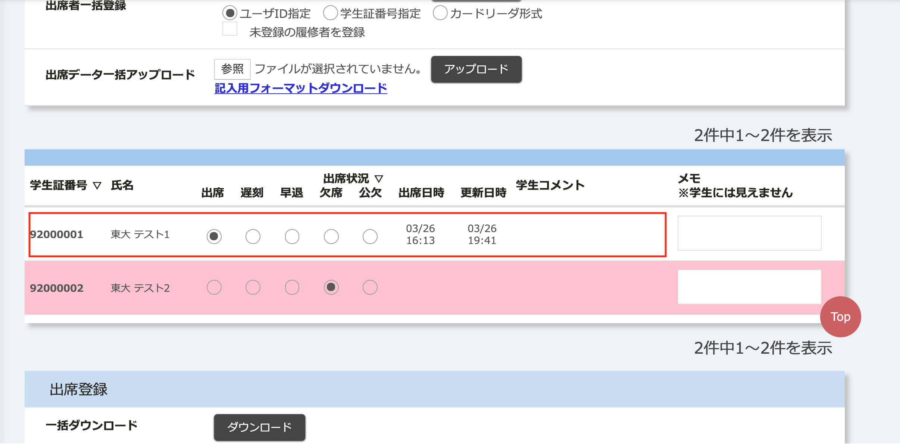

学生に「出席送信」ボタンを押して，ワンタイムパスワードを入力するように求めたあとに，状況を確認するには以下のようにおこなえます．

1. コースの画面で左上の三本線のアイコンを選択してメニューを出します．

2. 「コースコンテンツ」を展開して，「出席管理」を選択します．

3. 該当する授業日の「出席」が0以上になっていることを確認します．更新をするには，ブラウザで「再読み込み」をしてください．

4. 個々の受講者の出席状況を確認するには，出席管理の画面で該当する授業日の「操作」から，「出席登録」を選択してください．

5. 「出席登録」の画面の下の方に，個々の学生の出席状況 (出席日時，更新日時)を確認できます．学生にコメントを書かせた場合は，この画面で確認できます．

## 参考情報
* <a href="https://www.ecc.u-tokyo.ac.jp/itc-lms/faq.html">FAQ: よくある質問 (ITC-LMS)</a>
  * <a href="https://www.ecc.u-tokyo.ac.jp/announcement/2014/05/13_1904.html">ITC-LMS で出席確認を行う方法について (教員)</a>
