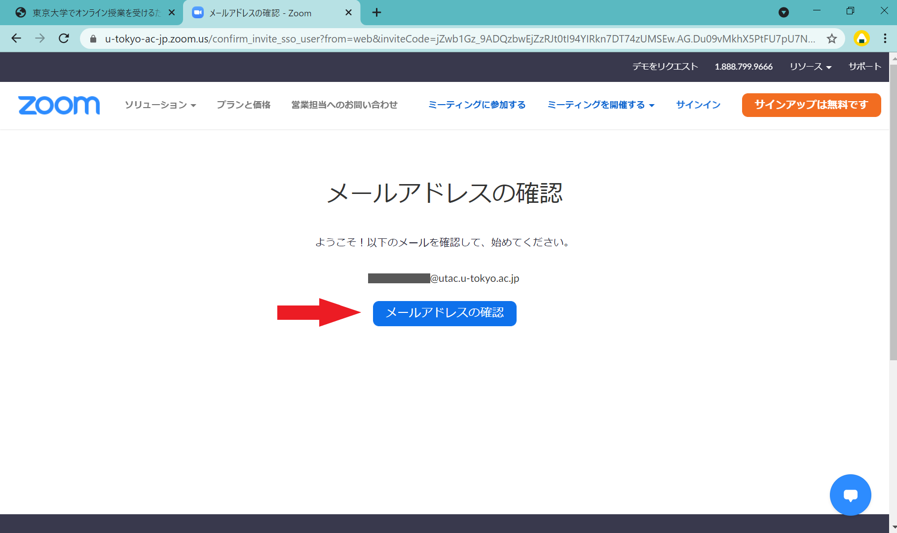

東京大学のZoomアカウントは，現在，UTokyo Accountでサインインするアカウント（ `1234567890@utac.u-tokyo.ac.jp` のような，10桁の共通IDに `@utac.u-tokyo.ac.jp` を付けたもの）が所定のアカウントとなっています．

つきましては，**ECCSクラウドメールの自分で設定したメールアドレス `xxxx@g.ecc.u-tokyo.ac.jp` のアカウントなど，UTokyo Accountでサインインするもの以外のアカウントで東大のZoomを利用している方は，このページの案内に従って，UTokyo Accountでサインインするアカウント**（ `1234567890@utac.u-tokyo.ac.jp` のような，10桁の共通IDに `@utac.u-tokyo.ac.jp` を付けたもの）**へ変更していただき，今後はそちらを利用してください．**

サインイン方法の統一により一元的な管理ができるよう移行を進めておりますので，当該のアカウントは，無効化などの対応を順次行わせていただく予定です．また，これらのアカウントのうち一部は，所定の形式と異なるアカウントであるためライセンス（有料機能）が付与されておらず，ミーティングの上限時間が原則40分となるなど機能上の制約もあります（大学メールアドレスのアカウントに対する制限緩和も2022年春で終了しています）ので，速やかにサインイン方法を変更するようお願いいたします．

<code>1234567890@<em>g.ecc</em>.u-tokyo.ac.jp</code>のような10桁の共通IDのECCSクラウドメールのZoomアカウントをお使いの場合

<code>1234567890@<em>g.ecc</em>.u-tokyo.ac.jp</code>のような10桁の共通IDのECCSクラウドメールのZoomアカウントは，原則として<a href="/change2021s/">2021年春のシステム変更</a>において自動で<code>@<em>utac</em>.u-tokyo.ac.jp</code>に変更され，UTokyo Accountでサインインできるようになっていますので，このページで案内している作業を行う必要はありません．システム変更後に手動でアカウントを作成したなどの理由で，現在も<code>1234567890@<em>g.ecc</em>.u-tokyo.ac.jp</code>のような10桁の共通IDのECCSクラウドメールのZoomアカウントを利用している場合は，UTokyo Accountでサインインすることはできませんので，このページの案内に従って変更をお願いいたします．

## 当該のアカウントが不要の場合
{:#existing-account-is-unnecessary}

現在利用している，UTokyo Accountサインインではないアカウント（ECCSクラウドメールの自分で設定したメールアドレス `xxxx@g.ecc.u-tokyo.ac.jp` など）が不要の場合，**[Zoomのサインインの仕方](/zoom/signin)**のページに書かれている手順でZoomにサインインすると，新たにUTokyo Accountでサインインするアカウントを利用開始することができますので，今後はそちらを利用していただければ十分です．

<!--
なお，UTokyo AccountサインインではないZoomアカウントについては，管理者の方で削除しますので，[不要なZoomアカウント削除フォーム](https://forms.office.com/Pages/ResponsePage.aspx?id=T6978HAr10eaAgh1yvlMhHUY5ws7h1xGr9koV-KGC8RUNTBGSjJPN0ZWN0RIVFI2TVZZODZNT0xRRy4u)からご連絡ください．
-->

## 当該のアカウントを引き継ぎたい場合

UTokyo Accountサインインではないアカウント（ECCSクラウドメールの自分で設定したメールアドレス `xxxx@g.ecc.u-tokyo.ac.jp` など）は，当面はそのままでも引き続きご利用いただけますが，今後順次無効にさせていただく予定です．

当該のアカウントには次の「サインイン方法」の手順でサインインすることができますが，ご都合のよいタイミングで**なるべく早く，下の「UTokyo Accountサインインへの変更手順」に従ってUTokyo Accountでサインインへの移行**するようお願いいたします．

### サインイン方法

[2021年春のシステム変更](/change2021s/)でUTokyo Accountサインインに変更されていないZoomアカウント（ECCSクラウドメールの自分で設定したメールアドレス `xxxx@g.ecc.u-tokyo.ac.jp` など）については，当面の間，**Zoomの通常のサインインページ [https://zoom.us/signin](https://zoom.us/signin) にこれまで利用していたメールアドレスとZoom専用のパスワードを入力**していただくと，サインインすることができます．

サインインしたら作成・設定していた会議室の情報やクラウド録画の情報が見つからないという場合

上記の方法ではなくUTokyo Accountを使う新しいサインイン方法を使ってしまうと，UTokyo Account用の別のZoomアカウントが新しく作成されてそちらにサインインしてしまうため，このような現象が発生します．一度サインアウトして，Zoomの通常のサインインページ <a href="https://zoom.us/signin">https://zoom.us/signin</a> からこれまで利用していたメールアドレスとZoom専用のパスワードでサインインしてみてください．

### UTokyo Accountサインインへの変更手順
{:#change-procedure}

お使いのアカウントのメールアドレスが，ECCSクラウドメールの自分で設定したメールアドレス (`xxxx@g.ecc.u-tokyo.ac.jp`) の場合は， **[専用の移行サイト](https://sites.google.com/g.ecc.u-tokyo.ac.jp/utelecon-zoom-checker/home)** を利用してワンストップで移行できます．移行サイトの指示に従って作業してください．移行が完了するとUTokyo Accountでのサインインが可能になりますので，今後は[Zoomのサインインの仕方](/zoom/signin)のページに書かれている手順でサインインしてご利用ください．

お使いのアカウントのメールアドレスが上記以外の場合

お使いのアカウントのメールアドレスが上記以外（ECCSクラウドメールではないメールアドレスや，<code>1234567890@g.ecc.u-tokyo.ac.jp</code>のようなECCSクラウドメールの10桁の共通IDのメールアドレス）の場合は，以下の手順で手動で移行してください．

<ol>
    <li>
        <a href="https://zoom.us/profile">Zoomのプロフィールページ</a> にアクセス（サインインしていない場合はサインイン）して，「サインイン用メールアドレス」の欄の右の方にある「編集」を押してください．
        
    </li>
    <li>
        新しいメールアドレスとして，<code>1234567890@<em>utac</em>.u-tokyo.ac.jp</code>のように，10桁の共通IDの後に<code>@<em>utac</em>.u-tokyo.ac.jp</code>を付けたものを入力してください．
        

            
ヘルプ：この手順で，メールアドレス「1234567890@utac.u-tokyo.ac.jp」は使用されています，と表示された場合

            既に<code>1234567890@<em>utac</em>.u-tokyo.ac.jp</code>というアカウントが存在しているため，先にそちらを削除する必要があります．<a href="https://forms.office.com/Pages/ResponsePage.aspx?id=T6978HAr10eaAgh1yvlMhHUY5ws7h1xGr9koV-KGC8RUOUJaRDVGUEdDVERDNVozSUw1WEJTSE9ONi4u">10桁の共通ID@utac.u-tokyo.ac.jpのアカウント削除フォーム</a>を入力・送信してください．削除が完了したらメールが届きますので，その後あらためて上の手順でメールアドレスを変更してください．
        

    </li>
    <li>
        変更についてメールでの確認が行われます．変更前のメールアドレスとECCSクラウドメールの双方に順番にメールが届くので，記載に従って作業を行ってください．
        
※上の手順で入力した変更後のメールアドレス <code>1234567890@<em>utac</em>.u-tokyo.ac.jp</code> 宛にメールが送信される旨が表示されますが，このメールアドレス宛のメールは転送されてECCSクラウドメール <code>@<em>g.ecc</em>.u-tokyo.ac.jp</code> に届くようになっているため，ECCSクラウドメールにログインして受け取ってください．

    </li>
    <li>
        <a href="https://zoom.us/profile">Zoomのプロフィールページ</a>の右上のアイコン（人のマークか，または自分のアイコンを設定していればそれ）を押して「サインアウト」を選択し，Zoomから一度サインアウトしてください．
    </li>
    <li>
        東京大学専用のZoomページ <a href="https://u-tokyo-ac-jp.zoom.us/">https://u-tokyo-ac-jp.zoom.us/</a>で「Config」ボタンを押して，UTokyo Accountでサインインしてください（<a href="/zoom/signin#browser">「Zoom サインイン方法」のページの「ブラウザからサインインする方法」</a>と同じ手順です）．
        
        

            
ヘルプ：この手順でサインイン直後に「メールアドレスの確認」などと表示された場合

            
            アカウントを東京大学の組織契約 (UTokyo Zoom) に切り替えるためにメールによる確認が必要です．「メールアドレスの確認」ボタンを押して少し待つとECCSクラウドメールに確認メールが届くので，記載に従って作業を行ってください．
            <small style="display: block">※<code>1234567890@<em>utac</em>.u-tokyo.ac.jp</code> のメールアドレスを確認するよう表示されていますが，このメールアドレス宛のメールは転送されてECCSクラウドメール <code>@<em>g.ecc</em>.u-tokyo.ac.jp</code> に届くようになっているため，確認メールはECCSクラウドメールにログインして受け取ってください．</small>
        

    </li>
    <li>
        サインイン後，右上のアイコン（人のマークか，または自分のアイコンを設定していればそれ）を押したときに，自分の共通IDが表示されていれば，OKです．
    </li>
</ol>

移行を行った後，ライセンスが「ライセンスあり」ではなく「基本」と表示される場合があります．その場合，移行の翌日にライセンスが付与されるようになっているので，翌日まで待ってからもう1度確認してみてください．

以上の手順でうまくいかないことがある場合は，[サポート窓口](/support/)に相談してください．
