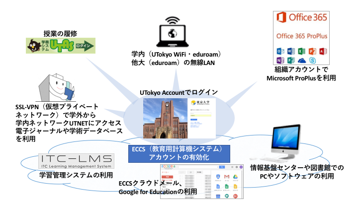

## オンライン授業を受けるための準備

<ol>
  <li> <b>（2020年度新入生のみ） <a href="">UTokyo Account を有効化します</a></b>   </li> 
	 
	 
  <li> <b><a href="https://www.ecc.u-tokyo.ac.jp/onlineseminar.html" target="_blank">ECCS 新規利用者講習を受講します</a></b> 
     ECCS クラウドメールを有効化するために必要です．  </li>  
	 
	 
  <li> <b><a href="https://hwb.ecc.u-tokyo.ac.jp/wp/literacy/email/initialize/" target="_blank">ECCS クラウドメールを有効化します</a></b>   
      ECCS クラウドメールは，本学のGoogleメール（UTokyo Account の数字10桁@g.ecc.u-tokyo.ac.jp もしくは，自分で設定した文字列@g.ecc.u-tokyo.ac.jp）のことで，授業で用いる Web 会議システムを利用するために必要になります． </li> 
     

<b>UTokyo Accountでできること</B>

各サービスの活用については，[『東京大学ICT活用ハンドブック』](https://fye.c.u-tokyo.ac.jp/students/?action=common_download_main&upload_id=1316)（2019年版．随時更新します）を参照して下さい．  
     
  <li> 各授業で，担当する教員から指定されたシステムをご利用ください．
</ol>
 
  