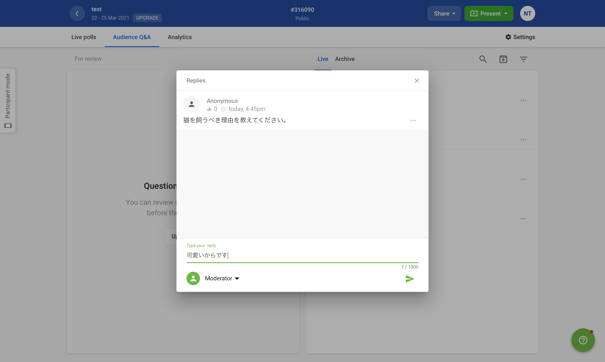

<figure>

<figcaption>基本的な編集画面とボタンの名称機能</figcaption>
</figure>

①イベント名・日時 
②イベントのコード 
③イベントのQRコードを表示・ダウンロードする 
④投票の作成（後述） 
⑤学生に表示されている投票の表示（後述）

## 投票（polls）を開始する

Slidoの投票機能は全部で6つあります．それぞれ，投票機能の画面から，各機能のアイコンのボタンをクリックすることで新規の投票を作成できます．

* Multiple choiceー選択形式で答える質問を設定する 
* Word cloudー参加者の回答が「cloud」として可視化される質問を設定する（参加者はOpen textと同様に短文形式で答える） 
    * 回答が図のように表示されます．同一の回答が複数あった場合，その単語が大きく表示されます．（学生側の表示） 
* Quizー正解が表示される問題を設定する 
* Ratingー最大10段階で評価される評価軸を設定する
* Open textー短文形式で答える質問を設定する
* Rankingー参加者に順位付けしてもらうための複数の項目を設定する 
    * 作成した投票は，画面左側と画面右側に表示されます．画面左側にはこれまで作成した全ての投票が表示され，画面右側には参加者に表示されている投票が表示されます．参加者への投票の表示を停止する場合は，画面左側の投票についている赤色のボタンをクリックして下さい． 
    * 赤いボタンをクリックすると，上の画像のように，画面右側に表示されていた投票が消えます．再度参加者への投票の表示を行いたい場合は，画面左側の投票についている緑色のボタン（元々赤色のボタンだったもの）をクリックして下さい． 

## 参加者の質問に回答する

Slidoでは，学生が自由に質問・感想を送ることができます．

ここでは学生からきた質問への回答方法を説明します．

<figure>

<figcaption>Q＆Aの画面（画面左上の「Audience Q&A」をクリックして選択） 学生の質問・感想が画面右側に表示される</figcaption>
</figure>

1. オレンジ色の枠で囲まれた質問に答えるため，青色の円で囲まれた三点リーダーをクリック

2. 表示された選択肢の中から「Reply」を選択

3. 回答を入力し，送信する

三点リーダーをクリックして表示されるそのほかの選択肢には，以下のようなものがあります．

* Edit: 学生からの質問・感想を編集します．
* Archive: 学生からの質問・感想をアーカイブに入れます．アーカイブに入れられた質問・感想は，学生から見えなくなりますが，教員側からは常に確認できます．（タブ上記のArchiveを選択）また，「Restore question」のボタンをクリックすることで，再度アーカイブから取り出すことも可能です．
* Delete: 学生からの質問・感想を消去します．