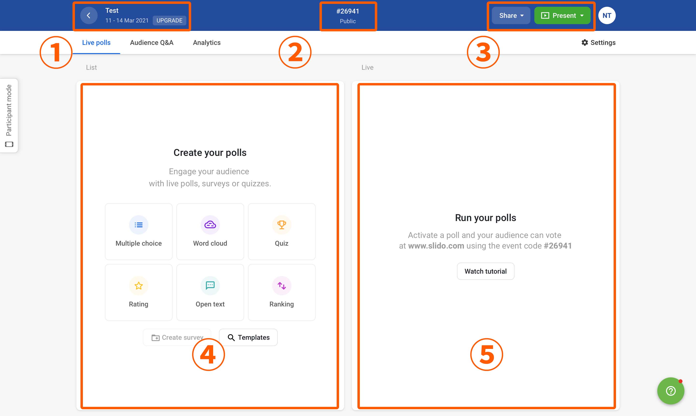
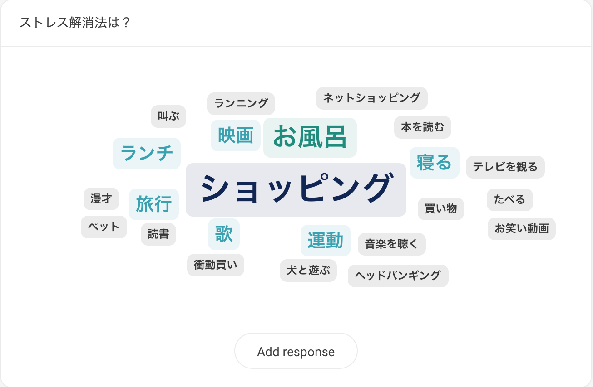
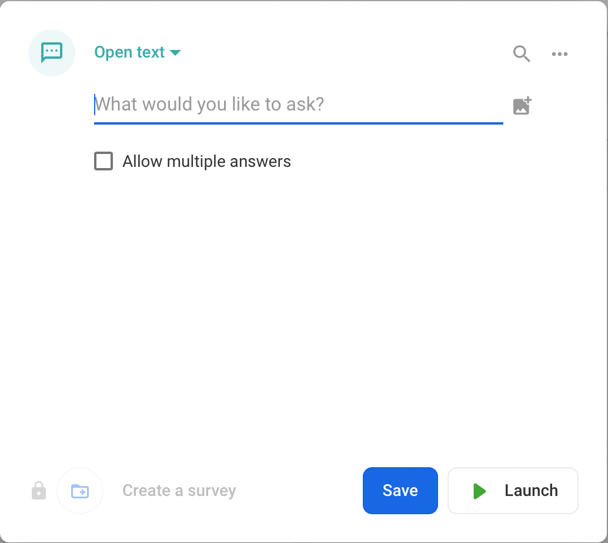
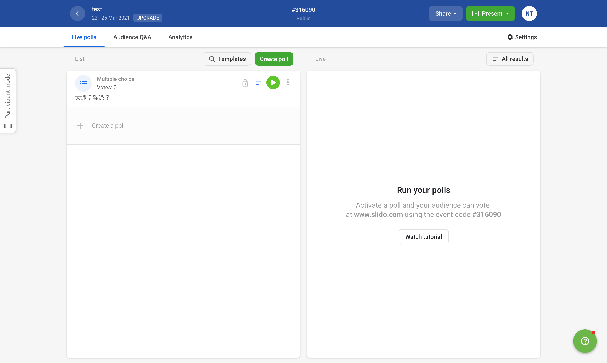

このページでは，Slidoの主催者側画面において，主催者ができることを説明しています．主催者側画面には，[イベントの一覧ページ](https://admin.sli.do/events)からアクセスしてください．

Slidoに参加者として参加する場合の操作方法は「[Slidoで参加者ができること](how_to_use_audience)」を確認してください．

## 学生の質問を確認する

Slidoでは，学生が自由に質問・感想を送ることができます．
画面左上の「Audience Q&A」を選択してください．学生からの質問・感想は，画面右側の「Live」欄に表示されます．

標準では，それぞれの投稿に付けられた「いいね」の数の順番に質問・感想が表示されており（「Top」：人気順），自動的に更新されます．
画面右上の下矢印を選択することで，「Recent」：投稿順 に変更することもできます．

<figure>

</figure>

それぞれの質問・感想にカーソルを重ねることで，以下のようなボタンが表示され，質問・感想に対する操作を行うことができます．
* **「★」 (Star Question)**：Slidoでは新しい質問・感想が送信されるたびに表示が入れ替わるため，質問・感想を見失いやすくなっています．質問・感想にStarをつけておくことで，後からStarのついた質問・感想だけをまとめて確認することができます．なお，主催者がStarをつけたことは参加者にはわかりません．
* **「^」 (Highlight Question)**：特定の質問・感想を画面の上部に固定することができます．ここで設定した投稿は，全ての参加者の画面でも上部に固定されます．
* **「☑︎」 (Mark as answerd)**：このボタンを選択することで，質問・感想を回答済みとしてアーカイブできます．アーカイブした質問は学生から見えなくなりますが，教員側からは常に確認できます．

また，右下三点リーダーをクリックして表示されるそのほかの選択肢には，以下のようなものがあります．
* **Edit**：学生からの質問・感想を編集します．
* **Reply**：質問・感想に対して返信をすることができます．
* **Archive**：学生からの質問・感想をアーカイブに入れます．アーカイブに入れられた質問・感想は，学生から見えなくなりますが，教員側からは常に確認できます．（タブ上記のArchiveを選択）また，「Restore question」のボタンをクリックすることで，再度アーカイブから取り出すことも可能です．
* **Delete**：学生からの質問・感想を消去します．

## 投票（polls）を開始する

Slidoでは，投票（polls）機能を使うことで，教員から学生に対して質問やクイズを行うことができます．
画面左上の「Live polls」を選択してください．

<figure>

</figure>

①イベント名・日時 
②イベントのコード 
③イベントのQRコードを表示・ダウンロードする 
④投票の作成（後述） 
⑤学生に表示されている投票の表示（後述）

### 投票を作成する
投票には以下の6種類があります．投票機能の画面から，各機能のアイコンのボタンをクリックすることで新規の投票を作成できます．

* Multiple choiceー選択形式で答える質問を設定する 
* Word cloudー参加者の回答が「cloud」として可視化される質問を設定する（参加者はOpen textと同様に短文形式で答える） 
    * 回答が図のように表示されます．同一の回答が複数あった場合，その単語が大きく表示されます．（学生側の表示） 
* Quizー正解が表示される問題を設定する 
* Ratingー最大10段階で評価される評価軸を設定する
* Open textー短文形式で答える質問を設定する
* Rankingー参加者に順位付けしてもらうための複数の項目を設定する 

### 作成した投票を管理する

作成した投票は，画面左側と画面右側に表示されます．画面左側にはこれまで作成した全ての投票が表示され，画面右側には参加者に表示されている投票が表示されます．参加者への投票の表示を停止する場合は，画面左側の投票についている赤色のボタンをクリックして下さい． 

赤いボタンをクリックすると，上の画像のように，画面右側に表示されていた投票が消えます．再度参加者への投票の表示を行いたい場合は，画面左側の投票についている緑色のボタン（元々赤色のボタンだったもの）をクリックして下さい． 
