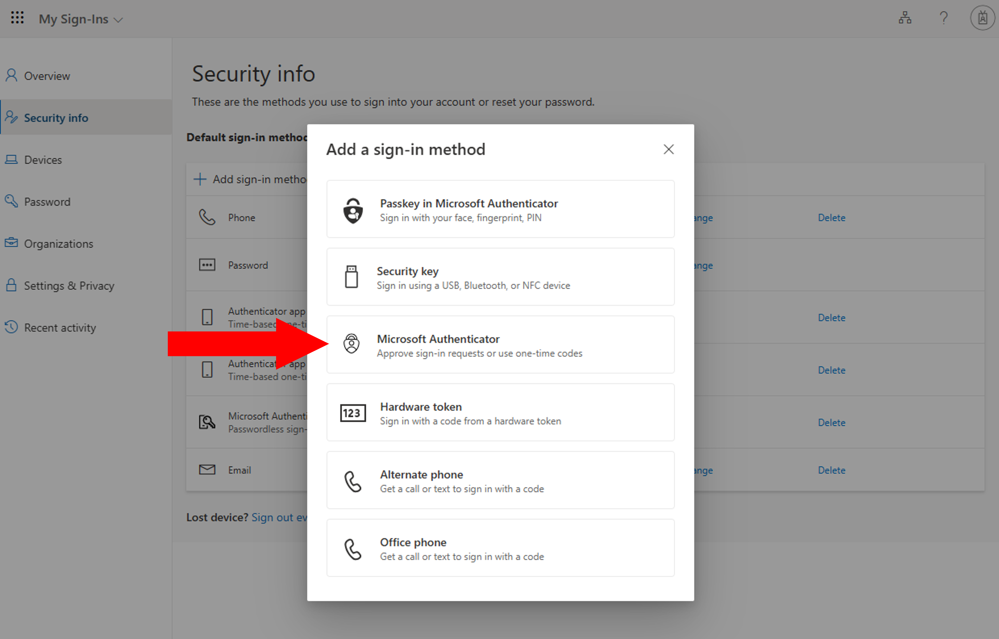

{/**
  * @typedef {object} Props
  * @property {string} selection
  */}

<li>
  Open [Security info page](https://mysignins.microsoft.com/security-info?domain_hint=univtokyo.onmicrosoft.com).
</li>
<li>
  Click "Add sign-in method".
  
</li>
<li>
  For "Add a sign-in method", select {props.selection}.
  {props.methodSupplement}
  
</li>
