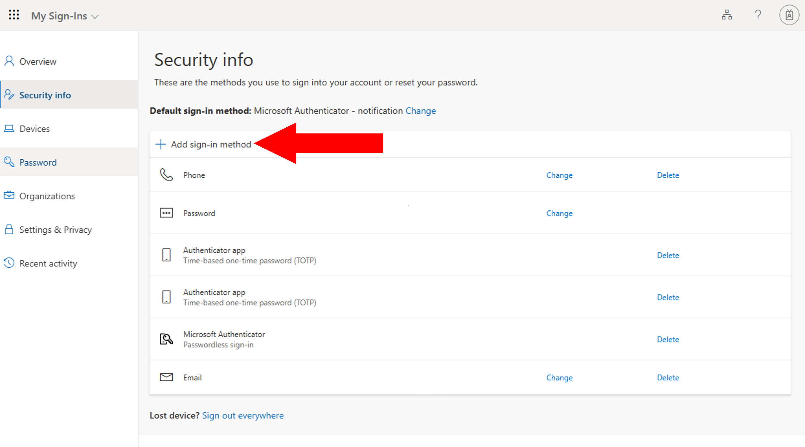
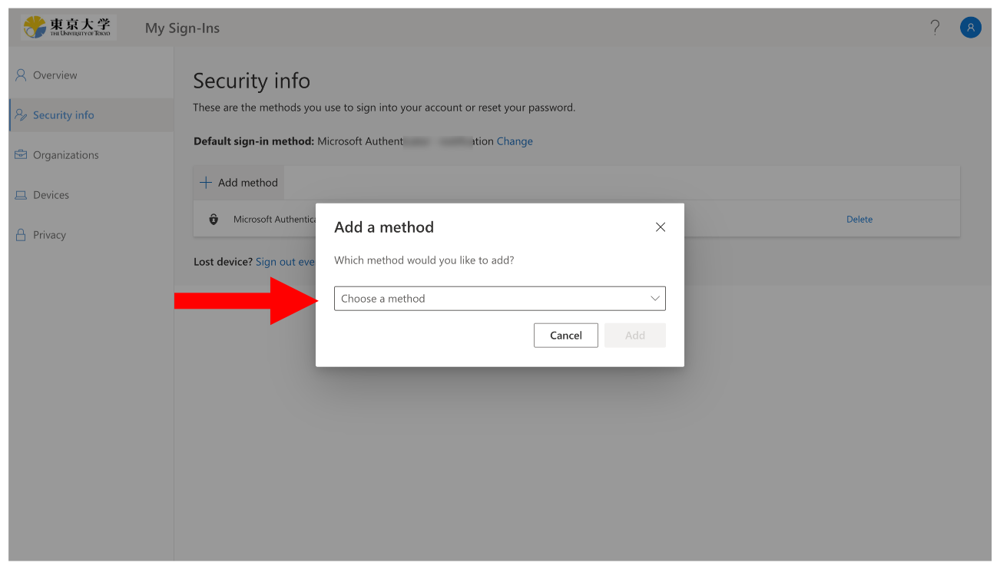

{/**
  * @typedef {object} Props
  * @property {string} selection
  */}

<li>
  Click "Add method" in the  [Security info page](https://mysignins.microsoft.com/security-info?domain_hint=utac.u-tokyo.ac.jp).
  
</li>
<li>
  For "Which method would you like to add?", select {props.selection} and click "Add".
  
</li>
