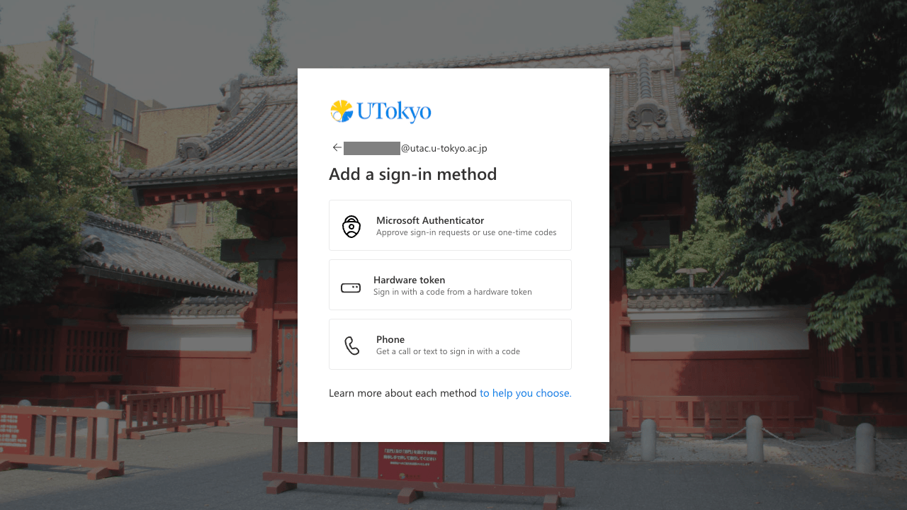

import ArrowOverlay from "@components/utils/ArrowOverlay.astro";

import firstAnotherMethod from "./first_another_method.png";

{/**
  * @typedef {object} Props
  * @property {string} selection
  */}

<li>
  Click "Set up a different way to sign in" at the bottom of the setup page.
  <ArrowOverlay image={firstAnotherMethod} x={455} y={580} angle={45} />
</li>
<li>
  For "Add a sign-in method", click {props.selection}.
  
</li>