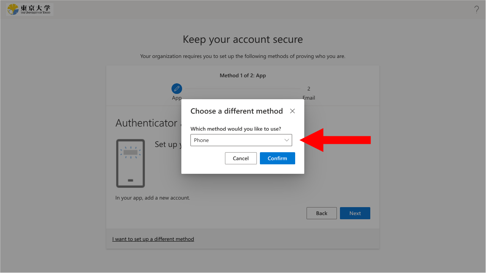

{/**
  * @typedef {object} Props
  * @property {string} selection
  */}

<li>
  Click "I want to use a different method" at the bottom of the setup page.
  
</li>
<li>
  For "Which method would you like to use?", select {props.selection}, and then click "Add".
  
</li>