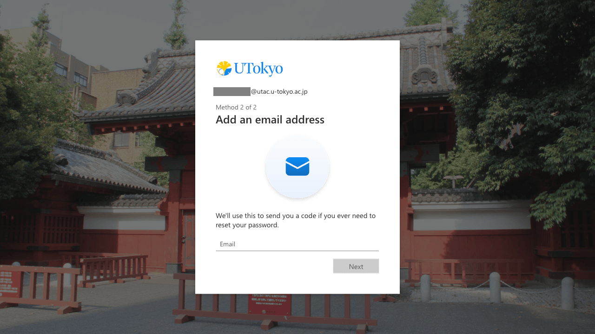
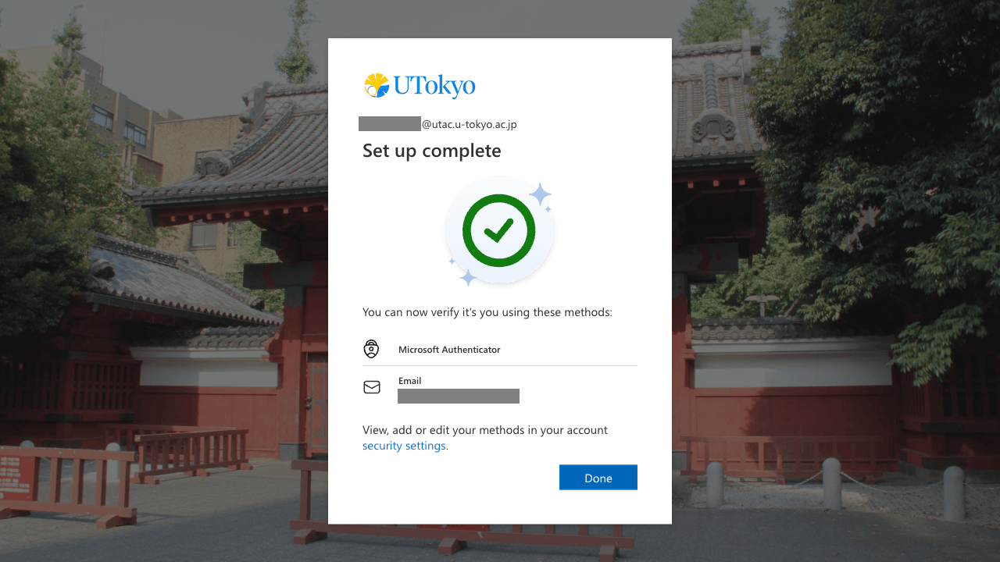

<li>If you haven't already registered, you are required to enter your email address. The email provider does not matter as long as you can receive emails, but you should use one other than ECCS Cloud Email or staff email. Then follow the instruction to input the 6-digit code sent to the address. </li>
<li>This step has been completed when you are told "Set up complete". </li>
