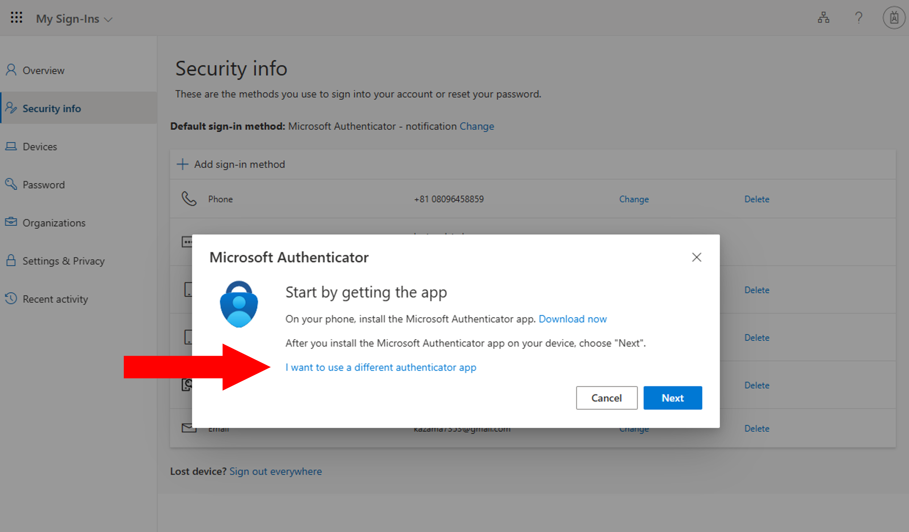

import { Image } from "astro:assets";
import If from "@components/utils/If.astro";
import AltAddMethod from "../AltAddMethod.mdx";

import firstQr from "./first_qr.png";
import altQr from "./alt_qr.png";

{/**
  * @typedef {object} Props
  * @property {import("@components/pages/mfa/tabs").Step} step
  */}

<ol>
  <If cond={props.step === "alt"}>
    <Fragment>
      <AltAddMethod selection={`"Authenticator app"`} />
      <li>
        Click "I want to use a different authenticator app".
        
      </li>
    </Fragment>
    <Fragment slot="else">
      <li>
        Click "I want to use a different authenticator app" in the middle of the setup page.
        
      </li>
    </Fragment>
  </If>

  <li>
    Follow the instructions until you reach the QR code page. Scan the QR code with your authenticator app and complete the setup procedure.
    <Image src={{ firstQr, altQr }[`${props.step}Qr`]} alt="" />
  </li>
</ol>