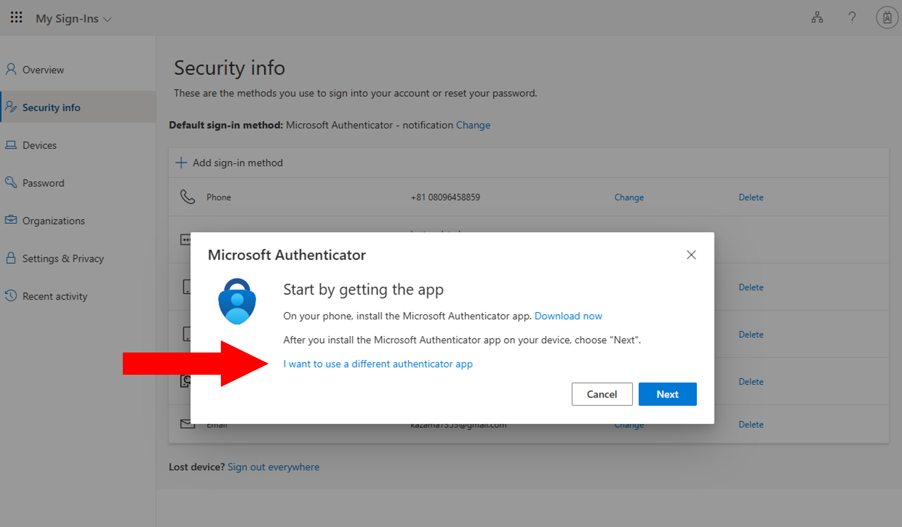

import { Image } from "astro:assets";
import If from "@components/utils/If.astro";
import ArrowOverlay from "@components/utils/ArrowOverlay.astro";
import FirstAccess from "../FirstAccess.mdx";
import FirstEmail from "../FirstEmail.mdx";
import AltAddMethod from "../AltAddMethod.mdx";

import first from "./first.png"
import firstQr from "./first_qr.png";
import altQr from "./alt_qr.png";

{/**
  * @typedef {object} Props
  * @property {import("@components/pages/mfa/tabs").Step} step
  */}

<ol>
  <If cond={props.step === "alt"}>
    <Fragment>
      <AltAddMethod selection={`"Microsoft Authenticator"`} />
      <li>
        Click "I want to use a different authenticator app".
        
      </li>
    </Fragment>
    <Fragment slot="else">
      <FirstAccess />
      <li>
        Click "Set up a different authentication app" in the setup page.
        <ArrowOverlay image={first} x={455} y={545} />
      </li>
    </Fragment>
  </If>

  <li>
    Follow the instructions until you reach the QR code page. Scan the QR code with your authenticator app and complete the setup procedure.
    If you want to use YubiKey and Yubico Authenticator app, see "[Instructions on how to use the Yubico Authenticator for the Multi-Factor Authentication of UTokyo Accounts](../yubikey-totp/)" page for details.
    <Image src={{ firstQr, altQr }[`${props.step}Qr`]} alt="" />
  </li>

  <If cond={props.step !== "alt"}>
    <FirstEmail />
  </If>
</ol>
