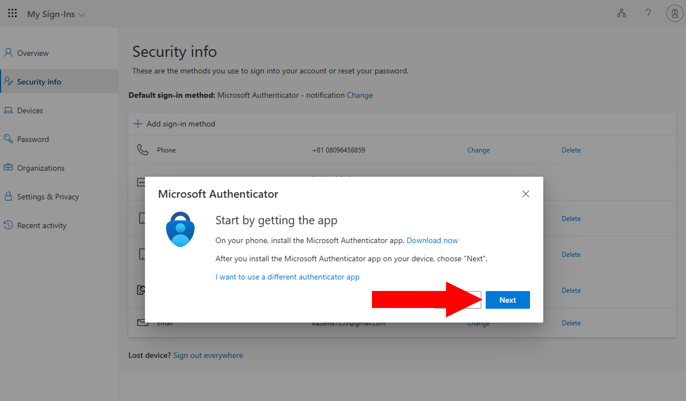
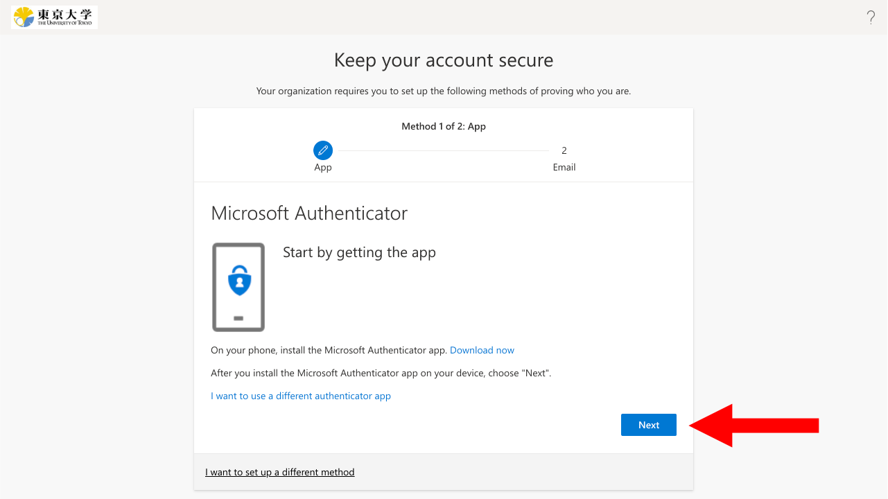
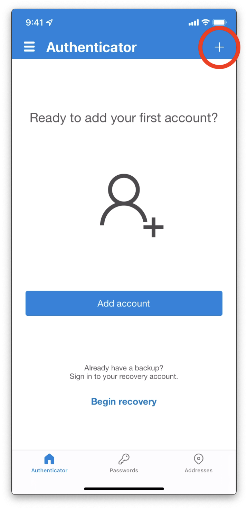

import { Image } from "astro:assets";
import If from "@components/utils/If.astro";
import FirstAccess from "../FirstAccess.mdx";
import FirstEmail from "../FirstEmail.mdx";
import AltAddMethod from "../AltAddMethod.mdx";

import firstLink from "./first_link.png";
import firstQr from "./first_qr.png";
import altLink from "./alt_link.png";
import altQr from "./alt_qr.png";

{/**
  * @typedef {object} Props
  * @property {import("@components/pages/mfa/tabs").Step} step
  */}

<ol>
  <li>
    Install the “Microsoft Authenticator” app on your smartphone<If cond={props.step === "alt"}> (if you haven't already done so)</If>. The Android version can be downloaded from [Google Play](https://play.google.com/store/apps/details?id=com.azure.authenticator) and the iPhone version from [App Store](https://apps.apple.com/app/microsoft-authenticator/id983156458).

    {:.extra-small}
  </li>

  <If cond={props.step === "alt"}>
    <Fragment>
      <AltAddMethod selection={`"Authenticator app"`} />
      <li>
        Click "Next" on the "Start by getting the app" screen.
        
      </li>
    </Fragment>
    <Fragment slot="else">
      <FirstAccess />
      <li>
        Click "Next" to continue setup for the Microsoft Authenticator app.
        
      </li>
    </Fragment>
  </If>

  <li>
    The next procedure differs depending on the device that you are using.

    - **Smartphone (the same device where you installed the Microsoft Authenticator app)**: Click "Pair your account to the app by clicking this link". Check that your UTokyo Account appears in the Microsoft Authenticator app.
      {/* ここの画像がPC版になっている */}
      <Image src={{ firstLink, altLink }[`${props.step}Link`]} alt="" />
    - **Other Devices (PC etc.)**
      1. Read the instructions and click "Next" to go to the QR code page.
          <Image src={{ firstQr, altQr }[`${props.step}Qr`]} alt="" />
      2. Open the Microsoft Authenticator app on your smartphone, select "+" from the icon in the upper-right, then "Work or school account", and "Scan QR code".
          
      3. Scan the QR code with your device's camera.
      4. Check that your UTokyo Account appears on the app.
          
  </li>

  <If cond={props.step !== "alt"}>
    <FirstEmail />
  </If>
</ol>
