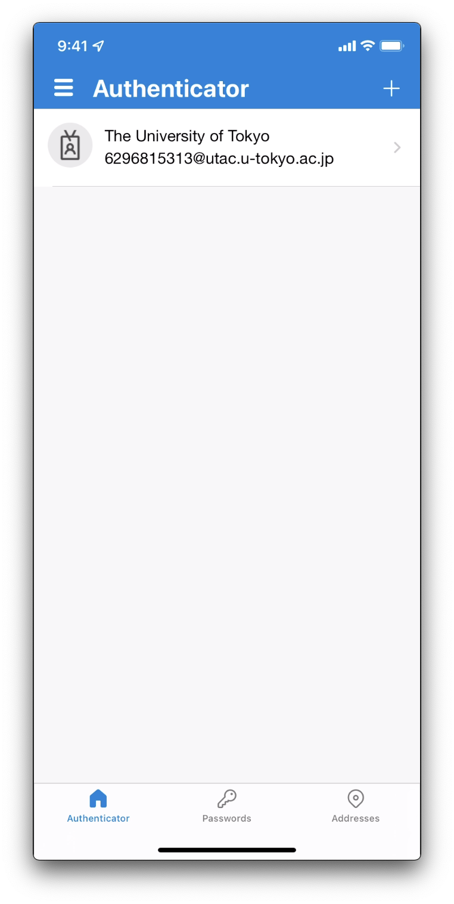

import { Image } from "astro:assets";
import If from "@components/utils/If.astro";
import FirstAccess from "../FirstAccess.mdx";
import FirstEmail from "../FirstEmail.mdx";
import AltAddMethod from "../AltAddMethod.mdx";

import firstLink from "./first_link.png";
import firstQr from "./first_qr.png";
import altLink from "./alt_link.png";
import altQr from "./alt_qr.png";
import firstNextNext from "./first_next_next.png";
import altNextNext from "./alt_next_next.png";
import firstTry from "./first_try.png";
import altTry from "./alt_try.png";
import firstApproved from "./first_approved.png";
import altApproved from "./alt_approved.png";

{/**
  * @typedef {object} Props
  * @property {import("@components/pages/mfa/tabs").Step} step
  */}

<ol>
  <li>
    Install the “Microsoft Authenticator” app on your smartphone<If cond={props.step === "alt"}> if you haven't already done</If>. The Android version is available in [Google Play](https://play.google.com/store/apps/details?id=com.azure.authenticator), and the iPhone version is available in [App Store](https://apps.apple.com/app/microsoft-authenticator/id983156458).

    {:.extra-small}
  </li>

  <If cond={props.step === "alt"}>
    <Fragment>
      <AltAddMethod selection={`"Authenticator app"`} />
      <li>
        Click "Next" on the "Start by getting the app" screen.
        
      </li>
    </Fragment>
    <Fragment slot="else">
      <FirstAccess />
      <li>
        You are required to set up a verification method. By default, Microsoft Authenticator app is selected, so just click "Next".
        
      </li>
    </Fragment>
  </If>

  <li>
    The next procedure differs depending on the device that you are using: your smartphone (Microsoft Authenticator app has been installed) or else (PC etc.)

    - **Smartphone (the same device where you installed the Microsoft Authenticator app)**: Click "Pair your account to the app by clicking this link". Check that your UTokyo Account appears in the Microsoft Authenticator app. Go back to the browser and click "Next".
      <Image src={{ firstLink, altLink }[`${props.step}Link`]} alt="" />
    - **Other Devices (PC etc.)**
      1. Click "Next" on "Set up your account" screen, and then QR code is shown.
          <Image src={{ firstNextNext, altNextNext }[`${props.step}NextNext`]} alt="" />
          <Image src={{ firstQr, altQr }[`${props.step}Qr`]} alt="" />
      1. Open the Microsoft Authenticator app on your smartphone. If you open the app for the first time after installation, you will be asked to accept privacy policy and to select whether to share your app usage data, so follow the instructions.
          <figure class="gallery">{:.small .border}{:.small .border}</figure>
      1. If "Secure your digital life" screen like the first image below is shown, tap "Scan a QR code". Instead, screens like the second or third images is shown, tap the "+" icon in the upper right, and select "Work or school account" and "Scan a QR code" in turn. In all cases, you may be asked to allow the app to access the camera, so then do.
          <figure class="gallery">{:.small .border}{:.small .border}{:.small .border}</figure>
      1. Scan the QR code with your device's camera. If you are asked to allow the app to notify, then do.
      1. After succeeding scan, check that your UTokyo Account appears on the app. Go back to the screen with the QR code and click "Next".
          
      {:style="list-style: lower-roman;"}
  </li>

  <li>
    Two-digit number is shown on "Let's try it out" screen, and at the same time a prompt opens on Microsoft Authenticator app on your smartphone. Input the number to the prompt and tap "Yes".
    <figure class="gallery"><Image src={{ firstTry, altTry }[`${props.step}Try`]} alt="" />{:.small .border}</figure>
  </li>

  <li>
    When "Notification approved" is appeared, click "Next".
    <Image src={{ firstApproved, altApproved }[`${props.step}Approved`]} alt="" />
  </li>

  <If cond={props.step !== "alt"}>
    <FirstEmail />
  </If>
</ol>
