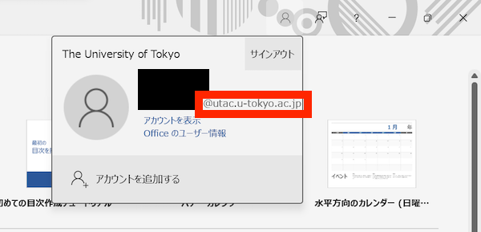

import Support from "@components/utils/Support.astro";
import Switch from "@components/utils/Switch.astro";
import HelpItem from "@components/utils/HelpItem.astro";
import If from "@components/utils/If.astro"

{/**
  * @typedef {object} Props
  * @property {boolean} support
  * @property {import("@components/types").Variant} variant
  */}

<Switch variant={props.variant}>
<Fragment slot="oc">
**Install the apps**
</Fragment>
<Fragment slot="individual">
### Install the apps
{:#install}
</Fragment>
</Switch>

1. Access [Microsoft 365 > Apps](https://m365.cloud.microsoft/apps/?auth=2) and sign in with your UTokyo Account (your 10-digit Common ID followed by `@utac.u-tokyo.ac.jp`).
    <If cond={props.variant !== "oc"}>For detailed instructions and information on switching between Microsoft accounts, see [**Signing in to Microsoft Systems with UTokyo Account**](/microsoft/signin/).</If>
    

       
Help: If you see a "You don't have access to this" error

        The <a href="/utokyo_account/mfa/">Multi-Factor Authentication for your UTokyo Account</a> required to use Microsoft Office applications may not have been completed or may not yet be reflected in the system. Please make sure to complete the "<strong><a href="/utokyo_account/mfa/initial/">Initial Setup Procedures for UTokyo Account Multi-Factor Authentication</a></strong>" <strong>all the way through "Step 4: Apply to use Multi-Factor Authentication"</strong> to enable Multi-Factor Authentication for your UTokyo Account. After that, <strong>please wait approximately 30 minutes for the Multi-Factor Authentication settings to be reflected in the system</strong>.
        
If the problem persists, please consult the <a href="/support/">Technical Support Desk</a>.

    

2. Click "Install apps" in the upper right corner of the screen, and then click "Microsoft 365 Apps" from the menu that appears.
    <HelpItem lang="en" type={"details"}>
      <Fragment slot="problem">If "Microsoft 365 Apps" is not displayed</Fragment>
      <Fragment slot="solution">
        <If cond={props.variant === "oc"}>
          You may not be registered as an [eligible user](/microsoft/install/#caution). If you believe you are eligible but "Microsoft 365 Apps" is not displayed, please check with the academic affairs office of your faculty/graduate school to confirm your student enrollment status.
          <Fragment slot="else">
            You are not an [eligible user](/microsoft/install/#caution). If you need to use Office, one alternative is [Microsoft Office Web Apps](/microsoft/#office_web). If you believe you are an eligible user but "Microsoft 365 Apps" is not displayed, please check with the relevant office of your faculty/graduate school (academic affairs office for students, human resources office for faculty and staff) to confirm your enrollment or personnel registration status.
          </Fragment>
        </If>
      </Fragment>
    </HelpItem>
    <If cond={props.variant == "individual"}>{:.border}</If>

3. If you see "Install Office", click "Install Office". If you see "Install and more", click "Install Microsoft 365 apps".
    <HelpItem lang="en" type={"details"}>
      <Fragment slot="problem">If "Install Office" or similar is not displayed</Fragment>
      <Fragment slot="solution">Your environment may not support the installation of Microsoft Office applications.</Fragment>
    </HelpItem>
4. The remaining steps may vary. The installation may proceed automatically, or you may need to click a confirmation button or manually open the downloaded file.
5. When a message indicating that the installation is complete is displayed, you are done. Next, <Switch variant={props.variant}><Fragment slot="oc">sign in to the app.</Fragment><Fragment slot="individual">proceed to the "[Sign in to the app](#signin)" section below.</Fragment></Switch>

<Switch variant={props.variant}>
<Fragment slot="oc">
**Sign in to the app**
</Fragment>
<Fragment slot="individual">
### Sign in to the app
{:#signin}
</Fragment>
</Switch>

1. Launch one of the installed Microsoft Office applications, such as Word, Excel, or PowerPoint. The following instructions use Word as an example.
1. Check the screen that appears and follow the instructions below.
    - If a dialog saying "Sign in to get the most out of Office" or similar is displayed: You are not signed in to any Microsoft account in the Office app. Click "Sign in or create account".
      <If cond={props.variant == "individual"}>{:.medium}</If>
    - If the above screen does not appear and the normal editing screen is displayed: You are signed in to the Office app with some Microsoft account. Click the person icon in the upper right corner, then check which account you are currently signed in with. If you are signed in with an account other than your UTokyo Account, select "Add account".
      <If cond={props.variant == "individual"}>{:.small}</If>
1. <If cond={props.variant == "individual"}>[Installation](#install)<Fragment slot="else">Installation</Fragment></If> will show a similar sign-in screen. Sign in.
1. On Windows, a dialog saying "Stay signed in to all your apps" may appear. Depending on your selections here, error messages may occur while using the Office app. To prevent this, please respond as follows:

    1. **Uncheck "Allow my organization to manage my device".**
    1. If you want to automatically sign in with your UTokyo Account to other Microsoft systems (such as OneDrive) in addition to Office apps, select "Yes". If you want to sign in with your UTokyo Account to Office apps only, select "No, sign in to this app only".
    <HelpItem lang="en" type={"details"}>
    <Fragment slot="problem">If you made a different selection from the above</Fragment>
    <Fragment slot="solution">Error messages (error code: 80180018, etc.) may appear while using the Office app. This error occurs because of a mismatch between the administrative settings of UTokyo Account and the behavior of the Office app, and it does not adversely affect your device, other software, or saved data. If the Office app is working without issues, you can safely ignore this error. However, if you find the error messages annoying or if the error prevents you from using the Office app altogether, you can follow the steps below to correct the settings and prevent such errors from occurring.</Fragment>
    1. Close all Office apps such as Word and Excel.
    1. Open the Windows "Settings" app (gear icon).
    1. In the settings menu, select "Accounts" > "Access work or school".
    1. If your UTokyo Account is displayed on the "Access work or school" screen, select "Disconnect".
    1. Try signing in to the Office app again.
    </HelpItem>
    <If cond={props.variant == "individual"}>{:.small}</If>
1. Click the person icon in the upper right corner and confirm that you are signed in with your UTokyo Account.
    <If cond={props.variant == "individual"}>{:.small}</If>
