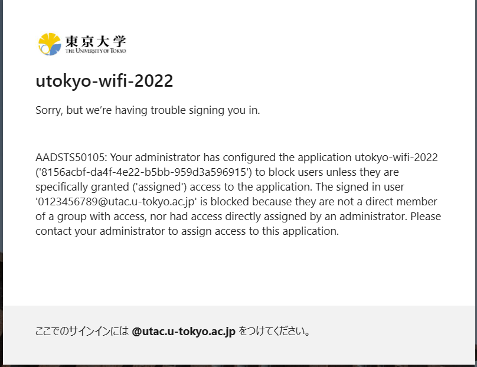

import HelpItem from "@components/utils/HelpItem.astro";

{/**
  * @typedef {object} Props
  * @property {import("@components/types").HelpItemType} type
  */}

<HelpItem lang="en" type={props.type} >
  <Fragment slot="problem">When the error message “申し訳ありませんが、サインイン中に問題が発生しました” or “Sorry, but we’re having trouble signing you in.” appears</Fragment>

    If you encounter an error message like the one shown in the image below (Error Code: AADSTS50105) and are unable to sign in to the UTokyo Wi-Fi account menu, it's possible that you have not completed the required information security education to use UTokyo Wi-Fi. Please check the [page for the Information Security Education](https://univtokyo.sharepoint.com/sites/Security/SitePages/en/Information_Security_Education.aspx), and complete and pass the confirmation test. Once you pass the test, the results will be immediately reflected in the system.

    {:.small}
     
    If the issue is still not resolved, please consult the [Technical Support Desk](/en/support/).
</HelpItem>
