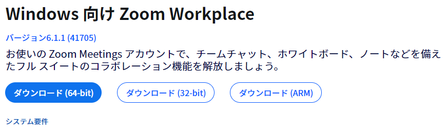
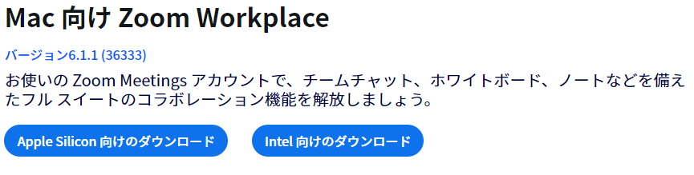

import Support from "@components/utils/Support.astro";
import If from "@components/utils/If.astro";

{/**
  * @typedef {object} Props
  * @property {boolean} support
  * @property {import("@components/types").Variant} variant
  */}

<If cond={props.variant === "oc"}>
We expect you to primarily join meetings using the application on your computer. If the Zoom app is not installed, please install it.
</If>

1. Access the Zoom "[Download Center](https://zoom.us/download)".
2. Click the "Download" button for "Zoom Workplace". The Zoom Workplace installer will be downloaded. ("Zoom Workplace" is the name of the application used for Zoom.)
  <If cond={props.variant !== "oc"}>
    {:.border .medium}
    {:.border .medium}
  </If>
3. The remaining steps may vary. The installation may proceed automatically, or you may need to click a confirmation button or manually open the downloaded file.
4. (macOS only) If necessary, to grant the permission required for screen sharing, go to "System Settings" > "Privacy & Security" > "Screen & System Audio Recording" and turn on the toggle for "zoom.us" (or "zoom" or "zoom.us.app").
  <If cond={props.variant === "oc"}>
    - Since you may need to share your screen on Zoom during presentations in online classes, we recommend granting screen sharing permission when you install the app.
  </If>
<Support lang="en" show={props.support} />
