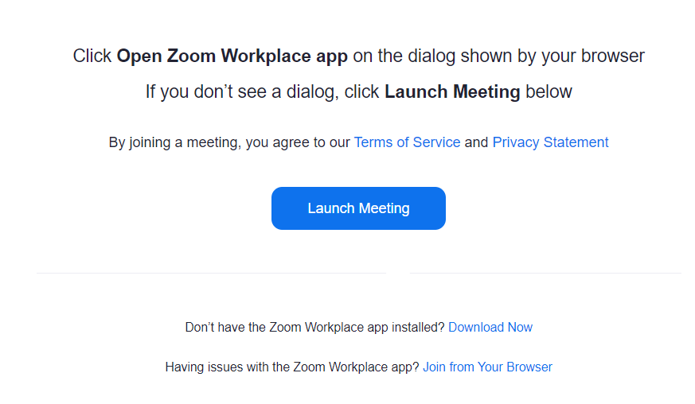

import If from "@components/utils/If.astro";
import Support from "@components/utils/Support.astro";
import Help from "@components/utils/Help.astro";

{/**
  * @typedef {object} Props
  * @property {boolean} support
  * @property {true} [inlineHelp]
  * @property {true} [big]
  */}

- In the meeting room, your microphone audio or camera image may be sent to other people (in the test room used here, your audio or video will not be sent to others just by joining the room. However, it could be sent while testing different functions). If you are concerned, please perform this test in a situation that is safe for sending audio and video.
1. Access the test meeting room URL via the [UTOL test cource](https://utol.ecc.u-tokyo.ac.jp/lms/course?idnumber=20197J919010V02).
2. Please click "Launch Meeting" at the bottom of the screen shown below.
<If cond={props.big}>
     {:.medium.center.border}
   </If>
3. After the Zoom app opens, if you see a message saying "Join Audio to hear other participants," please click the button labeled "Join with Computer Audio" or "WiFi or Cellular Data." Note that the button name may vary depending on the type of device you are using.
4. If you see a black screen with options like "Start Video" and "Participants" at the bottom, you have successfully entered the meeting room.