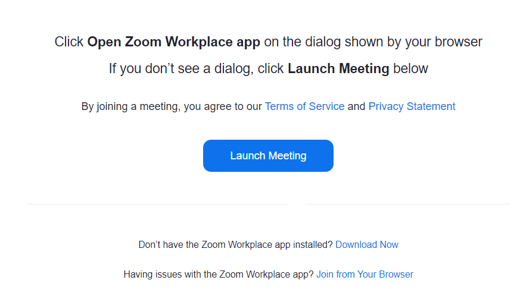

import If from "@components/utils/If.astro";
import Support from "@components/utils/Support.astro";
import Help from "@components/utils/Help.astro";

{/**
  * @typedef {object} Props
  * @property {boolean} support
  * @property {true} [inlineHelp]
  * @property {true} [big]
  */}

- In the meeting room, your microphone audio or camera image may be sent to other people (in the test room used here, your audio or video will not be sent to others just by joining the room. However, it could be sent while testing different functions). If you are concerned, please perform this test in a situation that is safe for sending audio and video.
1. Access the test meeting room URL via the [UTOL test course](https://utol.ecc.u-tokyo.ac.jp/lms/course?idnumber=20197J919010V02).
2. Click "Join from Zoom Workplace app" or "Join from App" in the center of the screen (or "Join from browser" if the app is not installed on your device).
    - If a popup such as "Open zoom.us?" appears before these screens, you may also be able to open it from the "Open zoom.us" button in the popup.
<If cond={props.big}>
     {:.medium.center.border}
   </If>
3. After the Zoom app opens, if a preview screen appears, click "Join".
    - If a message saying "To hear other participants, please connect to audio" is displayed, click the button labeled "Join with Computer Audio" or "WiFi or Cellular Data". Note that the name of this button may vary depending on your device.
4. If you see a black screen with options like "Start Video" and "Participants" at the bottom, you have successfully entered the meeting room.