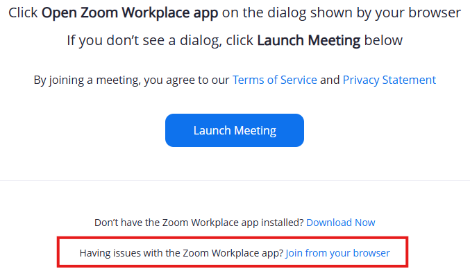

import If from "@components/utils/If.astro";
import Help from "@components/utils/Help.astro";

{/**
  * @typedef {object} Props
  * @property {boolean} support
  */}

1. Access the test meeting room URL via the [UTOL test cource](https://utol.ecc.u-tokyo.ac.jp/lms/course?idnumber=20197J919010V02).
2. If you click "Join from Your Browser" at the bottom of the screen shown below, a screen will appear where you can enter your name and adjust the audio and video settings for the meeting. If you are not signed in, you can enter the name that will be displayed to other participants in the meeting, then click "Join" to participate in Zoom from your browser.
 <If cond={props.big}>
     {:.medium.center.border}
   </If>
<Help lang="en" support={props.support}>
  - **You are asked to install the application when you access the meeting room URL, or the installation starts**: This happens when the application has not been properly installed. Please reinstall the application and access the URL again.
  - **When the message "This meeting is only for authorized participants" is displayed**: This happens when you have not signed in to Zoom with your UTokyo Account. The same is true if it is displayed as "Switch Accounts to Join". Click the "Sign in to Join” or "Switch Account" or "Switch Account to Join" button and sign in by following the instructions shown below in "Optional task: Sign in to the application".
</Help>
