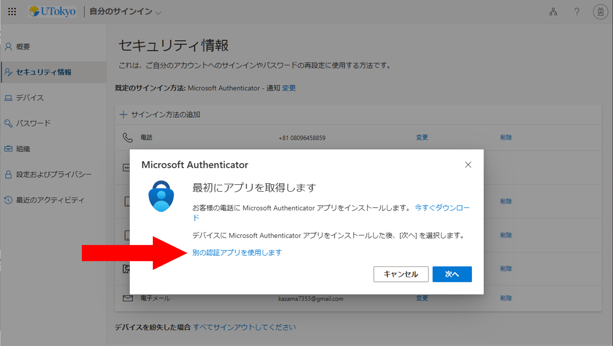
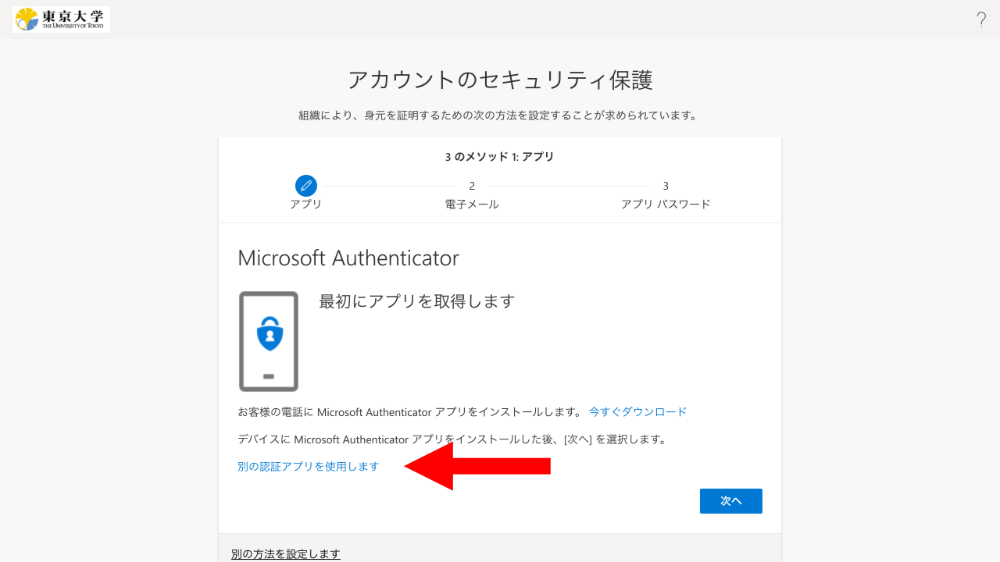

import { Image } from "astro:assets";
import If from "@components/utils/If.astro";
import FirstAccess from "../common/FirstAccess.mdx";
import FirstEmail from "../common/FirstEmail.mdx";
import AltAddMethod from "../common/AltAddMethod.mdx";

import firstQr from "./first_qr.png";
import altQr from "./alt_qr.png";

{/**
  * @typedef {object} Props
  * @property {import("@components/pages/mfa/tabs").Step} step
  */}

<ol>
  <If cond={props.step === "alt"}>
    <Fragment>
      <AltAddMethod selection="「認証アプリ」" />
      <li>
        「別の認証アプリを使用します」というリンクを探して押してください．
        
      </li>
    </Fragment>
    <Fragment slot="else">
      <FirstAccess />
      <li>
        画面の中ほどにある「別の認証アプリを使用します」というリンクを探して押してください．
        
      </li>
    </Fragment>
  </If>

  <li>
    画面の指示に従って進むとQRコードが表示されるので，お使いの認証アプリでQRコードを読み取り，設定を行ってください．

    ※「YubiKey」と「Yubico Authenticator」アプリを使う場合の設定手順については，「[UTokyo Account多要素認証におけるYubico Authenticatorアプリの利用方法](/utokyo_account/mfa/yubikey-totp/)」をご覧ください．
    <Image src={{ firstQr, altQr }[`${props.step}Qr`]} alt="" />
  </li>

  <If cond={props.step !== "alt"}>
    <FirstEmail />
  </If>
</ol>
