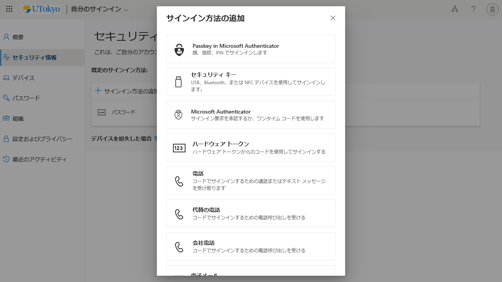

{/**
  * @typedef {object} Props
  * @property {string} selection
  */}

<li>
  [多要素認証の設定ページ](https://mysignins.microsoft.com/security-info?domain_hint=univtokyo.onmicrosoft.com)にアクセスしてください．
</li>
<li>
  「サインイン方法の追加」を押してください．
  
</li>
<li>
  「サインイン方法の追加」欄で{props.selection}を押してください．
  {props.methodSupplement}
  
</li>
