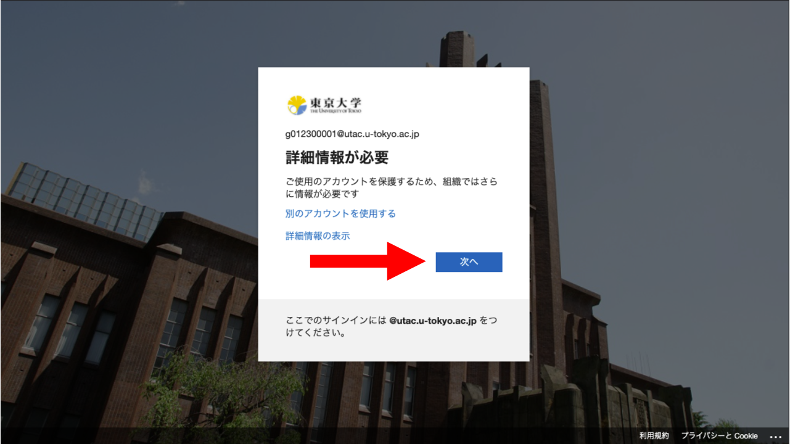

<li><a href="https://account.activedirectory.windowsazure.com/proofup.aspx?proofup=1&whr=univtokyo.onmicrosoft.com">多要素認証の設定ページ</a>にアクセスしてください．</li>
<li>（サインイン済みでなければ）サインイン画面が表示されるので，UTokyo Accountのユーザ名（10桁の数字）とパスワードを入力してください．</li>
<li>「詳細情報が必要」という画面が表示されるので，「次へ」を押してください．</li>
