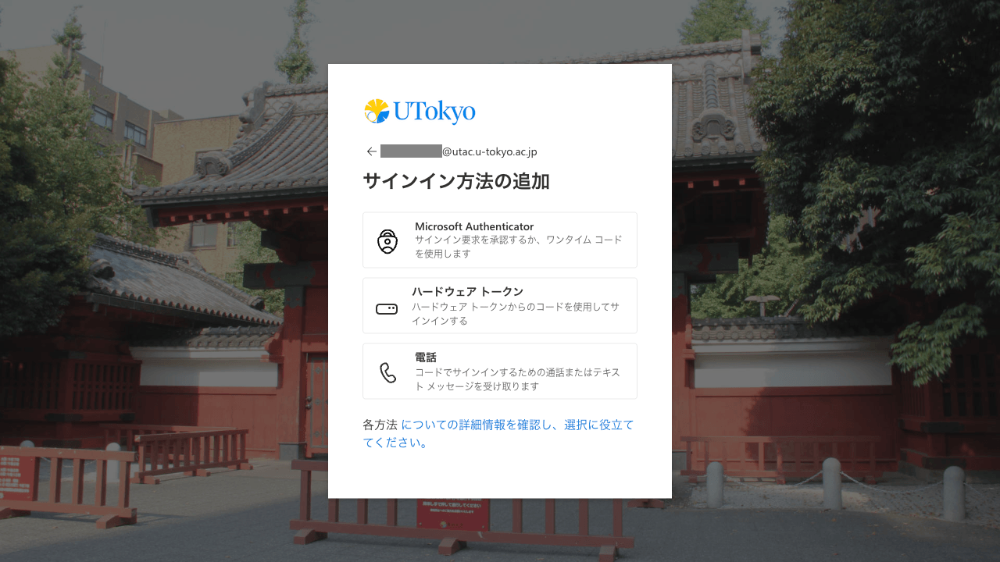

import ArrowOverlay from "@components/utils/ArrowOverlay.astro"
import firstMsAuth from "./first_ms_auth.png"

{/**
  * @typedef {object} Props
  * @property {string} selection
  */}

<li>
  画面の下の方にある「別のサインイン方法を設定してください」というリンクを探して押してください．
  <ArrowOverlay image={firstMsAuth} x={450} y={600} angle={45} />
</li>
<li>
  「サインイン方法の追加」という画面が表示されるので，{props.selection}を押してください．
  
</li>
