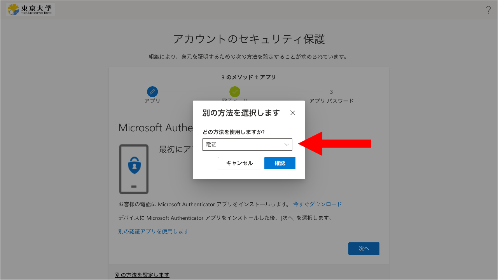

import ArrowOverlay from "@components/utils/ArrowOverlay.astro"
import firstMsAuth from "./first_ms_auth.png"

{/**
  * @typedef {object} Props
  * @property {string} selection
  */}

<li>
  画面の下の方にある「別の方法を設定します」というリンクを探して押してください．
  <ArrowOverlay image={firstMsAuth} x={300} y={700} angle={45} />
</li>
<li>
  「どの方法を使用しますか?」欄で{props.selection}を選び，「確認」を押してください．
  
</li>
