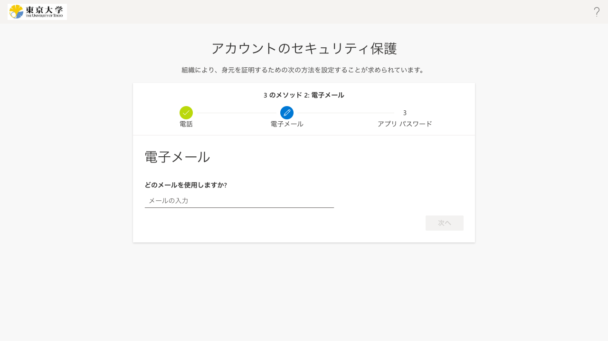
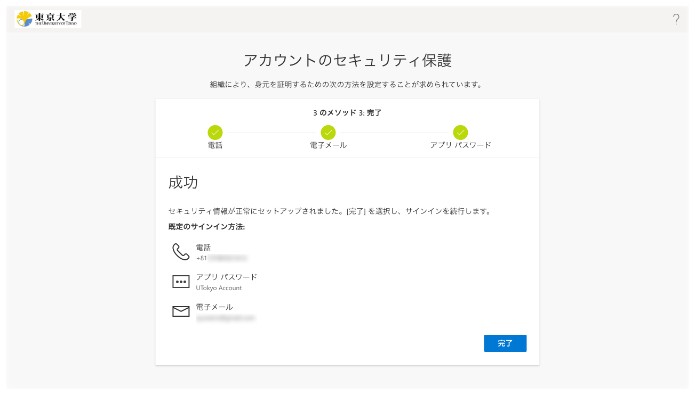

<li>（既に登録しているのでなければ）メールアドレスの入力を求められます．受信できるメールアドレスであれば何でもかまいませんが，なるべくECCSクラウドメール・職員メール以外のメールアドレスを入力してください．続いてそのメールアドレスに送られてくる「コード」（6桁の数字）を入力するよう求められるので，そのようにしてください．</li>
<li>画面上に「成功」と表示されたらOKです．</li>
