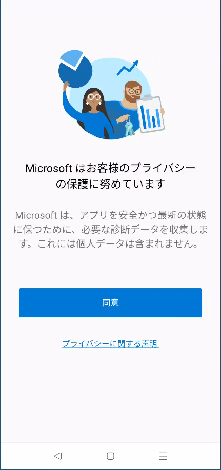
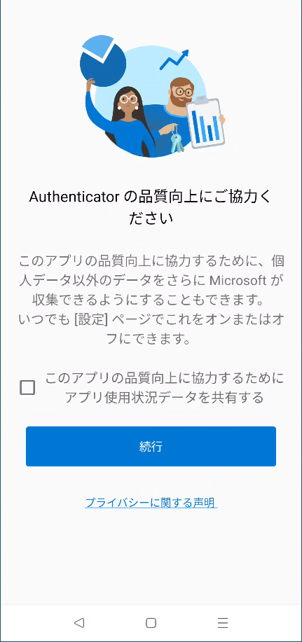
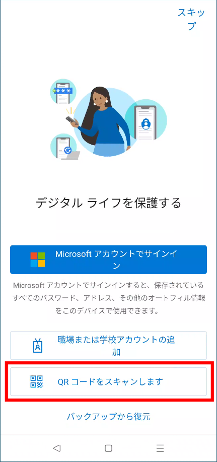
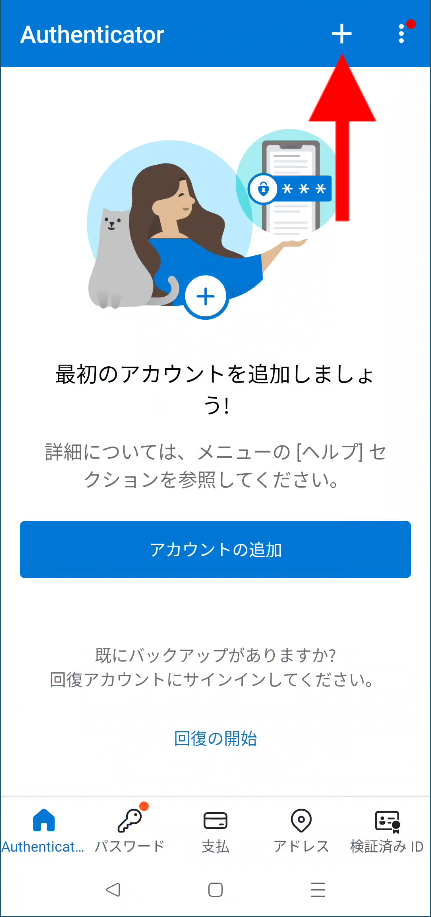
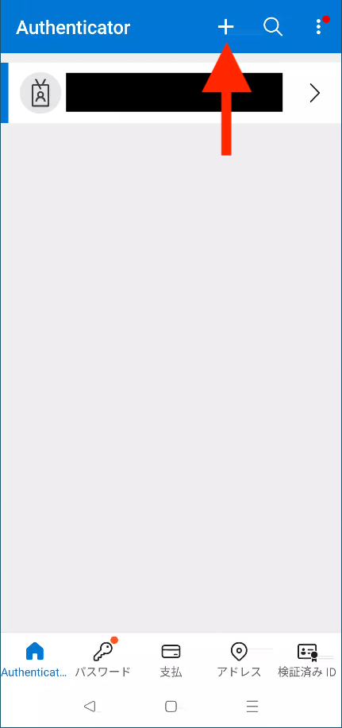
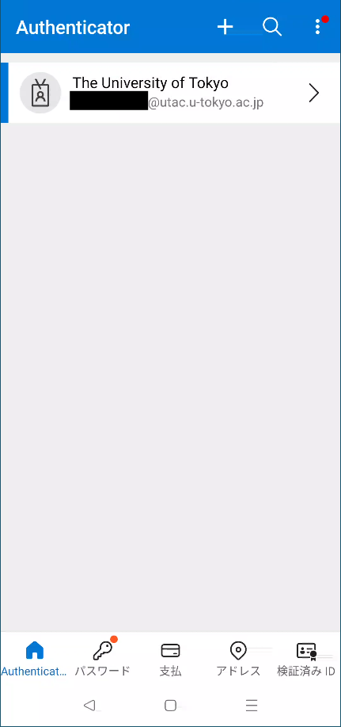
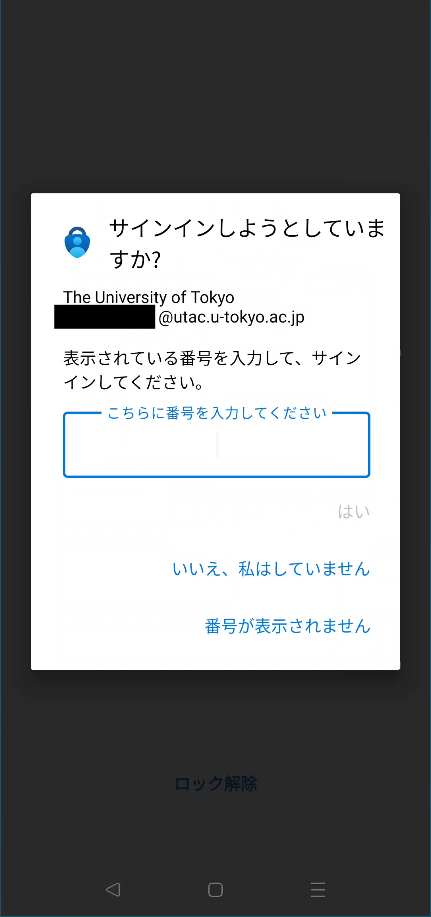

import { Image } from "astro:assets";
import If from "@components/utils/If.astro";
import FirstAccess from "../common/FirstAccess.mdx";
import FirstEmail from "../common/FirstEmail.mdx";
import AltAddMethod from "../common/AltAddMethod.mdx";

import firstLink from "./first_link.png";
import altLink from "./alt_link.png";
import firstNextNext from "./first_next_next.png";
import altNextNext from "./alt_next_next.png";
import firstQr from "./first_qr.png";
import altQr from "./alt_qr.png";
import firstTry from "./first_try.png";
import altTry from "./alt_try.png";
import firstApproved from "./first_approved.png";
import altApproved from "./alt_approved.png";

{/**
  * @typedef {object} Props
  * @property {import("@components/pages/mfa/tabs").Step} step
  */}

<ol>
  <li>
    <If cond={props.step === "alt"}>（まだしていなければ）</If>スマホに以下のアイコンの「Microsoft Authenticator」アプリをインストールしてください．Androidの人は[Google Play](https://play.google.com/store/apps/details?id=com.azure.authenticator)から，iPhoneの人は[App Store](https://apps.apple.com/app/microsoft-authenticator/id983156458)からダウンロードできます．

    {:.extra-small}
  </li>

  <If cond={props.step === "alt"}>
    <Fragment>
      <AltAddMethod selection="「認証アプリ」" />
      <li>
        Microsoft Authenticatorの設定をする画面が表示されるので，そのまま「次へ」を押してください．
        
      </li>
    </Fragment>
    <Fragment slot="else">
      <FirstAccess />
      <li>
        多要素認証の本人確認方法を設定する画面になります．デフォルトでMicrosoft Authenticatorの設定をする画面になっているので，そのまま「次へ」を押してください．
        
      </li>
    </Fragment>
  </If>

  <li>
    以降の手順はこの作業をスマホ（Microsoft Authenticatorアプリをインストールしたもの）でしているかそれ以外（パソコンなど）でしているかによって異なります．

    - **スマホでこの作業をしている場合**：「このリンクをクリックして、アカウントをアプリにペアリングします。」を押してください．Microsoft Authenticatorアプリに移動し，自分のUTokyo Accountが表示されればOKです．元の画面に戻って「次へ」を押してください．
      
    - **スマホ以外（パソコンなど）でこの作業をしている場合**
      1. 「アカウントのセットアップ」という画面が表示されるので，さらに「次へ」を押してください．QRコードが表示されます．
          
          
      1. スマホでMicrosoft Authenticatorアプリを起動してください．なおこの際，インストール後初めてアプリを起動したという場合は，プライバシーに関する事項の同意やデータ収集に関する設定の確認が求められますので，順に進めてください．
          <figure class="gallery">
            {:.small .border}
            {:.small .border}
          </figure>
      1. 「デジタル ライフを保護する」という画像1枚目のような画面が表示されている場合は，「QRコードをスキャンします」という項目を押してください．そうではなく画像2枚目または3枚目のような画面が表示されている場合は，画面右上の「+」を押してから，「職場または学校アカウント」「QRコードをスキャン」の順に選択してください．いずれの場合もカメラの利用を許可するか尋ねられることがありますが，その際は許可してください．
          <figure class="gallery">
            {:.small .border}
            {:.small .border}
            {:.small .border}
          </figure>
      1. QRコードを読み取ってください．この際，通知の送信を許可するか尋ねられることがありますが，許可してください．
      1. 読み取りに成功し，アプリ上に自分のUTokyo Accountが表示されればOKです．QRコードの表示された画面に戻って「次へ」を押してください．
          {:.small .border}
      {:style="list-style: lower-roman;"}
  </li>

  <li>
    「試してみましょう」という画面に2桁の数字が表示され，同時にスマホのMicrosoft Authenticatorアプリ上に数字を入力する欄が表示されます．この2桁の数字を入力欄に入力し，「はい」を押してください．
    <figure class="gallery">
      <Image src={{ firstTry, altTry }[`${props.step}Try`]} alt="" />
      {:.small .border}
    </figure>
  </li>

  <li>
    「通知が承認されました」という表示に切り替わるので，「次へ」を押してください．
    <Image src={{ firstApproved, altApproved }[`${props.step}Approved`]} alt="" />
  </li>

  <If cond={props.step !== "alt"}>
    <FirstEmail />
  </If>
</ol>
