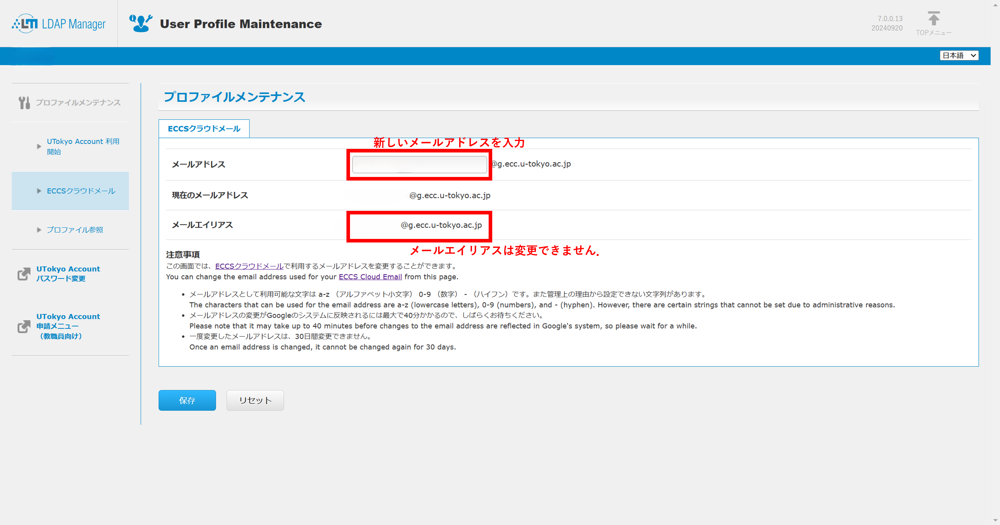

import If from "@components/utils/If.astro";
import Support from "@components/utils/Support.astro";

{/**
  * @typedef {object} Props
  * @property {boolean} [support]
  * @property {boolean} [img]
  */}

1. [UTokyo Account利用者メニュー](https://utacm.adm.u-tokyo.ac.jp/UserMenu/LoginServlet)にアクセスし，UTokyo Account（数字10桁の共通ID＋`@utac.u-tokyo.ac.jp`）とパスワードを入力してログインしてください．
1. 左のメニューにある「ECCSクラウドメール」を押すとメールアドレスの設定画面が表示されます．「メールアドレス」欄に好みのメールアドレスを入力して，「保存」ボタンを押してください．
    <If cond={props.img}>
      {:.medium}
    </If>

<Support lang="ja" show={props.support} />
