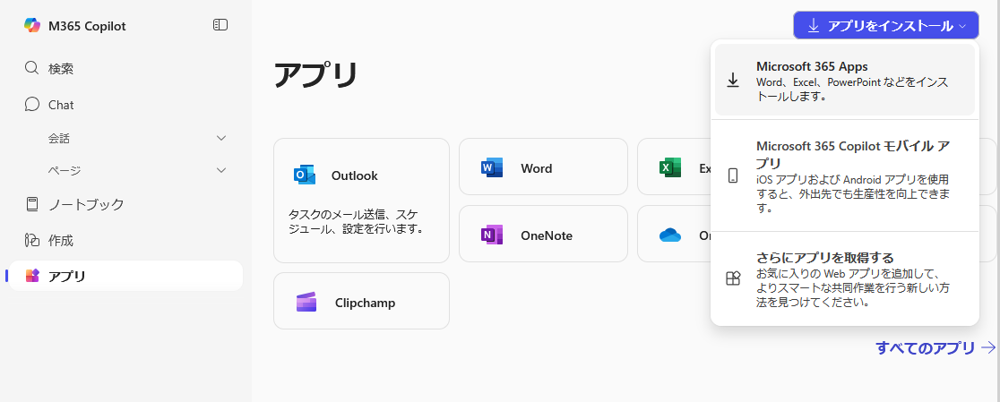
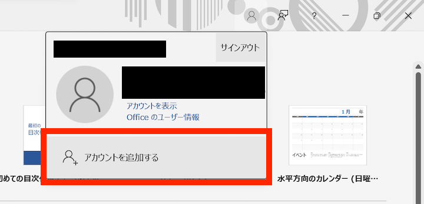

import Support from "@components/utils/Support.astro";
import Switch from "@components/utils/Switch.astro";
import HelpItem from "@components/utils/HelpItem.astro";
import If from "@components/utils/If.astro"

{/**
  * @typedef {object} Props
  * @property {boolean} support
  * @property {import("@components/types").Variant} variant 
  */}

<Switch variant={props.variant}>
<Fragment slot="oc">
**アプリをインストールする**
</Fragment>
<Fragment slot="individual">
### アプリをインストールする
{:#install}
</Fragment>
</Switch>

1. [Microsoft 365 > アプリ](https://m365.cloud.microsoft/apps/?auth=2)にアクセスし，UTokyo Account（数字10桁の共通ID＋`@utac.u-tokyo.ac.jp`）でサインインしてください．
    <If cond={props.variant !== "oc"}>詳しい手順や，他のMicrosoftアカウントとの使い分けに関しては，[**UTokyo Accountを用いてMicrosoftのシステムにサインインする**](/microsoft/signin/)をご覧ください．</If>
    

       
ヘルプ：「これに対するアクセス権がありません」または「You don’t have access to this」というエラーが表示される場合

        Officeアプリの利用に必要な<a href="/utokyo_account/mfa/">UTokyo Accountの多要素認証</a>の申請およびその反映が完了していない可能性があります．「<strong><a href="/utokyo_account/mfa/initial/">UTokyo Account多要素認証の初期設定手順</a></strong>」を<strong>最後の「手順4：多要素認証の利用を申請する」まで確実に</strong>行って，UTokyo Accountの多要素認証を有効化してください．その後，多要素認証の設定が<strong>システムに反映されるまで約30分かかるので，それまでしばらくお待ちください</strong>．
        
それでもうまくいかなければ，<a href="/support/">サポート窓口</a>に相談してください．
 
    

2. 画面の右上にある「アプリをインストール」をクリックして表示されるメニューで，「Microsoft 365 Apps」をクリックしてください．
    <HelpItem lang="ja" type={"details"}>
      <Fragment slot="problem">「Microsoft 365 Apps」が表示されない場合</Fragment>
      <Fragment slot="solution">
        <If cond={props.variant === "oc"}>
          あなたは[利用対象者](/microsoft/install/#caution)として登録されていない可能性があります．もし利用対象者であると思われるにも関わらず「Microsoft 365 Apps」が表示されない場合，自身の学籍が正しいかどうか，所属の学部・研究科等の学務・教務担当にご確認ください．
          <Fragment slot="else">
            あなたは[利用対象者](/microsoft/install/#caution)ではありません．Officeを利用する必要がある場合，代替手段の一つとして[Web版Office](/microsoft/#office_web)があります．もし，自身が利用対象者であると思われるのにもかかわらず「Microsoft 365 Apps」が表示されない場合，自身の学籍や人事上の登録が正しいかどうか，所属の学部・研究科等の窓口（学生は学務・教務担当，教職員は人事担当）にご確認ください．
          </Fragment>
        </If>
      </Fragment>
    </HelpItem>
    <If cond={props.variant == "individual"}>{:.border}</If>

3. 画面右上に表示されている「アプリをインストール」を押して，続いて「Microsoft 365 Apps」を押してください．「インストールなど」と表示されている場合には，「Microsoft 365 アプリをインストールする」を押してください．また「Office のインストール」と表示されている場合には，「Office のインストール」を押してください．
4. 以後の手順は場合によって異なります．インストールの完了まで自動で進むこともあれば，確認ボタンを押したり，ダウンロードしたファイルを自分で開いたりといった操作の必要があるかもしれません．
5. インストールが完了した旨が表示されれば完了です．続いて，<Switch variant={props.variant}><Fragment slot="oc">アプリにサインインしてください．</Fragment><Fragment slot="individual">下の「[アプリにサインインする](#signin)」の手順に進んでください．</Fragment></Switch>

<Switch variant={props.variant}>
<Fragment slot="oc">
**アプリにサインインする**
</Fragment>
<Fragment slot="individual">
### アプリにサインインする
{:#signin}
</Fragment>
</Switch>

1. Word，Excel，PowerPointなど，インストールされたOfficeアプリのうち，いずれかを一つ選んで起動してください．以下ではWordの場合を例にとって説明します．
1. 表示された画面を確認して，以下の指示に従ってください．
    - 「Officeを使い始めるにはサインインしてください」などのダイアログが表示された場合
      <If cond={props.variant == "individual"}>{:.medium}</If>
      OfficeアプリにどのMicrosoftアカウントでもサインインしていない状態です．「アカウントにサインインまたはアカウントを作成」をクリックしてください．
    - 上記のような画面が表示されず，通常の編集画面が表示された場合

      OfficeアプリになんらかのMicrosoftアカウントでサインインしている状態です．右上の人型のアイコンをクリックした後，現在サインインしているアカウントを確認してください．UTokyo Accountでない別のアカウントでサインインしていた場合は「アカウントを追加する」を選択してください．
      <If cond={props.variant == "individual"}>{:.small}</If>
1. [インストール](#install)時と同様のサインイン画面が表示されるので，サインインしてください．
1. Windows端末の場合，「すべてのアプリにサインインしたままにする」というダイアログが表示されることがあります．ここでの設定内容によっては，Officeアプリの利用中にエラーメッセージが発生しうることが確認されています．これを防ぐため，以下のように回答してください．
    まず，「組織がデバイスを管理できるようにする」の**チェックを外してください**．次に，Officeアプリ以外のMicrosoftのシステム（OneDriveなど）に自動でUTokyo Accountにサインインしたい場合は「はい」を，OfficeアプリのみにUTokyo Accountでサインインしたい場合は「いいえ，このアプリのみにサインインします」を選択してください．   
    <HelpItem lang="ja" type={"details"}>
    <Fragment slot="problem">上記と異なった選択をしてしまった場合</Fragment>
    <Fragment slot="solution">Officeアプリの利用中にエラーメッセージ（エラーコード：80180018など）が表示される場合があります．このエラーはUTokyo Accountの管理上の設定とOfficeアプリの動作が嚙み合わないために発生しているものであり，機器やその他のソフトウェア，保存されたデータなどに悪影響をもたらすものではないため，Officeアプリを問題なく利用できている状況であれば無視して構いません．一方で，このようなエラーメッセージがわずらわしい場合や，そもそもエラーによりOfficeアプリを利用することができない場合は，以下の手順を踏むことで上記の設定に修正し，このようなエラーの発生を防ぐことが可能です．</Fragment>
    1. WordやExcelといったOfficeアプリを全て終了してください．
    1. Windowsの「設定」アプリ（左下のWindowsマークのスタートメニューにある歯車マーク）を開いてください．
    1. 設定メニューのうち，「アカウント」>「職場または学校へのアクセス」を選択してください．
    1. 「職場または学校にアクセスする」の画面に，UTokyo Accountが表示されている場合は，「切断」を選択してください．
    1. 改めてOfficeアプリへのサインインをお試しください．
    </HelpItem>
    <If cond={props.variant == "individual"}>{:.small}</If>
1. 右上の人型のアイコンをクリックし，UTokyo Accountでサインインしていることを確認してください．
    <If cond={props.variant == "individual"}>{:.small}</If>
