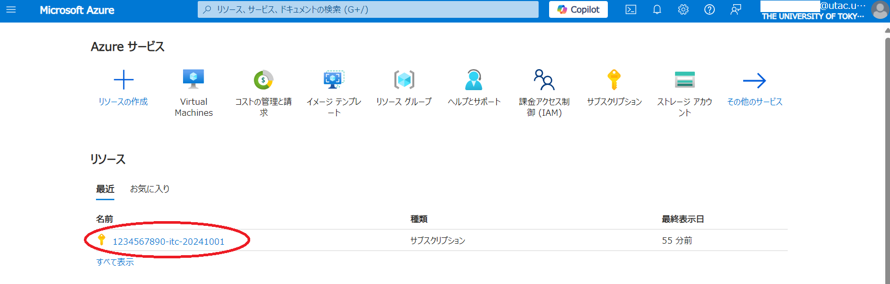

import HelpItem from "@components/utils/HelpItem.astro";

{/**
  * @typedef {object} Props
  * @property {import("@components/types").HelpItemType} type
  */}

<HelpItem lang="ja" type={props.type} >
  <Fragment slot="problem">まだサブスクリプションをお持ちでない場合</Fragment>

[Azure portal](https://portal.azure.com/)に[UTokyo Account](/utokyo_account/)でログインし、リソースの欄にサブスクリプションがない場合（下図参照），先に以下のURLからサブスクリプションを申請してください．

- [UTokyo Azure新規利用申請ページ](http://azure.itc.u-tokyo.ac.jp/) 
  - 学内ネットワークからのアクセスに限定．
  - UTokyo Account 所有者のみログイン可．
  - 教職員のみ申請可．
- UTokyo Azure 担当による承認作業が入るため，申請から利用可能になるまで時間がかかります．予めご承知ください．
- Azure portal のサブスクリプションサービスを確認し，申請したサブスクリプションが表示されましたら利用可能です．
  - アイコンが見当たらない場合，Portal トップページにある「移動」パートのサブスクリプションからでも同じ表示が見れます．

{:.medium.center.border}

参考：[サブスクリプションとは](/research_computing/utokyo_azure/faq/subscription/)

</HelpItem>
