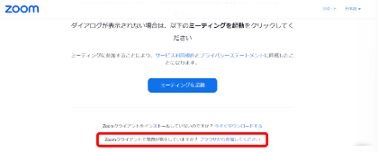

import If from "@components/utils/If.astro";
import Help from "@components/utils/Help.astro";

{/**
  * @typedef {object} Props
  * @property {boolean} support
  */}

1. [UTOLの練習用ページ](https://utol.ecc.u-tokyo.ac.jp/lms/course?idnumber=20197J919010V02)に書かれているテスト用の東大アカウント専用会議室のURLにアクセスしてください．
2. 下図の画面下部にある「ブラウザから参加」を押すと，ミーティング内で表示される名前とオーディオとビデオのon/offの設定画面が表示されます．「参加」をクリックするとブラウザからZoomに参加できます．サインインを行っていない場合は，東大のアカウントでのサインインが求められますので，アプリにサインインする際と同様の手順でサインインしてください．

   <If cond={props.big}>
     {:.medium.center.border}
   </If>
<Help lang="ja" support={props.support}>
  - **会議室のURLにアクセスすると，アプリのインストールを求められる，または，アプリのインストールが始まる場合**：アプリがうまくインストールできていないときに起きます．そのままアプリをインストールしてみて，うまくいけば，その後にもう一度アクセスしてみてください．
  - **「このミーティングの対象者は権限のある参加者のみです」・「このミーティングに参加できません」などと表示される場合**：東大のアカウントでサインインしていないときに起きます．「このミーティングには認証が必要です」または「このミーティングは承認された参加者のみを対象としています」と表示される場合も同様です．「サインインして参加」・「アカウントを切り替え」・「アカウントを切り替えて参加」・「サインイン」のいずれかのボタンを押して，「任意の作業：アプリにサインインする」の手順でサインインしてください．

</Help>
