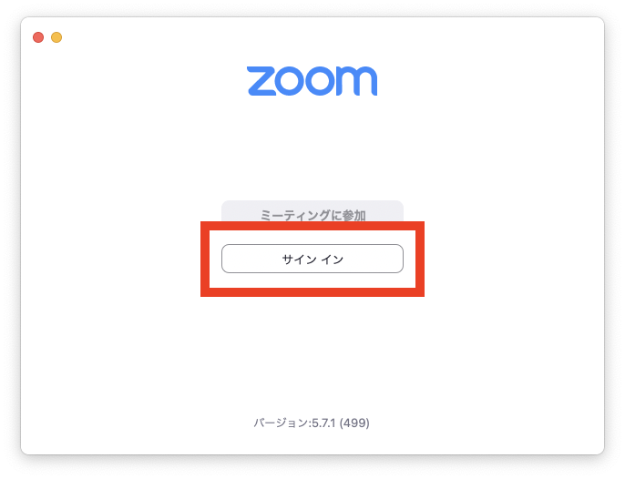
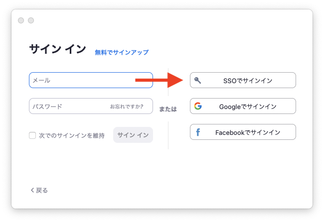
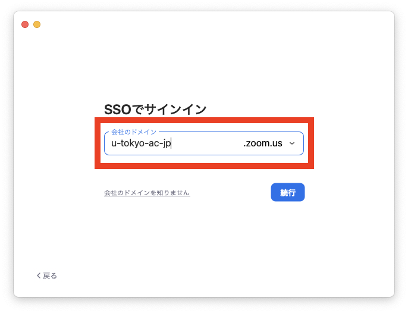
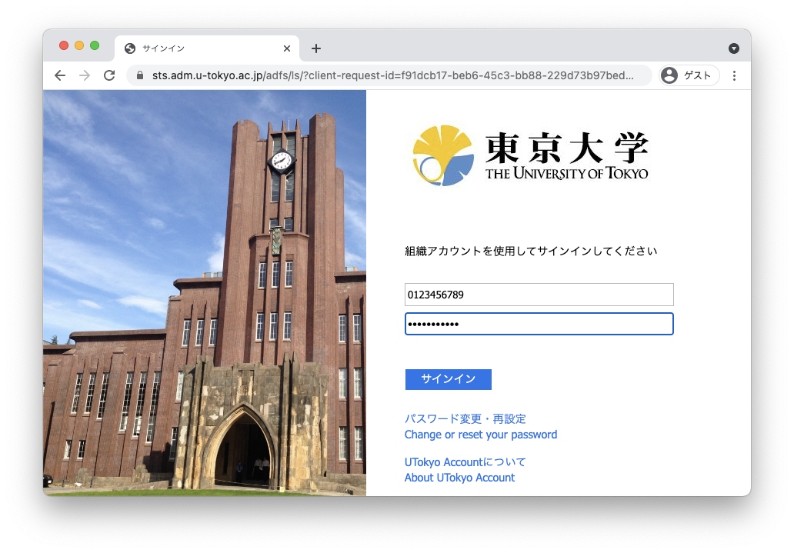

import If from "@components/utils/If.astro";
import Support from "@components/utils/Support.astro";
import Help from "@components/utils/Help.astro";
import SigninAppHelpDomain from "./SigninAppHelpDomain.mdx";

{/**
  * @typedef {object} Props
  * @property {boolean} support
  * @property {true} [inlineHelp]
  * @property {true} [big]
  */}

1. Zoomアプリを開き，「サインイン」ボタンを押してください．
   <If cond={props.big}>
     {:.medium}
   </If>
2. サインイン画面で，「SSO」または「SSOで続行」と書かれた文字を探して押してください<If cond={props.big}>（この画面のメールアドレス・パスワード欄に UTokyo Account の情報を入力してもサインインできません）</If>．
   <If cond={props.big}>
     {:.medium}
     {:.medium}
   </If>
3. 「会社のドメイン」の欄に，`u-tokyo-ac-jp`と入力してください（`ac`の前後はピリオドではなくハイフンであることに注意してください）．
   <If cond={props.big}>
     {:.medium}
   </If>
4. 既にUTokyo Accountにサインイン済みの場合を除き，UTokyo Accountのサインイン画面がブラウザで表示されるので，サインインしてください．
   <If cond={props.big}>
     {:.medium}
   </If>
   <If cond={props.inlineHelp}>
     <SigninAppHelpDomain type="details" />
   </If>
5. パソコンの場合は，設定画面（例えば，「ホーム」画面右上の歯車アイコンからアクセスできます）の「プロフィール」タブで，スマホの場合は右下の「詳細」を押して表示される画面で，自分の名前（設定していない場合は共通ID）と「ライセンス ユーザー」の表示が出ていれば，正しくサインインできています．

<If cond={props.inlineHelp}>
  <Support lang="ja" show={props.support} />
  <Help lang="ja" support={props.support}  slot="else">
    - <SigninAppHelpDomain type="oneline" />
  </Help>
</If>
