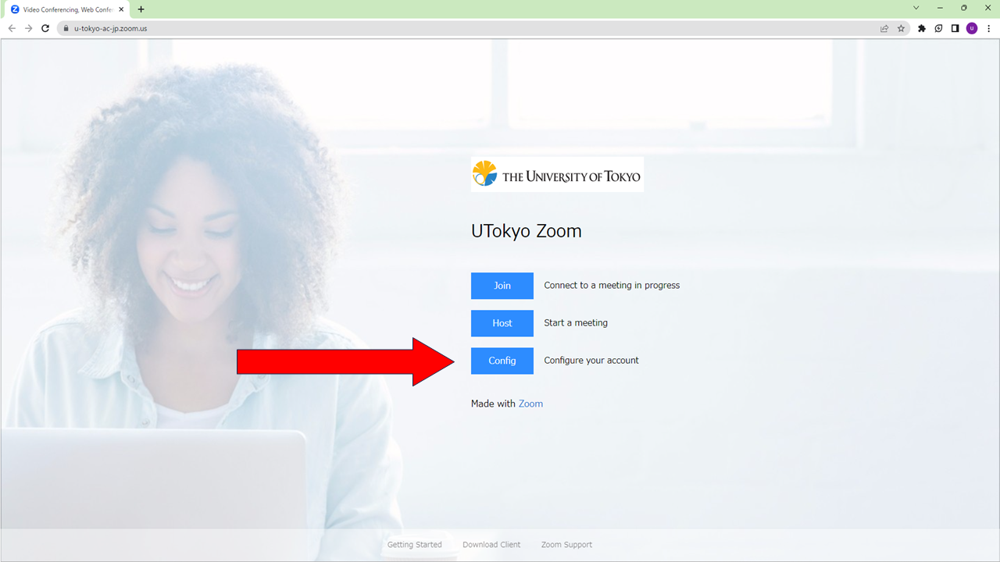
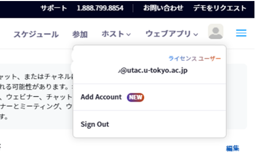

import If from "@components/utils/If.astro";
import Support from "@components/utils/Support.astro";
import Help from "@components/utils/Help.astro";
import SigninBrowserHelpExisting from "./SigninBrowserHelpExisting.mdx";

{/**
  * @typedef {object} Props
  * @property {boolean} support
  * @property {true} [inlineHelp]
  * @property {true} [big]
  */}

1. [東京大学専用のZoomのページ](https://u-tokyo-ac-jp.zoom.us/)にアクセスしてください．
2. 「UTokyo Zoom」と書かれたページが表示されるので，そのページにある「Config」と書かれたボタンを押してください．
   <If cond={props.big}>
     {:.medium}
   </If>
   <If cond={props.inlineHelp}>
     <SigninBrowserHelpExisting type="details" />
   </If>
3. 既にUTokyo Accountにサインイン済みの場合を除き，UTokyo Accountのサインイン画面が表示されるので，サインインしてください．
   <If cond={props.big}>
     {:.medium}
   </If>
4. サインインが完了します．右上のアイコン（人のマーク，または設定した自分のアイコン）を押したときに，自分のUTokyo Accountとともに「ライセンス ユーザー」と表示されれば，OKです．
   <If cond={props.big}>
     {:.medium}
   </If>

<If cond={props.inlineHelp}>
  <Support lang="ja" show={props.support} />
  <Help lang="ja" support={props.support} slot="else">
    - <SigninBrowserHelpExisting type="oneline" />
  </Help>
</If>

