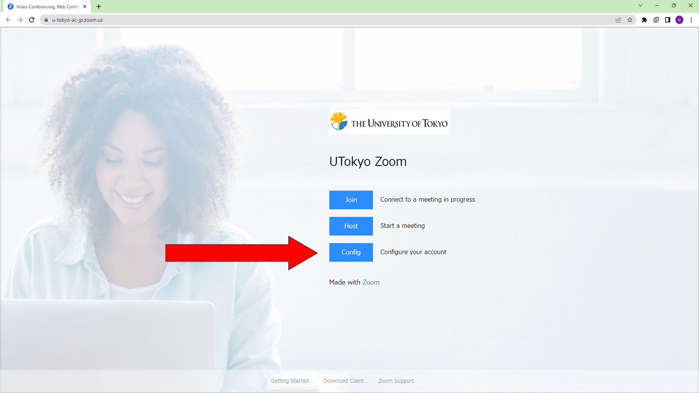
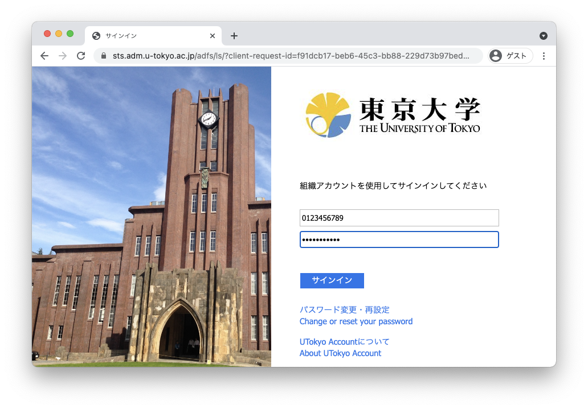
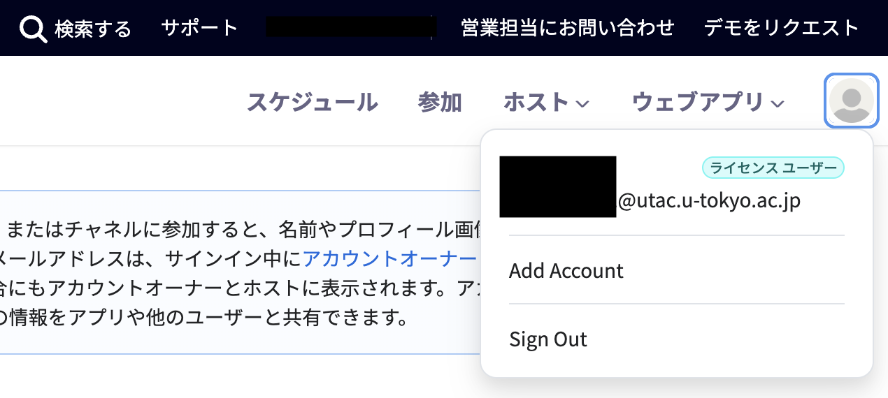
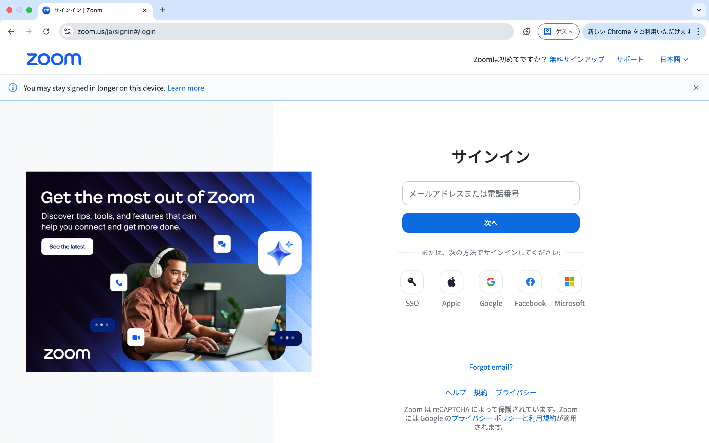
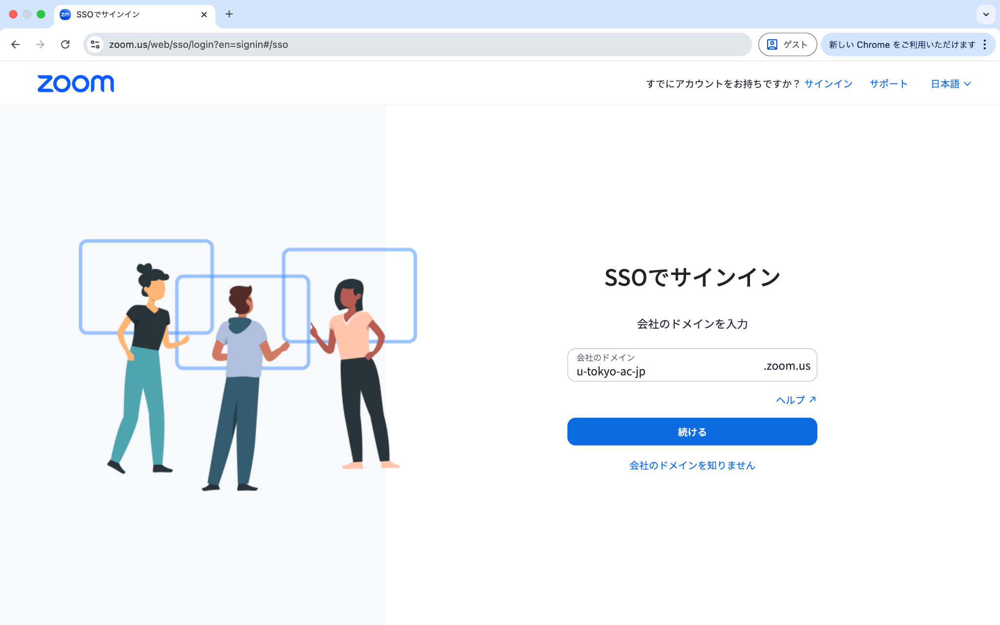

import If from "@components/utils/If.astro";
import Support from "@components/utils/Support.astro";
import Help from "@components/utils/Help.astro";
import SigninBrowserHelpExisting from "./SigninBrowserHelpExisting.mdx";

{/**
  * @typedef {object} Props
  * @property {boolean} support
  * @property {true} [inlineHelp]
  * @property {true} [big]
  */}

Zoomには東京大学専用ページというものが存在し，これを用いることでサインインの手間を少し省けます．
一方，オンライン授業のレコーディング視聴などでZoomのリンクが共有された場合には専用ページを経由しないため，後述の「専用ページを用いない方法」を参照してください．

## 東京大学専用ページからサインインする方法
1. [東京大学専用のZoomのページ](https://u-tokyo-ac-jp.zoom.us/)にアクセスしてください．
2. 「UTokyo Zoom」と書かれたページが表示されるので，そのページにある「Config」と書かれたボタンを押してください．
   <If cond={props.big}>
     {:.medium}
   </If>
   <If cond={props.inlineHelp}>
     <SigninBrowserHelpExisting type="details" />
   </If>
3. 既にUTokyo Accountにサインイン済みの場合を除き，UTokyo Accountのサインイン画面が表示されるので，サインインしてください．
   <If cond={props.big}>
     {:.medium}
   </If>
4. サインインが完了します．右上のアイコン（人のマーク，または設定した自分のアイコン）を押したときに，自分のUTokyo Accountとともに「ライセンス ユーザー」と表示されれば，OKです．
   <If cond={props.big}>
     {:.medium}
   </If>

<If cond={props.inlineHelp}>
  <Support lang="ja" show={props.support} />
  <Help lang="ja" support={props.support} slot="else">
    - <SigninBrowserHelpExisting type="oneline" />
  </Help>
</If>

## 専用ページを用いない方法
1. Zoomのサインインページ，またはホストなどから共有されたリンク（オンライン授業のレコーディング，ホワイトボードのリンク等）を開いてください．
   <If cond={props.big}>
     {:.medium}
   </If>
2. サインイン画面で「SSO」と書かれたボタンを探して押してください（この画面のメールアドレス・パスワード欄に UTokyo Account の情報を入力してもサインインできません）．
3. 「会社のドメイン」の欄に，u-tokyo-ac-jpと入力してください（acの前後はピリオドではなくハイフンであることに注意してください）．
   <If cond={props.big}>
     {:.medium}
   </If>
4. UTokyo Accountのサインイン画面がブラウザで表示されるので，サインインしてください．
   <If cond={props.big}>
     {:.medium}
   </If>
5. 既にUTokyo Accountにサインイン済みの場合を除き，サインインが完了します．右上のアイコン（人のマーク，または設定した自分のアイコン）を押したときに，自分のUTokyo Accountとともに「ライセンス ユーザー」と表示されれば，OKです．
   <If cond={props.big}>
     {:.medium}
   </If>
