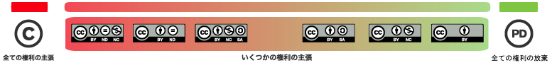
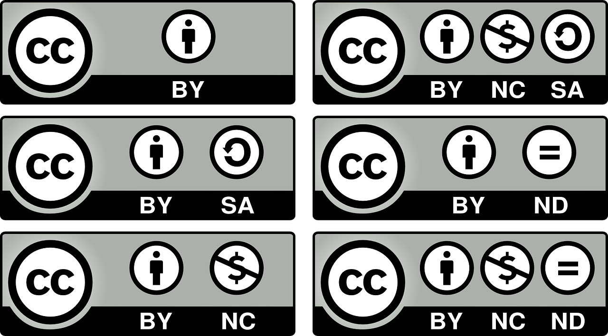
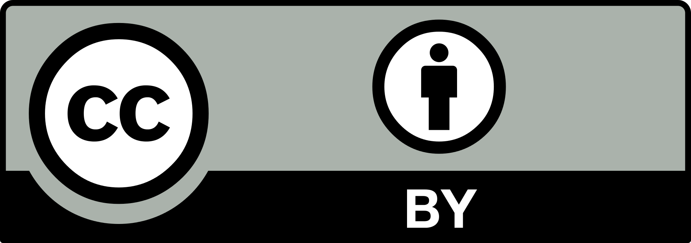
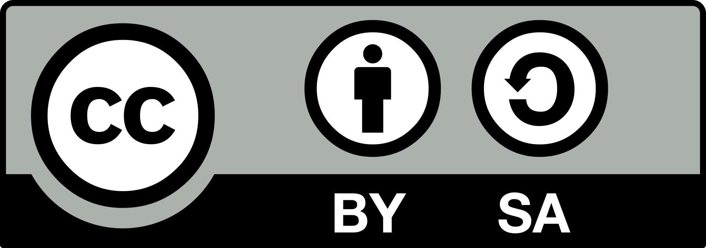
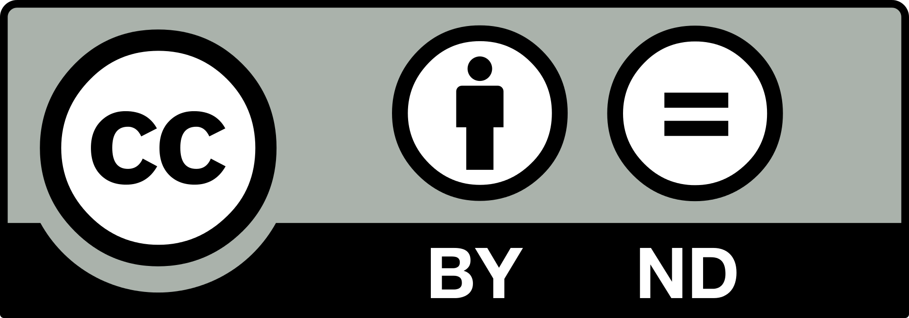
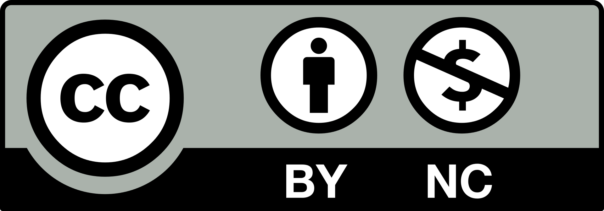
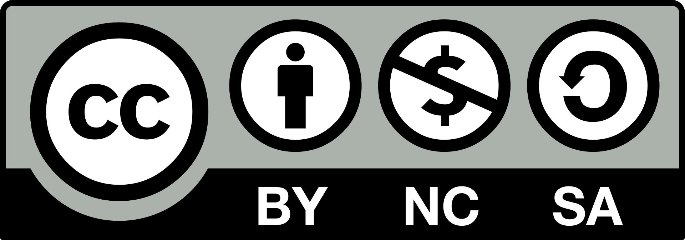
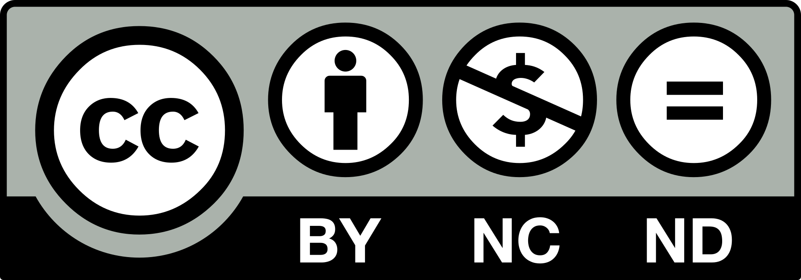
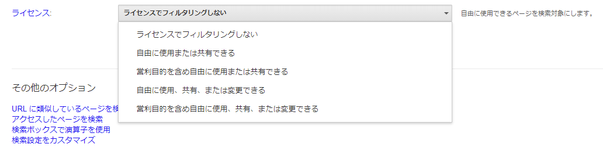

## この記事の概要

教員が授業資料を作成するとき，また，学生がレポートや課外活動で資料を作成するとき，他人が作成した著作物や素材を活用することがあります．
以前の解説「[著作権法に関する基本](basic)」で述べたように，著作権存続期間を満了していない著作物を利用する場合には原則許諾が必要であり，
一定の条件を満たした場合に無許諾での著作物利用が認められていました．
この記事では，より広く自由利用が可能な素材を探すためのヒントとして，パブリックドメインの考え方やクリエイティブ・コモンズについて紹介します．
資料作成前に，ぜひご一読ください．

## パブリックドメインとは

**パブリックドメイン（public domain）**とは，**公衆の自由利用が可能な素材・知識**が属する領域のことを指します．

**伝統的には，著作権存続期間が満了した（＝法による保護を受けなくなる）作品**が想定されていましたが，
**現在では，より多様な素材や知識**がパブリックドメインに属すると考えられています．

例えば，どのようなものがあるでしょうか．以下では，パブリックドメインに該当する素材・知識を，より詳細に説明します．

### パブリックドメインに属する素材

パブリックドメインに属する素材には，次のようなものがあります．

#### 著作権存続期間を満了した著作物

日本における著作権存続期間は，原則として著作者の死後（団体名義の著作物や映画の著作物の場合は公表後）70年までです[^1]．
したがって，この期間を過ぎた著作物は自由に利用することができます．

[^1]:
    
      著作権法51条，ただし無名の著作物（52条1項），団体名義の著作物（53条1項），映画の著作物（54条1項）は，公表後70年までと定められています． 
      参考：<a href="https://www.bunka.go.jp/seisaku/chosakuken/seidokaisetsu/gaiyo/hogokikan.html">https://www.bunka.go.jp/seisaku/chosakuken/seidokaisetsu/gaiyo/hogokikan.html</a>
    

例えば，主に日本国内におけるパブリックドメインの文学作品を集めてテキスト形式で掲載している[青空文庫](https://www.aozora.gr.jp/)というWebサイトがあります．
芥川龍之介の『羅生門』や宮沢賢治の『銀河鉄道の夜』は，令和3年（2021年）の時点で著作者の死後70年以上が過ぎているため，パブリックドメインに入っています．
青空文庫はこれらの作品を自由に掲載することができ，また誰でも自由に閲覧・利用することができます．

ただし，著作権法の細かな規定はそれぞれの国によって異なり，諸外国では日本よりも長く，あるいは短く著作権存続期間を設定する国があります[^2]．
したがって，著作物を利用する際には，その著作物ごとに著作権存続期間などを確認する必要があります．

[^2]:
    
      著作物は国境を越えて流通することから，国際的な著作権保護制度の枠組みとして，
      ベルヌ条約や万国著作権条約といった条約があり，これらの条約加盟国間で相互に権利保護を図っています．
      加盟国間で著作権存続期間が異なる場合，基本的には自国と同じだけ保護し（内国民待遇），
      対象国が自国よりも短い存続期間だった場合は対象国の存続期間だけ保護すればよい（相互主義）とされています．
    

#### 著作者によって，自由に利用可能とされた著作物

著作者によって著作権（財産権）が自発的に放棄された場合，その著作物はパブリックドメインに入ります．

著作者の意思表示によって利用可能となっている点で，後述のクリエイティブ・コモンズ・ライセンスが付与された作品と似ています．
最も制約が緩く自由に利用できる作品ということになります．

このことを示すためのライセンスとして，後述のクリエイティブ・コモンズからCC0という形式が提供されています．
そちらも併せて参照してください．

#### そもそも著作権などの保護を受けない素材や知識

例えばアイデアやありふれた表現など，著作権による保護を受けないものや，言語や文字といった誰のものでもないものも，パブリックドメインに属します．

## クリエイティブ・コモンズとは

クリエイティブ・コモンズとは，**クリエイティブ・コモンズ・ライセンス（以下：CCライセンス）を提供している国際的非営利組織とそのプロジェクトの総称**です．

著作権法による全ての権利を著作権者が主張する「All rights reserved」と対比して，CCライセンスは一部の権利を主張する「Some rights reserved」と表現されることがあります．

<figure>
  
  <figcaption>
    <cite>
      (By Creative Commons Japan, Creative commons license spectrum from "All rights reserved" to "No rights reserved". CC
      BY <a
        href="https://creativecommons.org/licenses/by/4.0/deed.ja">https://creativecommons.org/licenses/by/4.0/deed.ja</a> )
    </cite>
  </figcaption>
</figure>

**著作者は，自分の著作物にCCライセンスを付与することによって，他の人が使用する際の利用条件を表示する**ことができます．
CCライセンスが付与された著作物は，ライセンス条件の範囲内で自由に使用することができ，条件によって許容されている範囲内での再配布やリミックスなどが可能な場合もあります．

ただし，CCライセンスが付与された著作物は**パブリックドメインとは異なり，著作権が完全に放棄されているわけではない**点に注意しましょう．

CCライセンスには次項で紹介するような種類があります．利用したい著作物のライセンス証をよく確かめ，何が許され，何が禁止されているのかを理解してから使用しましょう．

（参考リンク：<https://creativecommons.org/licenses/>）

<figure>
  
  <figcaption>図：コモンズ証のアイコン例</figcaption>
</figure>

### コモンズ証アイコンの読み方

- **コモンズ証：**ライセンスの趣旨を簡潔に示したアイコンです．
  アイコンには「BY」「NC」「SA」「ND」という4種類があり，それぞれが著作物利用の条件（利用するときに守るべきルール）を表しています．
  役割については次のコモンズ証の種類と併せて説明していきます．
- **ライセンスの種類：**コモンズ証はこれら4つのアイコンの組み合わせで構成されていて，現在は次の6種類が使用されています．

#### CC BY

CC BYライセンスは，日本語で「表示」と呼ばれ，このライセンス下にある著作物を使用する際には，原作者などのクレジットを明示する必要があります．

{:width="250px"}

BYは英語の前置詞のbyから来ており，使用時に原作者などのクレジットを表示する必要性を示しています．さらに，可能な限り元の著作物へのリンクを貼る，およびクリエイティブ・コモンズのライセンスページへのリンクを貼るなどといった工夫がなされるべきであることを示しています．逆に，表示さえすれば改変や商用利用も可ということになります．なお，改変した場合にはそのことを明記する必要があります．

#### CC BY-SA

CC BY-SAライセンスは，日本語で「表示-継承」と呼ばれます．CC BYの条件に加え「継承」という条件が加わります．

{:width="250px"}

SAは英語のShare Alikeの略で，直訳すれば「同様に配布せよ」です．他のアイコンに比べ少々難解ですが，これは，このライセンスを持つ著作物を改変して作られた著作物は元の著作物と同じライセンスを継承せよという意味になります．つまり，このライセンスを持つ著作物を元にした二次創作物などには同じCC BY-SAライセンスを付与しなければなりません．例えば，二次創作者が他者に改変を禁止するなど，他の条件に変更することはできなくなります．

余談ですが，Wikipediaの文章も，CC BY-SAライセンスに従って利用可能であるとされています[^3]．

[^3]: [https://ja.wikipedia.org/wiki/Wikipedia:ウィキペディアを引用する](https://ja.wikipedia.org/wiki/Wikipedia:%E3%82%A6%E3%82%A3%E3%82%AD%E3%83%9A%E3%83%87%E3%82%A3%E3%82%A2%E3%82%92%E5%BC%95%E7%94%A8%E3%81%99%E3%82%8B)

#### CC BY-ND

CC BY-NDライセンスは，日本語で「表示-改変禁止」と呼ばれます．CC BYの条件に加え，「改変禁止」の条件が付きます．

{:width="250px"}

NDはNo Derivative Worksの略で，文字通り改変を禁止しています．すなわち，画像の一部だけを切り取ったり，枠や文字等を重ねたり，文章を翻訳して使用したりといったことはできません．

#### CC BY-NC

CC BY-NCライセンスは，日本語で「表示-非営利」と呼ばれます．CC BYの条件に，「非営利」の条件が加わっています．

{:width="250px"}

NCはNoncommercialの略で，非営利での使用であれば改変も可能です．

#### CC BY-NC-SA

CC BY-NC-SAライセンスは，日本語で「表示-非営利-継承」と呼ばれます．CC BY-SAにNCが付加されたものとなります．

{:width="250px"}

このライセンスの下では，非営利での利用であれば改変も可能ですが，改変した場合も元と同じCC BY-NC-SAを継承することが必要となります．

#### CC BY-NC-ND

CC BY-NC-NDライセンスは，日本語で「表示-非営利-改変禁止」と呼ばれます．CC BY-NDにNCが追加されています．

{:width="250px"}

このライセンスはCCライセンスの中で最も厳しいものであり，BYに基づいてクレジット表示をする限り著作物のダウンロードや共有が許可されますが，改変や商用利用をすることはできません．

#### CC0

これまで紹介したCCライセンスは権利所有者が著作権を保持したまま再利用の条件を定めるためのものでしたが，CC0は，それらとは異なる選択肢を提供するものです．
数字のゼロのアイコンや，copyrightを表すCに斜線を重ねたアイコンで表されることが多いようです．

{:width="250px"}
{:width="250px"}

CC0は，著作者が自身の意思で作品をパブリックドメインに置くために，クリエイティブ・コモンズが用意した規格です．
CC0は，「その作品について世界全地域において著作権法上認められる，その者が持つすべての権利（その作品に関する権利や隣接する権利を含む．）を，
法令上認められる最大限の範囲で放棄して，パブリック・ドメインに提供」[^4]するという意味を持ちます．

[^4]: <https://creativecommons.org/publicdomain/zero/1.0/deed.ja> より引用

ここでの注意点は「法令上認められる最大限の範囲」という部分で，日本において，後述する著作者人格権は法令上放棄できないということになっているため，著作者人格権はCC0の著作物に対しても有効であると考えるのが一般的です．

## 著作者人格権

パブリックドメインの著作物，またはCCライセンスの下で著作物を利用する際でも注意すべき点があります．
それは，著作者の財産的利益を保護する著作権（財産権）とは別に，著作者の人格的利益を保護する著作者人格権が存在することです．

著作者人格権については本サイトの「[著作権法に関する基本](basic)」でも解説しています．

パブリックドメインの著作物，またはCCライセンスに基づいて著作物を利用する場合，主に問題になるのは同一性保持権と名誉声望保持権です．

- **同一性保持権：**「著作物の内容や題号を著作者の意思に反して改変されない権利」です．著作者によって改変が認められていない場合，著作物を改変して利用すると同一性保持権の侵害になります．利用規約などで改変してもよい旨が記されている場合，およびNDを含まないCCライセンスが付与されている場合は改変が認められますが，明らかに著作者の意思に反する改変は問題になる可能性があります．例えば，作品を侮辱するような形，作品の大意が変わるような形での改変や切り取りが当てはまります．
- **名誉声望保持権：**「著作者の名誉又は声望を害する方法で，その著作物を利用されない権利」です．名誉または声望を害する方法とは，著作者の意に反するような暴力的または差別的な表現を含むコンテンツでの利用，および政治的主張を含む場面での利用，アダルトサイトでの利用[^5]などが考えられます．

[^5]:
    
      起草者からは，「芸術作品である裸体画を複製してヌード劇場の立て看板に使う」，「文学作品を多くの広告と一緒に出版する」，
      「芸術的な価値の高い美術作品を名もない物品の包装紙に複製する」，「極めて荘厳な宗教音楽を喜劇用の楽曲と合体して演奏する」，
      「言語の著作物を悪文の例として利用する」といった例が挙げられています．
      （加戸守行『著作権法逐条講義 六訂新版』（著作権情報センター，2013年）755-756頁 より）
    

その利用が著作者の意に反するものどうかは，版元の利用規約などから判断できる場合があります．
例えば，フリーイラストを配布するWebサイト[いらすとや](https://www.irasutoya.com/)の利用規約[^6]のページには，
政治的利用，アダルトコンテンツでの利用，「攻撃的，性的，暴力的，差別的，グロテスク，法的に問題のある表現など，素材の印象を損なうような過激な形」
への改変を禁止する旨が明記されているため，そのような利用は避けなければなりません．

[^6]: <https://www.irasutoya.com/p/faq.html>

著作者人格権に照らして問題となるかどうかは，結局「著作者がどう思ったか」に依存する部分が大きく，そのボーダーラインをはっきりと引くことは困難です．利用規約などを確認しつつ，現実的には個々人のモラルによって判断していくことになります．場合によっては，著作者へ確認を求めることも一考する必要があるでしょう．

## 素材を検索する際のコツ ―著作権を侵害しないために―

著作物を利用する際，パブリックドメインやCCライセンスが付与されているコンテンツを選択することは，著作権を侵害しない有効な方法の1つです．
そのようなコンテンツを簡単に検索できる方法を，3通り紹介します．

### 方法1：キーワードを添えて検索

最も単純な方法は，インターネット上でコンテンツを検索する際に「○○ free」「○○ 商用利用可」「○○ public domain」などのキーワードを添えて入力するという方法です．

まず，コンテンツを利用する前に，そのコンテンツが掲載されているWebサイトが正統なものであるかどうかを確認します．そのWebサイトが版元ではない場合，そのサイトに違法にアップロードされたコンテンツである場合などがあるからです．次に，必ず利用規約などのページを参照し，コンテンツが本当に利用可能かどうか，どのような利用が可能か，確認しましょう．

### 方法2：Googleの検索オプションを利用した条件検索

Googleの検索オプションには「ライセンス」という項目があり，そこからさらに条件を絞って検索することもできます．

1. Googleの検索ページ内にある「設定」から「検索オプション」をクリックするか，下のURLにアクセスしてみましょう． 
   <http://www.google.com/advanced_search>
1. アクセスすると次のような画面が出ます．「検索結果の絞り込み」の項目に，「ライセンス」という設定があります．
   
   このプルダウンメニューを展開すると次のようになります．
   
1. 使用したいコンテンツが見つかったら，そのコンテンツを提供しているWebサイト上で利用規約を確認することも重要です．
   パブリックドメインやCCライセンスが明示的に書かれていなかったとしても，条件を満たすことで使用が認められる場合もあります．

### 方法3：Openverseにて検索する

キーワードや条件を入力して，CCライセンスを付与された素材やパブリック・ドメインに属する素材を瞬時に検索することができます．

（クリエイティブ・コモンズが公式に提供する「CC Search」が，2021年12月にWordpress傘下に移行して「Openverse」と改名したものであり，サービス内容は同様です．）

- [公式サイト](https://wordpress.org/openverse/)
- [検索方法を紹介するページ](https://wordpress.org/openverse/search-help/)

### パブリックドメインおよびクリエイティブ・コモンズ・ライセンスで使用可能な素材まとめサイト集

パブリックドメインや，CCライセンスが付与されたコンテンツを提供するWebサイトがたくさんあります．提供元は，国家機関や国際機関をはじめ，博物館や美術館，テレビ局，教育機関，個人クリエイターまで様々です．

特に，令和2年（2020年）の新型コロナウイルス感染拡大を受け，オンライン需要が高まったことにより，デジタルコンテンツやオープンコンテンツの公開が世界的に進みました．

本サイトに，それらコンテンツを提供するWebサイトのリンクをまとめたページがありますので，是非ご活用ください．

[パブリックドメインおよびクリエイティブ・コモンズ・ライセンスで使用可能な素材まとめサイト集](copyright-free-resources)

これらのWebサイトにて直接検索することで，より素早く確実に安全に使用できるコンテンツを見つけることができるでしょう．

## 参考文献

- ライセンスについて - Creative Commons 
  <https://creativecommons.org/licenses/?lang=ja>
- CC0について ― “いかなる権利も保有しない” | クリエイティブ・コモンズ・ジャパン (creativecommons.jp) 
  <https://creativecommons.jp/sciencecommons/aboutcc0/>
- いらすとや よくあるご質問 
  <https://www.irasutoya.com/p/faq.html>
- 文化庁 著作者の権利の発生及び保護期間について 
  <https://www.bunka.go.jp/seisaku/chosakuken/seidokaisetsu/gaiyo/hogokikan.html>

## あわせて読みたい記事

- [著作権法に関する基本](basic)
- [パブリックドメインおよびクリエイティブ・コモンズ・ライセンスで使用可能な素材まとめサイト集](copyright-free-resources)
