## この記事のハイライト
{:#highlight}

* この記事では，GoodNotes 5を用いて画面上で板書を行う方法について紹介しています．
* 以下の場面で使用できます．
    * リアルタイムで板書をしながら授業を行いたい．
    * 事前に作成した資料（PDF，PowerPoint，Wordなど）に書き込みながら授業を行いたい．
    * 学生の提出課題（PDF，PowerPoint，Wordなど）を添削したい．
* 以下のようなことはできません．
    * Windowsに対応していません（iPhone，iPad，Macのアプリケーションです）．

## アプリケーションについての説明
{:#basic_info}

GoodNotes 5は，読み込んだスライドや文書（PDF，Power Point，Wordなどに対応）に手書きの注釈を付けることができるメモ／描画用アプリケーションです．Zoomと組み合わせて使用することで，リアルタイムで手書きの板書をしながら授業を展開することが可能です．

<figure>

</figure>

GoodNotes 5はiPad，iPhone，Macなどで利用できますが，板書をする場合にはiPad上での利用を推奨します．iPhoneの場合は画面サイズが小さいため，タッチペン等を別途購入して使用したとしても，細かい板書はしにくく不向きだと考えられます．またMacの場合は，ペンタブレットを別途購入すれば板書は可能ですが，iPadのように画面に直接タッチして書き込むことはできません．

アプリケーションは，[App Store](https://apps.apple.com/app/goodnotes-5/id1444383602)から購入することができます．

本記事では，iPad上でApple Pencil（別売）を用いてGoodNotes 5を使用する方法について説明します．

（注）Apple PencilはApple純正のタッチペンで，iPadのみに対応しています．2021年3月現在では，iPhoneおよびMac共に，Apple Pencilには対応していません．

* 提供元
    * Time Base Technology Limited
    * 公式サイト　[https://www.goodnotes.com/](https://www.goodnotes.com/)
* 使用可能な環境
    * 端末・OS 
        * iPad：iPadOS 12.0 以降
        * iPhoneまたはiPod touch：iOS 12.0 以降
        * Mac：MacOS 10.15 以降
        * Windowsには対応していません
    * 必須またはオプションのアクセサリ
        * 必須ではないがApple Pencilの使用を推奨
        * オンライン授業で使用する場合は，Zoom等のビデオ会議用ツールが別途必要
* 運用コスト
    * 費用 [2021年9月現在]
        * アプリケーションを購入する必要があります（980円で購入できます）
        * iPadの場合は，以下のいずれかの使用を推奨します
            * Apple Pencil（第1世代）10,800円（税別）
            * Apple Pencil（第2世代）14,500円（税別）
        * （非推奨）iPhoneの場合はタッチペン（100円〜5,000円程度），Macの場合はペンタブレット（5,000〜20,000円程度）を別途購入することにより，ペンを用いた板書が可能です．
* 授業を受ける学生側が準備すること
    * なし

## 基本的なツールの使い方
{:#tools}

基本的な操作は，[GoodNotes 5の公式サイト](https://support.goodnotes.com/hc/en-us/articles/360000690095-Getting-started-with-GoodNotes-5)に載っています（英語，繁体字，簡体字のみ）．

以下では，基本的なツールと簡単な使用方法を記載します．

### ペンツール    

<figure>

</figure>

手書き用の最も基本的なツールです．「万年筆」「ボールペン」「筆ペン」の3種類から選択できます．

それぞれを使用した際の筆跡は下の画像でご確認ください．

<figure>

</figure>

<figure>

</figure>

<figure>
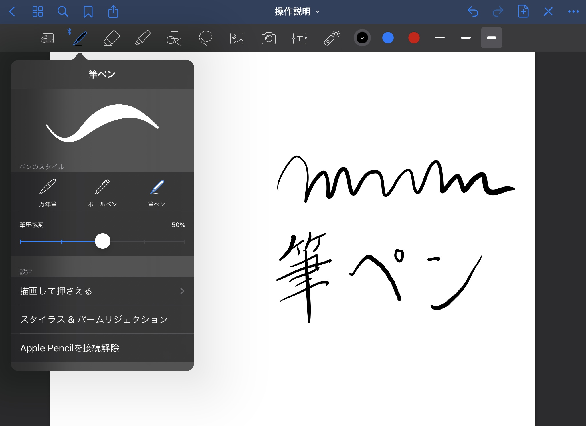
</figure>

下の画像のように，ペンのカラーや太さを変更することが可能です．

<figure>

</figure>   

<figure>
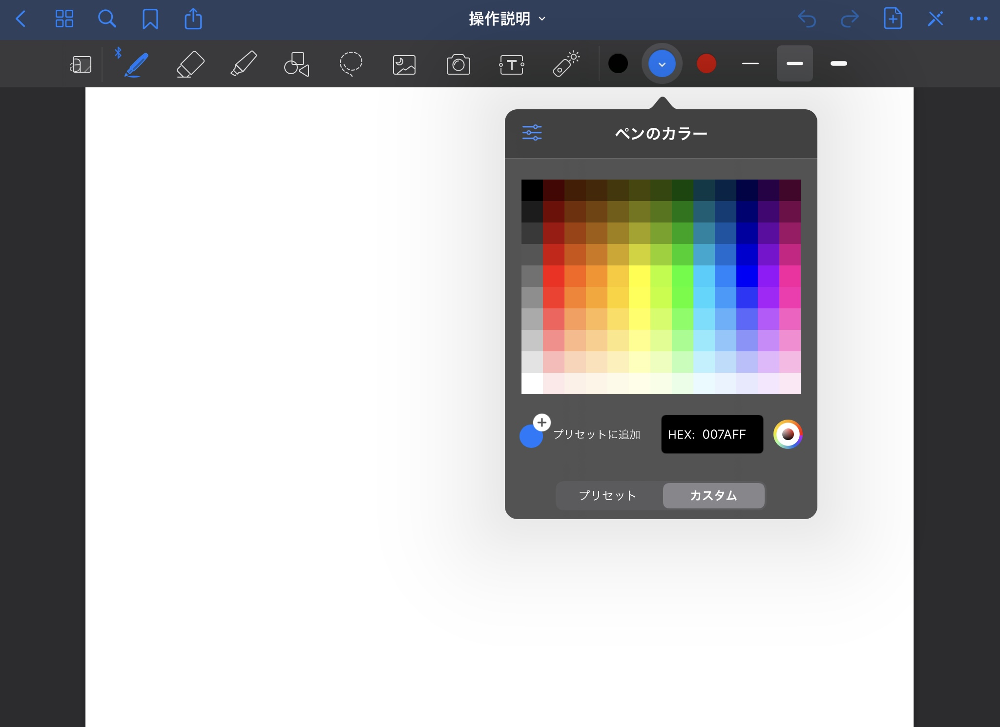
</figure>

<figure>
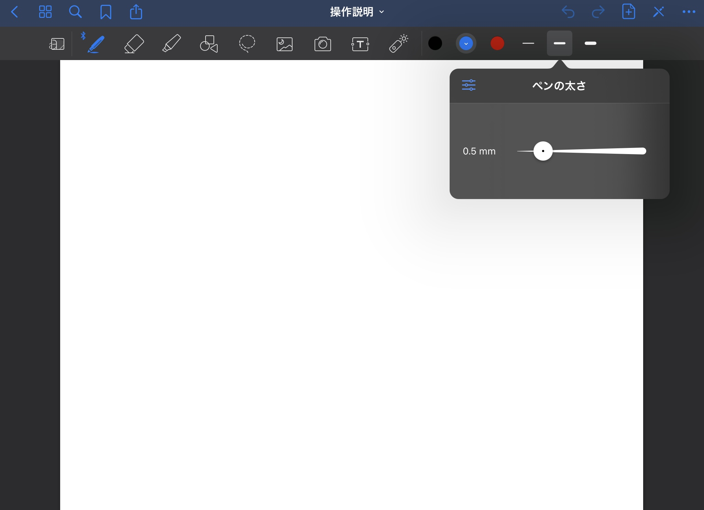
</figure>

### 消しゴムツール

<figure>

</figure>

ペンツールやマーカーツール（後述）などで描画した文字や線を消去するツールです．

アイコンを長押しすると，下の画像のようにメニューが現れ，ストローク全体を消去したり，蛍光ペンのみを消去したりすることも可能です．

<figure>

</figure>

### 蛍光ペンツール
    
<figure>

</figure>

マーク用ツールです．蛍光ペンツールを使うと，元の描画やPDFファイル上の文字の上に線を引いても，描画や文字の部分が透けるように線が引かれます．

アイコンを⻑押しすると，下の画像のようにメニューに「直線で描く」が現れます．これを選択すると，多少ブレた線を引いてしまっても⾃動的に直線に修正されます．

<figure>

</figure>

ペンツールと同じく，下の画像のように蛍光ペンのカラーや太さを変更することが可能です．

<figure>

</figure>  

<figure>
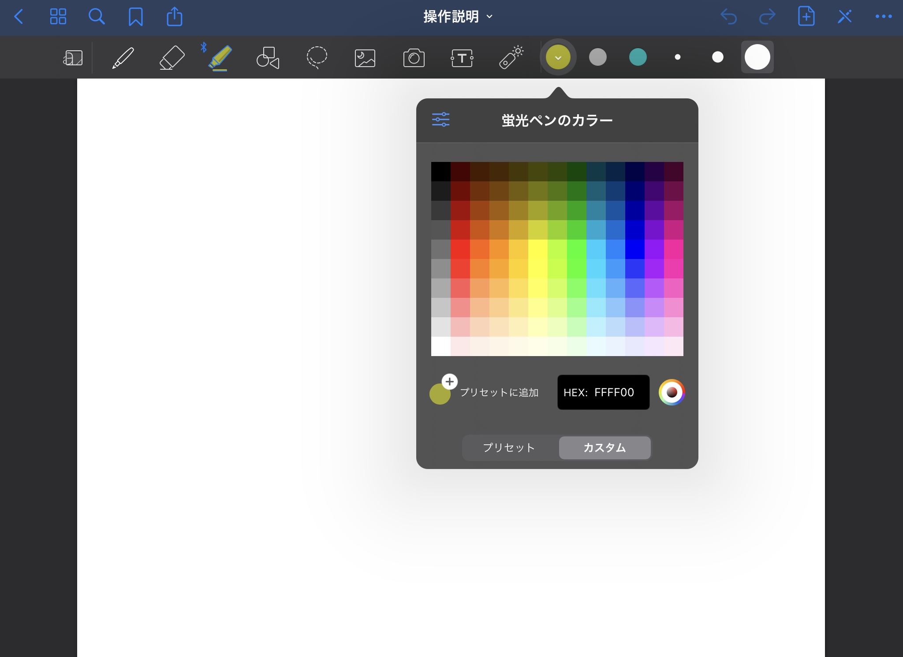
</figure>

<figure>
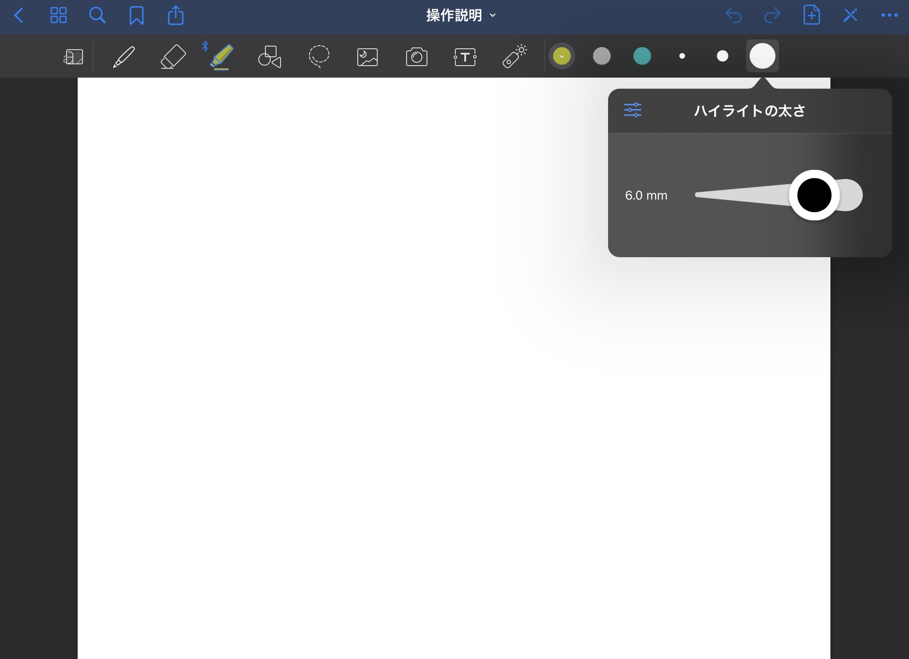
</figure>

### シェイプツール

<figure>

</figure>

図形を作成するツールです．

シェイプツールを用いて手描きで楕円（だえん）や円，四角形，三角形等を描画すると，下の画像のように自動で近い形状に修正されます．

<figure>
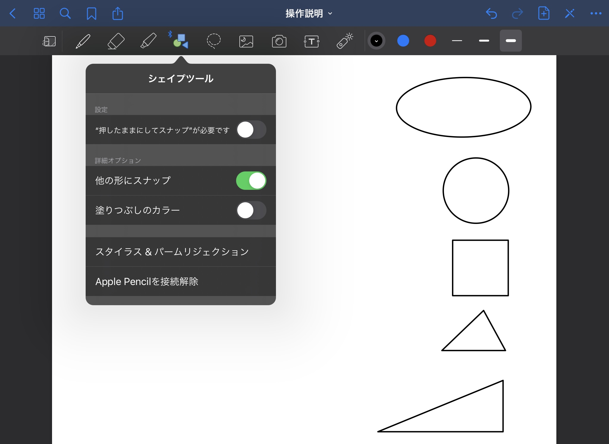
</figure>

### なげなわツール

<figure>

</figure>

描画した文字や図形を選択して移動したり，文字・図形の拡大や消去をすることが可能なツールです．

（例）下の画像は，シェイプツールで作成した楕円（だえん）を移動させるために、なげなわツールで楕円を選択している様子です．

<figure>

</figure>

### 画像ツール

<figure>

</figure>

デバイス上の画像を選択して，挿入できるツールです．iPad上の「フォト」や「ファイル」から選択可能です．
画像ツールをクリックすると表示されるカメラツールを使用すれば，その場で撮影した写真を挿入することができます．

<figure>

</figure>

<!---- カメラツールのアイコン
<figure>

</figure>
---->

### テキストツール

<figure>

</figure>

キーボードを用いてテキストを挿入できるツールです．
   
<figure>
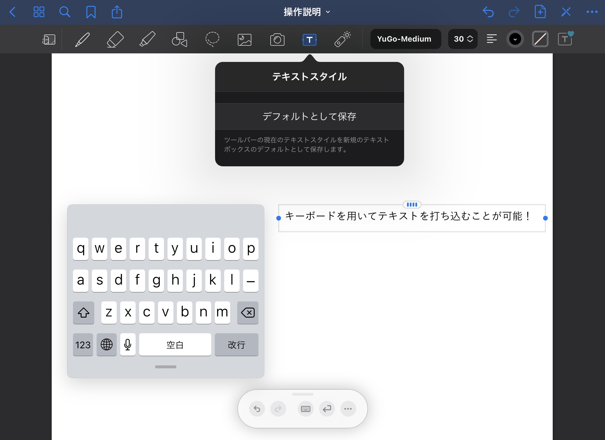
</figure>

下の画像のように，文字のフォントやサイズ，段落，テキストのカラー，テキストボックスのスタイルを変更可能です．

<figure>

</figure>

<figure>

</figure>

<figure>
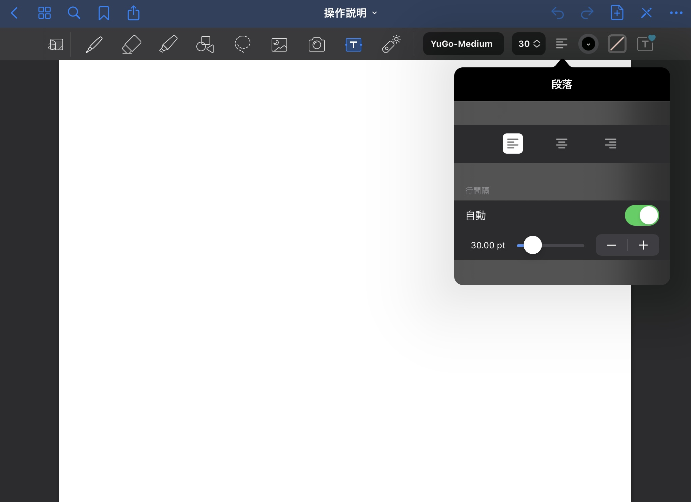
</figure>

<figure>
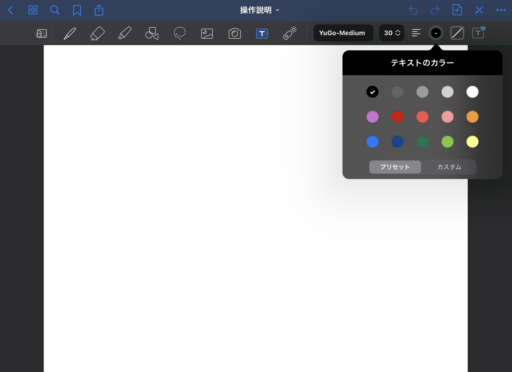
</figure>

<figure>

</figure>

<figure>

</figure>

<figure>

</figure>

### ポインタツール

<figure>

</figure>

タッチした位置にポインタを表示させるツールです．

タッチ操作を追尾してポインタが動くタイプと，タッチ操作を始めてから画面からApple Pencilを離すまでのポインタの軌跡が表示されるタイプの2種類があります．

↓タッチ操作を追尾してポインタが動くタイプ
<figure>

</figure>

↓タッチ操作を始めてから画面からApple Pencilを離すまでのポインタの軌跡が表示されるタイプ
<figure>

</figure>

## 授業での使用方法
{:#in_class}

### 準備
#### ホワイトボードとしての準備

何も書かれていない状態のページにリアルタイムで書き込みをしていくことで，対面授業におけるホワイドボードや黒板での板書をGoodNotes 5で再現できます．

以下では，新しいノートの作成方法を説明します．

1. GoodNotes 5を開き，画面下の「書類」を選択します．
2. 新しいノートを作成したいフォルダに移動して，「新規...」をタップします．
3. 表示されたメニューから「ノート」をタップします．
4. 表紙の有無や，用紙の色やサイズ，縦・横の向き，けい線の種類等を選択し，「作成」をタップします．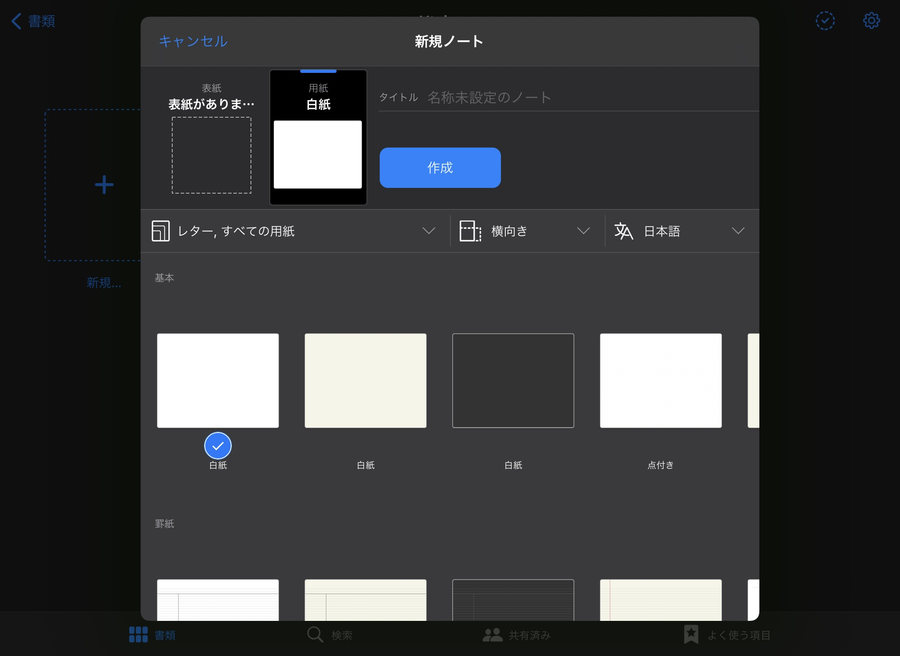
5. 白紙のノートが作成されます．

#### 事前に用意しておいたPowerPointやPDFを読み込む

GoodNotes 5では，PowerPoint，Word，PDF，各種画像ファイルを読み込んで，そこに書き込みを加えていくことができます．

以下では，Google ドライブ上に保存したファイルをGoodNotes 5に読み込む方法を説明します．

1. GoodNotes 5に読み込みたいファイルを，自身のGoogle ドライブに保存します．Google ドライブの基本的な使い方は，「[Google Driveの基本的な使い方](/articles/google-drive/)」を確認してください．
2. iPad上でGoogle ドライブを起動します．
   * アプリケーションは，[App Store](https://apps.apple.com/jp/app/google-%E3%83%89%E3%83%A9%E3%82%A4%E3%83%96-%E5%AE%89%E5%85%A8%E3%81%AA%E3%82%AA%E3%83%B3%E3%83%A9%E3%82%A4%E3%83%B3-%E3%82%B9%E3%83%88%E3%83%AC%E3%83%BC%E3%82%B8/id507874739)からインストールすることができます．  
3. Google ドライブ上で開きたいファイル（PDF，Power Point，またはWordのファイル）があるフォルダまで移動し，開きたいファイルのファイル名の横に表示されている「・・・」をタップします．
4. 表示されたメニューから「アプリで開く」をタップします．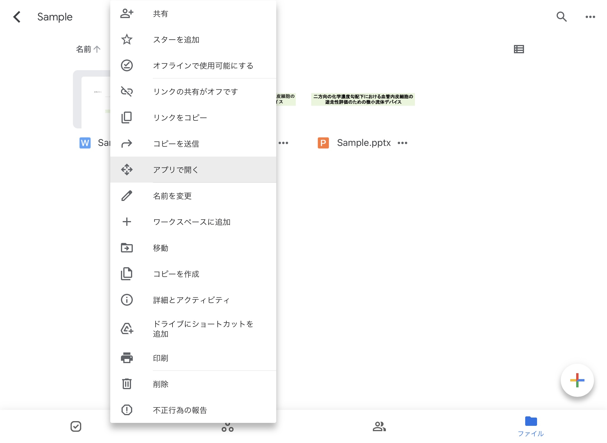
5. 「エクスポートの準備中」と表示されるので，準備が完了するまで待ちます．
6. 表示されたメニューから「GoodNotesで開く」をタップします．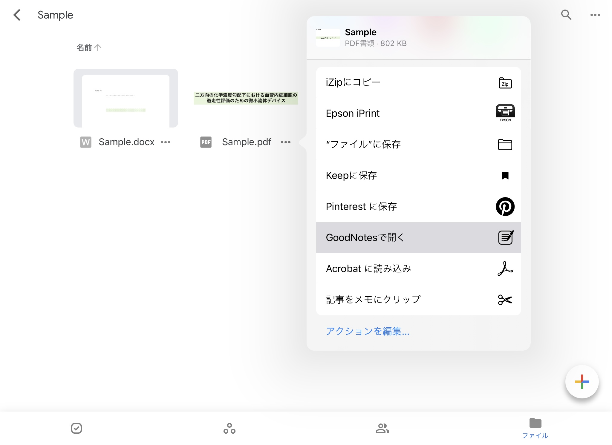
7. 自動でGoodNotes 5が起動し，「GoodNotesに読み込む」という画面が表示されます．GoodNotes 5内での保存場所を選択し，「新規ファイルとして読み込む」をタップしてください．

（注）GoodNotes 5で別のファイルを開いていた場合は，「新規書類として読み込む」の他に「現在の書類に読み込む」という選択肢が表示されます．現在GoodNotes 5で開いている書類と事前作成資料を結合したい場合は，「現在の書類に読み込む」を選択してください．

<figure>

</figure>

### 画面共有
{:#with_zoom}

受講している学生とリアルタイムで板書を共有する最も簡単な方法は，GoodNotes 5を利用している画面をそのままZoomで画面共有することです．

一般的なZoomの使い方については，「[Zoom](/zoom/)」を参考にしてください．

1. iPadでZoomの会議室を開き，メニューバーから「共有」をタップしてから，「画面」を選択してください．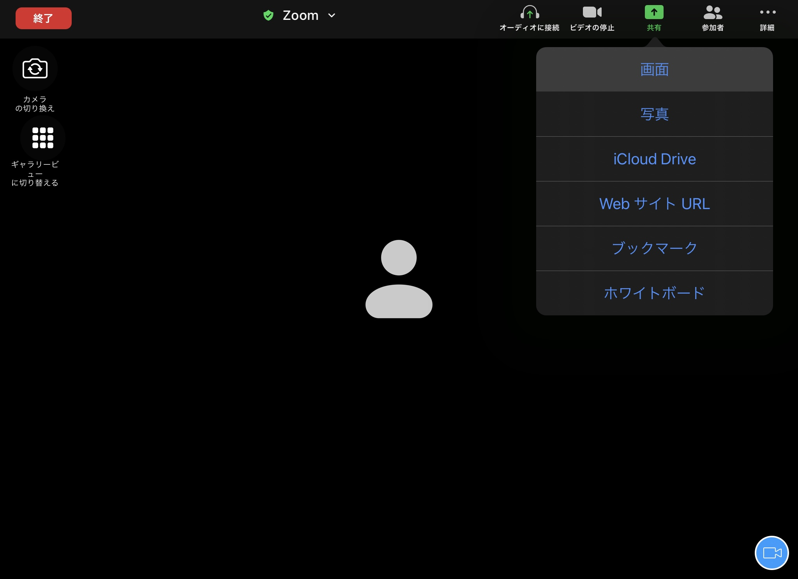
2. 「ブロードキャストを開始」をタップします．
3. 「画面を共有しています」と表示されます．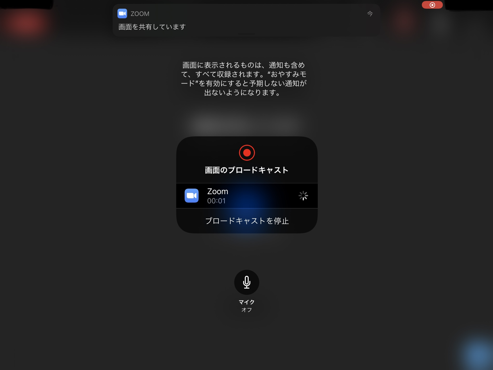
4. iPadで開くアプリをZoomからGoodNotes 5に切り替えると，GoodNotes 5の画面が共有されます．画面共有中は画面右上に赤いマークが表示されます．

本記事では詳述しませんが，「AirPlay（またはそのミラーリングソフト）」を用いた画面共有等の方法を用いることで，Macや一部のWindowsPCからiPadの画面を共有することも可能です．

### 板書をする

準備，共有ができたら実際に授業を行います．

これまでに紹介したツール等を用いて好きなように板書をすることができます．

次の動画は，授業中にリアルタイムに板書をするデモンストレーションです．GoodNotes 5を使って板書している教員の共有画面が受講している学生の画面に映し出される様子が再現されています．マーカーツール，ペンツール，消しゴムツール，テキストツールを使用している様子をご確認ください（閲覧には[ECCSクラウドメール](/eccs_cloud_email)が必要です）．

[https://drive.google.com/file/d/1MQ8Ib_lYkUzHV9ayQ_aPJvdRbANx0Y2I/view?usp=sharing](https://drive.google.com/file/d/1MQ8Ib_lYkUzHV9ayQ_aPJvdRbANx0Y2I/view?usp=sharing)

## グッドプラクティス・応用例の紹介
{:#advanced}

* [白石忠志　先生：法I](/good-practice/interview/shiraishi)
    * 白石先生の授業は約400人の学生が受講した大人数講義でした．講義中の板書にGoodNotes 5を使用し，講義後にはScrapboxに板書の画像を掲載していました．
* [齊藤宣一　先生：計算数理I・計算数理](/good-practice/interview/saito)
    * 齊藤先生の授業は約70人の学生が受講した中規模講義でした．講義中の板書にGoodNotes 5を使用し，講義後には板書の画像をPDFにして学生と共有していました．

以下では，先生方に共有いただいたTips（ポイント）を紹介します．

### Tips: GoodNotes 5でとった板書を書き出して資料化する

板書をPDFや画像ファイル（.jpeg）に書き出すことで，授業後の復習用資料として板書内容を学生に共有することが可能です．以下では，資料化のための手順を記載します．

1. 「共有」をタップし，続いて表示される「すべてを書き出す」または「このページを書き出す」をタップします．「すべてを書き出す」を選択すると，全ページを資料化できます．「このページを書き出す」を選択すると，表示中のページのみを資料化することができます．
2. PDF・イメージ（.jpeg）・GoodNotesファイルの中から，書き出したいファイル形式を選択します．「ファイル名」にファイル名を記入し，「書き出す」をタップします．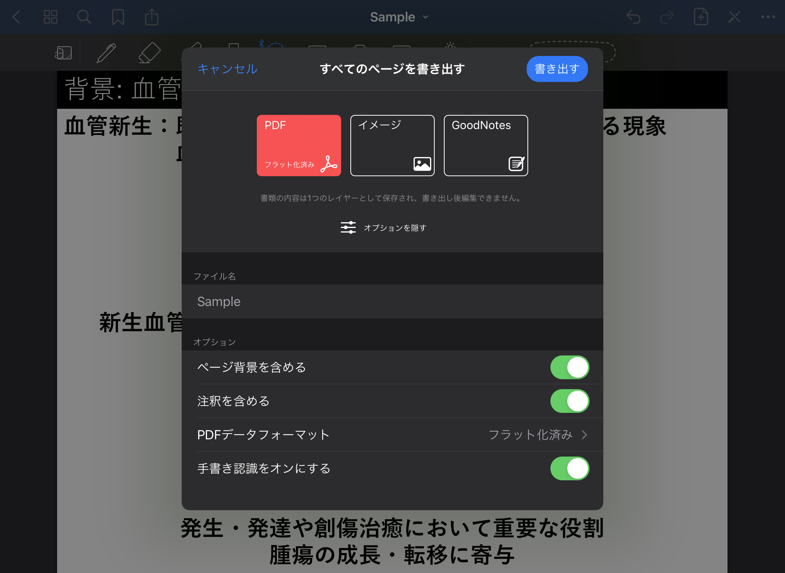
3. 書き出したファイルを保存または共有するためのアプリケーションを選択します．書き出したファイルは，Googleドライブに保存したり，Slackやメールで添付送信をしたりすることができます．本記事ではGoogle ドライブに保存する場合の手順を紹介します．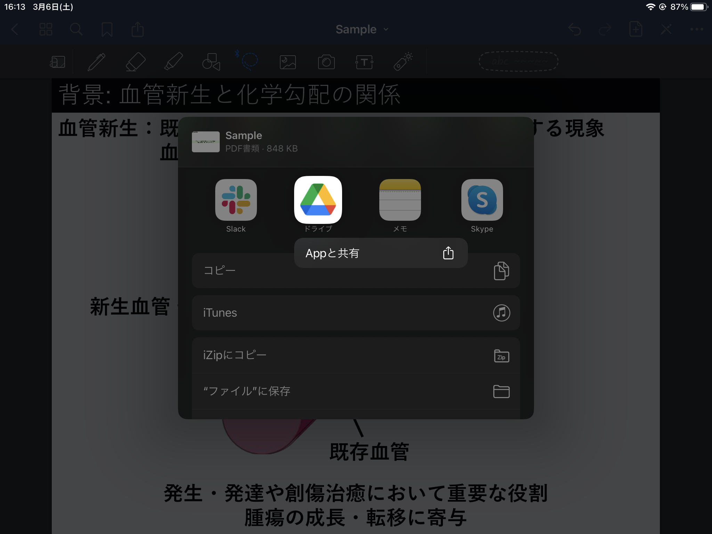
4. Googleドライブ内の保存先フォルダを指定して，「ここに保存」をタップします．
5. 「アップロード」をタップします．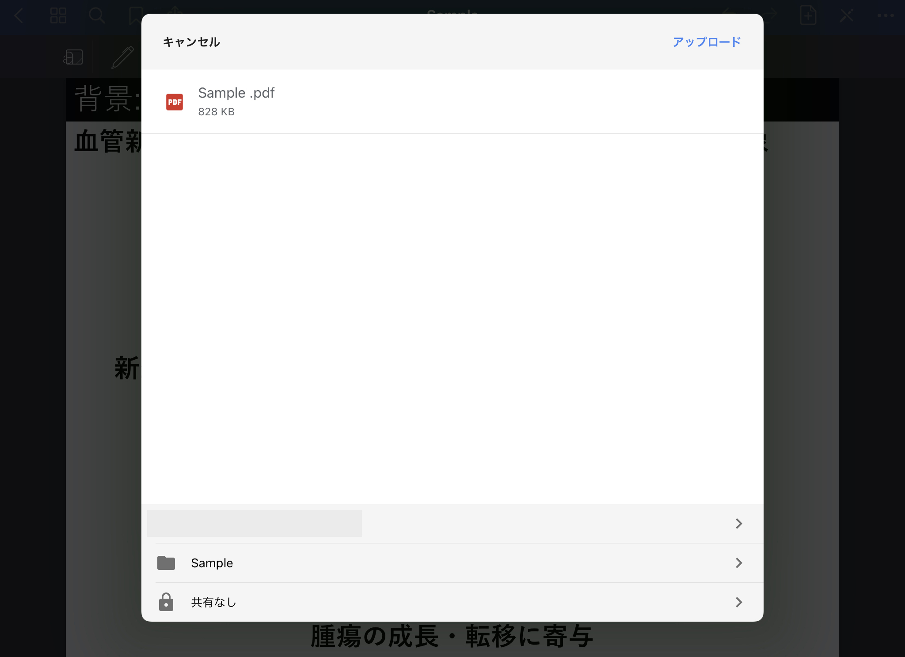
