このページでは，Googleフォームについての使い方をまとめています．また，東京大学で使う場合に想定される活用事例についてもまとめています．

## Googleフォームとは

フォームやアンケートを簡単に作成し，情報を収集することができるツールです．
以下のような特徴を持ちます．

* 簡単にフォームを作成できる
* フォームのテンプレートも用いることができる
* 収集した情報を，わかりやすく整理・分析することができる
* 全ての過程において，共同で作業できる

このページではフォームの作成・解答の基本的な流れや，フォームを編集する際の機能や設定について紹介します．なお手順についてはPCでの操作を前提としています．詳しい使い方や手順については，公式ヘルプを参照してください．  
Googleフォームは，ECCSクラウドメールのアカウント（東京大学のGoogleアカウント）で利用することができます．ECCSクラウドメールのアカウントで利用することで，フォームを学内構成員限定で公開することが可能となります．

## 活用できる場面

### アンケートフォームとしての活用

ここでは，Googleフォームをアンケートフォームとして使用する方法を紹介します．なお授業内でアンケートをとる場合，[UTOL](/utol/lecturers/surveys/)にも同様の機能があります．

使用する場面としては，授業の出席フォームのほか，イベントの参加登録，振り返りアンケートなどが考えられます．[メールアドレスを収集](#collect_email_addresses)することで，イベントの詳細情報などを回答者のメールアドレス宛に送ることができるようになります．

#### 出席フォームとしての活用

アンケートフォームを，教員が授業の出席フォームとしての使う場合，[UTOL](/utol/lecturers/attendances/)にも同様の機能があります．GoogleフォームとUTOLのそれぞれのメリットを以下に示します：

* Googleフォームを利用する際のメリットは以下が考えられます．
  * UTOLを利用するのが難しいと考えられる外部講師などを招く講義において，アンケート結果を共有しやすい
  * メールアドレスの収集をオフにすれば，匿名でアンケートを実施することができる
* UTOLを利用する際のメリットは以下が考えられます．
  * 遅刻登録の設定をすることができる
  * UTOLのログインに利用しているUTokyo Accountに基づいて個人を識別することができるので，回答者側に個人情報の入力を求める必要がない

### 小テストとしての活用

ここでは，Googleフォームを小テストで使用する方法を紹介します．

授業の理解度を確かめるような使い方（教員向け）が想定されます．授業の出欠フォーム同様，[UTOL](/utol/lecturers/quizzes/)にも同様の機能があります．GoogleフォームとUTOLのそれぞれのメリットを以下に示します：

* Googleフォームを利用する際のメリットは以下が考えられます．
  * 特別な設定をすることなく，講義の履修者以外（聴講生など）も回答することができる
  * フォームの中でファイルをアップロードできる
* UTOLを利用する際のメリットは以下が考えられます．
  * 制限時間，回答期限を設けられる
  * 履修者の回答状況をすぐに確認できる
  * 成績データをすぐにダウンロードできる

採点機能などを用いる場合は，後述の「[テストに関する設定](#テストに関する設定)」をご参照ください．

## フォームを作成する際の基本的な流れ

ここでは，フォームを作成する際の流れを紹介します．使い方に関する詳しい情報は，「[Google フォームの使い方](https://support.google.com/docs/answer/6281888?hl=ja&co=GENIE.Platform%3DDesktop)」（公式ヘルプ）やこのページの「[フォーム編集時の便利機能](#useful_features_for_form_editing)」より下の部分を確認してください．

フォームを作成する全体の流れは次のようになります．

* 手順1：[新規フォーム作成](#手順1新規フォーム作成)
* 手順2：[質問作成](#手順2質問作成)
* 手順3：[公開・共有](#手順3公開共有)
* 手順4：[回答の確認](#手順4回答の確認)

### 手順1：新規フォーム作成

1. [https://docs.google.com/forms/](https://docs.google.com/forms/)にアクセスしてください．
2. 『新しいフォームを作成』の中のテンプレートから，作成したいフォームを選択してください．

### 手順2：質問作成

フォームは，任意の個数の質問から構成されています．以下では，質問の作成方法を説明します．[フォームを編集する - Google ヘルプ](https://support.google.com/docs/answer/2839737?hl=ja&ref_topic=6063584&sjid=2142759939340137168-NC#zippy=)も適宜ご参照ください．

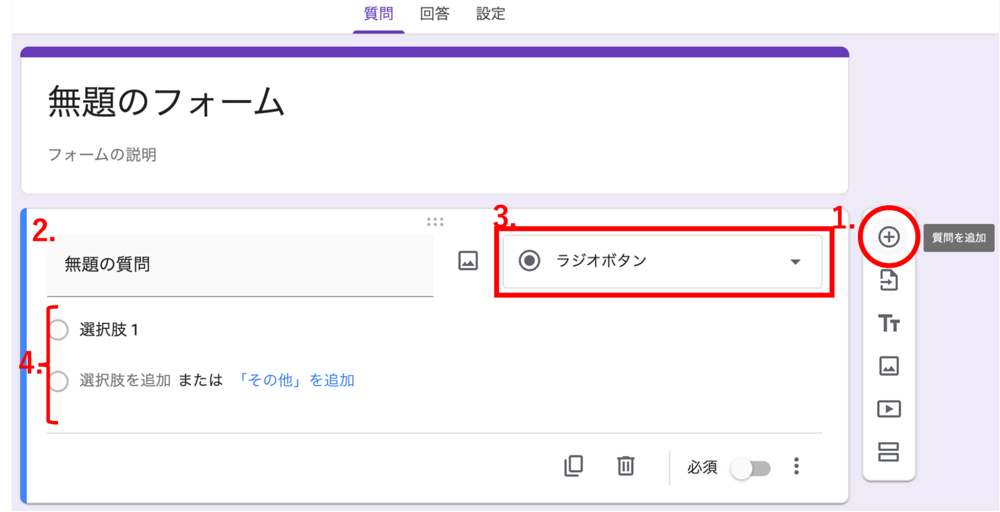{:.medium}
1. 「質問を追加」ボタンから質問を追加してください．
2. 質問の内容を記述してください．
3. 質問の形式を設定してください．
   * より具体的な方法は[フォームの質問の形式を選択する - Google ヘルプ](https://support.google.com/docs/answer/7322334?hl=ja&ref_topic=6063584&sjid=2142759939340137168-NC#zippy=)をご参照ください．
   * ファイルをアップロードするタイプの解答選択肢は，共有ドライブに置かれているフォームでは使えないことに注意してください．
4. 選択式の回答形式においては，選択肢の設定を行ってください．

### 手順3：公開・共有

作成したフォームを公開して他者が回答できるように共有したり，フォームを他者と共同で編集するように共有したりする手順を説明します．[フォームを公開して回答者と共有する - Google ヘルプ](https://support.google.com/docs/answer/2839588?hl=ja&ref_topic=6063592&sjid=18353895898968559699-NC)もご参照ください．

なお，テストとして利用する場合の設定や回答内容の記録に関する設定など，フォームを公開して回答してもらう前に行うべき設定もあります．必要に応じて下部「[フォームに関する設定](#form_settings)」も確認し設定してください．

#### フォームの公開

ページ右上の「公開」ボタンから，フォームを回答できる状態に公開することができます．

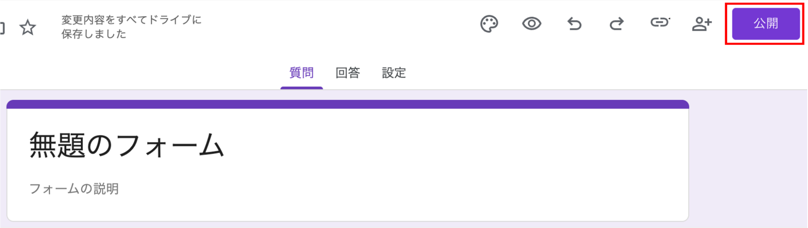{:.medium}

公開後は，「回答を受付中」のボタンから回答の受付を停止することができます．フォームを公開しただけでは，誰も回答することはできません．以下「[回答者への共有](#sharing_with_respondents)」を経て回答することができるようになります．

#### フォームの共有

フォームを共有する際，相手は[回答者](#sharing_with_respondents)と[編集者](#sharing_with_editors)の二つの立場が想定されます．そのため共有時の権限も，編集権限と回答権限の異なる2種類があり，回答者には回答権限を，編集者には編集権限を与えることになります．編集権限とは，フォームを編集することができる権限を指し，この権限があれば質問を編集したり回答を見たりすることができます．本来回答してほしい相手に編集権限を譲渡するリンクを共有してしまうと，回答するはずだった相手がフォームを編集することができるようになり収集した情報の漏洩につながるため，注意が必要です．

またフォームを共有する際，個人情報などの機密情報を収集するようなフォームにおいて「[結果の概要の表示](https://support.google.com/docs/answer/2839588?hl=ja#zippy=)」機能を利用していると，情報漏洩につながる可能性があるため，注意が必要です．  

編集者・回答者のそれぞれの「制限付き」「東京大学ECCSクラウドメール」などの権限が書かれているボタンを押すことで，フォームに回答することができる人の範囲を変更することができます．

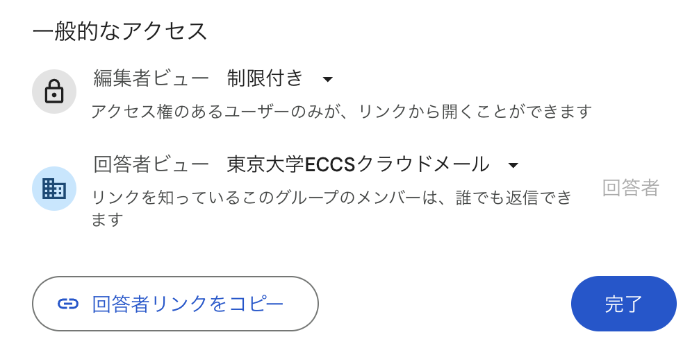{:.medium}

##### 回答者への共有
{:#sharing_with_respondents}

フォームに回答してもらうには，以下の手順で，回答用のリンクを共有する必要があります．

1. 右上のリンクアイコン（「回答者へのリンクをコピー」）を押してください．
2. 回答用リンクをコピーしてください．
   * 「URLを短縮」をオンにすることで，短いリンクとして共有することもできます．

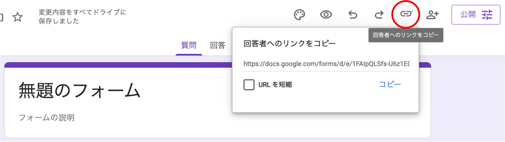

##### 編集者への共有
{:#sharing_with_editors}

フォームを編集するには，以下のいずれかの方法で編集権限を共有する必要があります．

* アクセスできるユーザーを直接入力する方法：共有したい相手のメールアドレスなどを入力することで共有できます．
* ブラウザのツールバーにあるURLをコピーして共有する方法：編集者の選択画面において，「リンクを知っている全員」もしくは「東京大学ECCSクラウドメール」に編集者ビューを許可しておく必要があります．

#### 公開範囲の管理

回答者の「管理」のボタンから，「リンクを知っている全員」もしくは「東京大学ECCSクラウドメール」に公開範囲を限定することができます．「東京大学ECCSクラウドメール」により，回答者を学内構成員に限定することができます．（この場合，学外者はリンクを知っていてもフォームに回答したり，フォームの質問を見たりすることはできません．）

## 手順4：回答の確認

ここでは，得られた回答を確認する方法を紹介します．

フォームを編集することができる「質問」タブを「回答」タブに切り替えると，質問ごとまたは個別の回答ごとに回答を確認することができます．また，結果に応じてグラフなどの可視化ツールを自動で用いることができます．

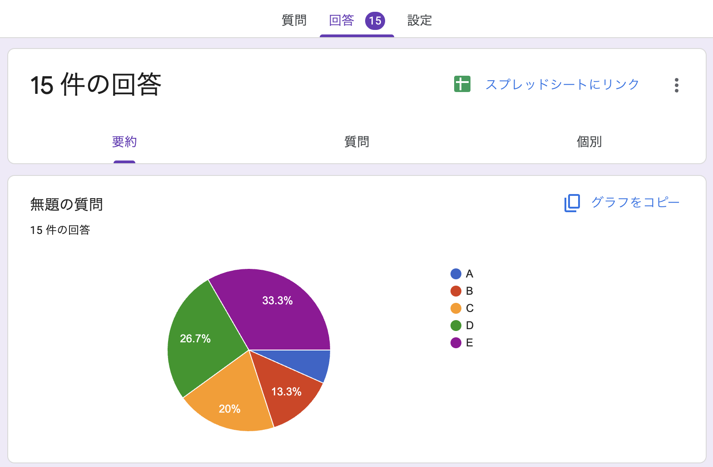{:.medium}

### スプレッドシートに出力する
得られた結果を，「スプレッドシートにリンク」のボタンからスプレッドシートに自動で出力されるように設定することもできます（すでに得られた回答もスプレッドシートに転記されます）．

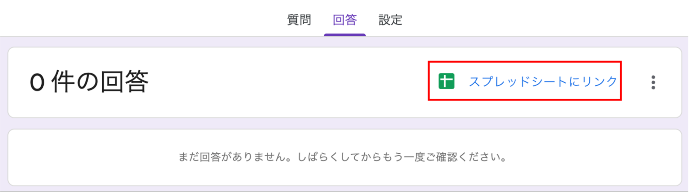{:.medium}

スプレッドシート内にある機能を用いて回答を管理したい場合に便利です．また，スプレッドシート上で出力される収集した回答は自由に編集することができます．

詳しくは，[フォームの回答の保存先を選択する - Googleヘルプ](https://support.google.com/docs/answer/2917686?hl=ja&ref_topic=6063592&sjid=18353895898968559699-NC)をご参照ください．

#### 回答の削除

一部または全部の回答を削除することができます．ただし，一度回答を削除すると，削除された回答を復元することはできないため，注意が必要です．また，回答を削除しても，リンクされているスプレッドシートからは削除されないので注意が必要です．

## フォームに回答する際の基本的な流れ

ここでは，回答者がGoogleフォームを利用してフォームに回答する際の流れを説明します．

## 回答する

フォームのオーナーが作成する「回答者へのリンク」にアクセスすることで，回答することができます．全ての必要事項を選択・入力し，「送信」ボタンを押すことで，回答が記録されます．

Googleアカウントにログインしたブラウザでは，入力途中の回答が下書きとして30日間自動で保存されます．ただし，これはネットにつながったオンラインの環境下で「フォームのオーナーが自動保存を無効にしていない」場合にのみ可能な機能です．

### 「アクセス権が必要です」と表示される場合

原因は，以下の二つが主に考えられます．詳しくは，[Google フォームを開く権限を取得する - Google ヘルプ](https://support.google.com/docs/answer/160166?sjid=9391686295985041241-NC)もご参照ください

* フォームを開く権限がない
  * 問題解決には，Google フォームを開く権限を取得する必要があります．
  * 任意でメッセージを入力し，「アクセス権をリクエスト」ボタンから権限をリクエストすると，フォームのオーナーに通知されます．
    * 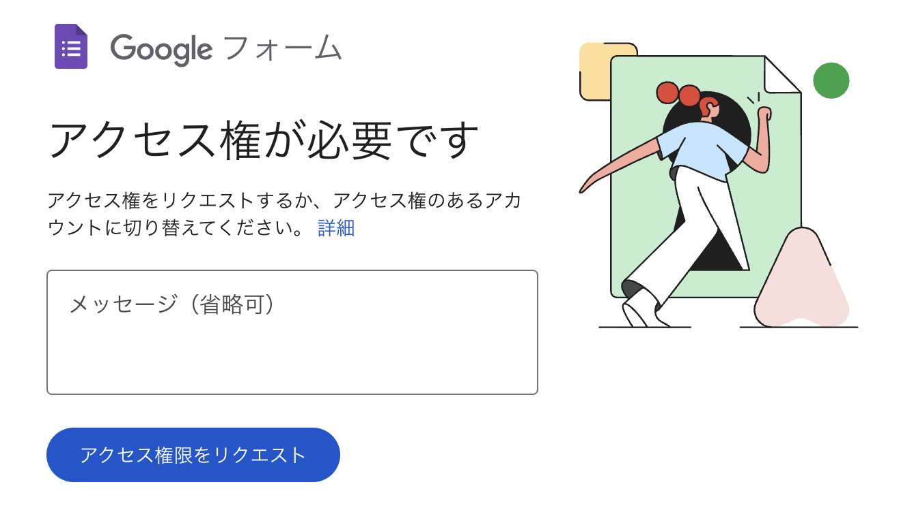{:.small}
* アクセス権がないGoogleアカウントにログインしている
  * 問題解決には，アクセス権を持つ別の Google アカウントにログインする必要があります．
  * 例えば，「東京大学ECCSクラウドメール」の範囲に限定して公開されているフォームに対しては，東京大学のアカウント以外でログインしていると上記のエラーとなってしまいます．

## フォーム編集時の便利機能
{:#useful_features_for_form_editing}

ここでは，フォームを編集しているときに便利な機能を説明します．  
下図中の数字は，以下の説明の番号と対応しています．  
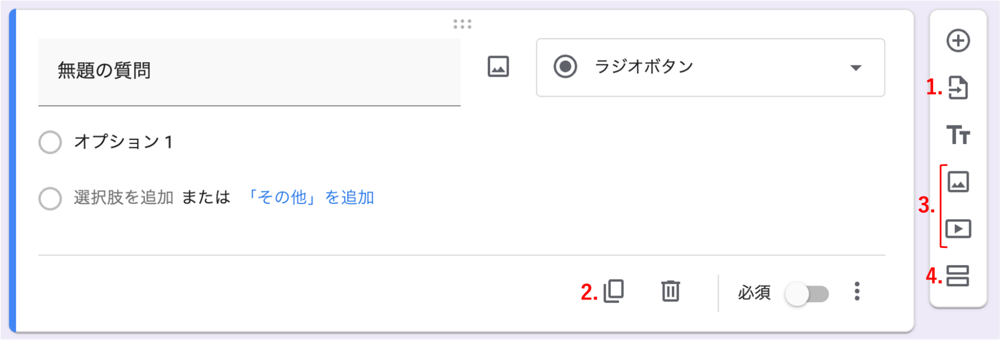

1. 質問のインポート  
   * 「質問のインポート」ボタンからは，他のフォームにおける質問を再利用することができます．ボタンからアクセスし，インポートしたいフォーム，インポートしたい質問の順に選択してください．似たようなフォームを作成する場合など，既に参考にすることができる質問がある場合に作成の手間を省くことができます．  
2. 質問の複製  
   * 「質問を複製」ボタンからは，作成した質問を複製することができます．複製することで，既に作成した質問と似たような質問を作成する際に，1から作り始める必要がなくなります．  
3. 画像，動画の挿入  
   * 「画像を追加」「動画を追加」ボタンからは，フォームに写真や動画を挿入することができます．質問の内容を画像や動画で補足する際に便利です．  
   * 類似の機能として，質問内や選択肢内に画像を挿入する機能もありますが，挿入する画像が質問や選択肢と直接関連するかどうかが異なります．こちらの画像挿入については，後述「[質問編集時の便利機能](#質問編集時の便利機能)の画像の挿入」をご参照ください．  
4. セクションの追加  
   * 「セクションの追加」ボタンからは，質問をセクションと呼ばれる単位に分割することで，別々のページに表示したり，これまでの質問の回答によって異なる質問をしたりすることができます．  
   * 質問の回答に応じたセクションの移動に関しては，後述「[質問編集時の便利機能](#質問編集時の便利機能)のセクションへの移動」をご参照ください．  
   * 作成したセクションは場所を移動したり複製して再度利用することが可能です．また，セクションの削除や結合，順序の移動も可能です．「セクションを削除」ではセクションに含まれる質問も削除されるため，区切りとしてのセクションを削除したい場合は「上と結合」を選択してください．

## 質問編集時の便利機能

ここでは，フォームの編集の中でも，特に質問を編集しているときに便利な機能を説明します．  
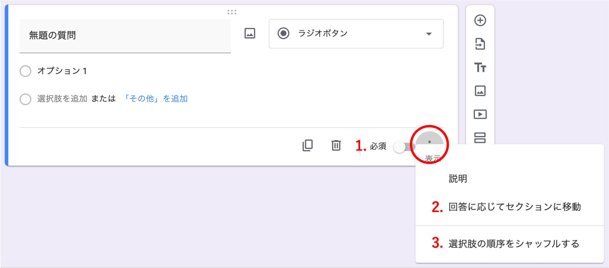

1. 質問への回答の必須化  
   * 質問の下部「必須」のトグルをオンにすると，該当する質問の回答を必須にすることができます．フォームの回答者は，必須となっている質問に回答せずには「フォームを送信する」または「次のページに進む」ことができないので，回答者から必ず取得したい回答は必須にしておくことが推奨されます．  
2. 選択肢の順序のシャッフル  
   * 「選択肢の順序をシャッフルする」ボタンからは，質問における選択肢の順序を，シャッフルすることができます．テストなどとして利用する際に，回答者によって異なる順番で選択肢を出すことなどが利点として考えられます．  
3. セクションへの移動  
   * 回答方法が選択式（ラジオボタン，プルダウン）である場合，「回答に応じてセクションに移動」ボタンから，回答に応じて移動するセクションを設定することができます．  
   * ある質問における回答に応じて異なる質問を用意している場合，回答に応じて自動的に異なる質問を表示させることができます．この場合，回答に応じて表示する質問はそれぞれ別のセクション内に作成しておく必要があります．  
   * 詳しい設定方法は「[回答に応じて質問を表示する](https://support.google.com/docs/answer/141062?hl=ja&ref_topic=6063584&sjid=13364979449790478673-NC) 」(公式ヘルプ)を参照してください．  
4. 回答の検証  
   * 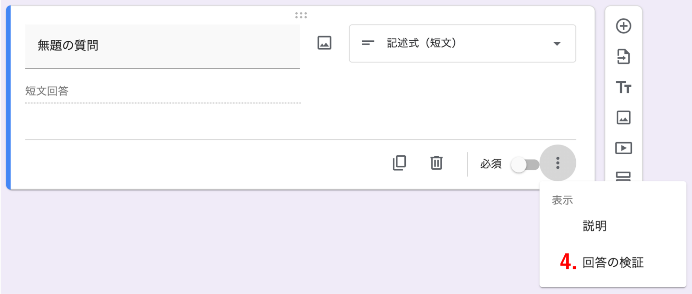 
   * 回答方法が記述を伴うもの，チェックボックス式である場合，「回答の検証」ボタンから回答の際のルール（「値が整数値でなければエラーを出力する」など）を設定することができます．  
   * 集まった回答を用いて処理する場合などには，書式が揃っている方が管理しやすいことが多いです．例えば，年齢を聞く質問において，「半角算用数字」を要求しておけば，漢数字や全角数字での回答はできないので，回答を管理しやすくなることが期待できます．  
5. 画像の挿入  
   * 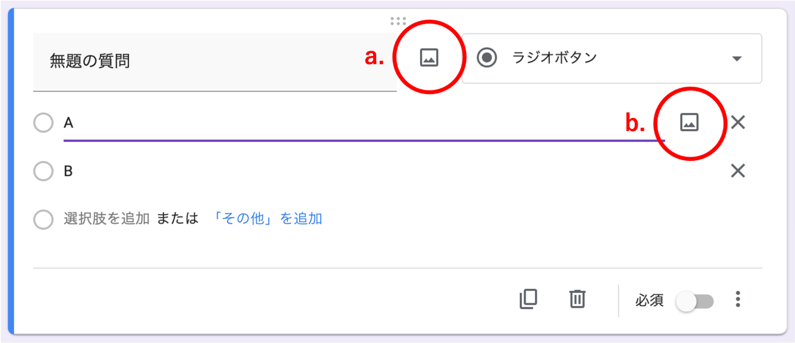  
   * 質問の内容を補足するために，質問文の右側のボタン（a.）からは質問文に，選択肢の右のボタン（b.）からは選択肢に画像を添付することができます．  
   * 実際に画像を挿入すると，回答画面は以下のように表示されます．質問文の横から挿入した画像は質問文の下に，選択肢の横から挿入した画像は選択肢の上に表示されます．  
   * 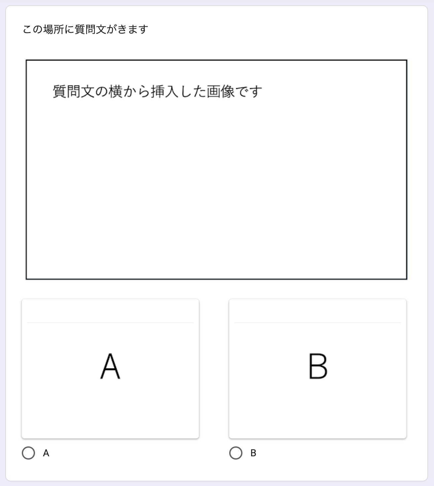

## フォームに関する設定
{:#form_settings}

ここでは，フォームに関して設定できるものを紹介します．  
「設定」タブに切り替えると，テストに関する設定や回答・質問に関する設定を行うことができます．

## テストに関する設定
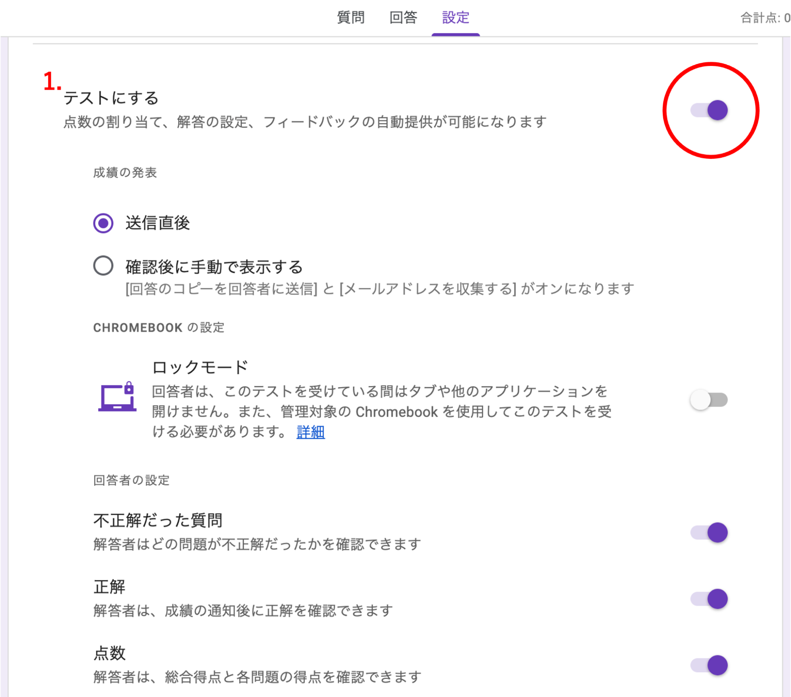

1. テストとして利用する
   * 小テストなどにGoogleフォームを利用したいときは，設定タブの「テストにする」をオンにすることで，テストとして利用することができます．テスト機能を用いることで，各々の質問に対し配点と模範解答を設定し，それに基づいた成績を回答者に知らせる採点機能を利用することができるようになります．
   * 回答後すぐに採点を行うかなどの採点のタイミング・結果の共有の方法などは場合に応じて選択することができます．
   * その他，適宜以下のサイトをご確認ください．
      * [Googleフォームでテストを作成，採点する](https://support.google.com/docs/answer/7032287?hl=ja&ref_topic=6063584&sjid=2142759939340137168-NC#zippy=)
      * [Googleフォームで小テストやアンケートを実施する](/articles/google-form/)

### 回答に関する設定

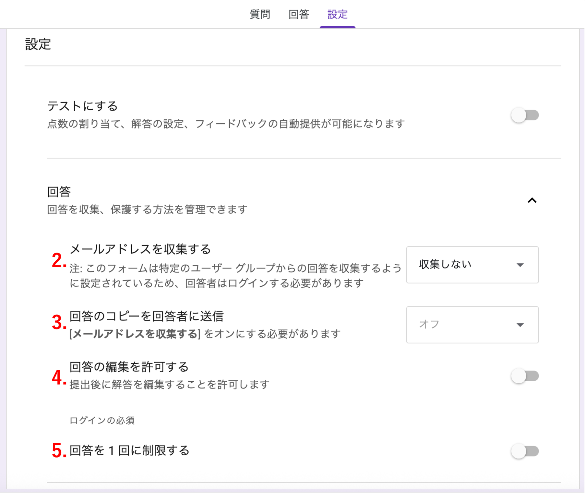

2. メールアドレスの収集
   * 「メールアドレスを収集する」を選択すると，回答者のメールアドレスを収集できます．「確認済み」を選択すると自動で，「回答者からの入力」を選択すると回答者の入力により収集することができます．メールアドレスの収集により，回答者の連絡先を入手することができるほか，回答のコピーを回答者に送信することができます．
   * 「確認済み」を選択する場合，回答者はGoogleアカウントでログインした状態でフォームに回答する必要があり，ログインしていない状態ではログインが求められます．「回答者からの入力」を選択する場合は，ログインの必要はありません．
3. 回答のコピーの送信
   * 「回答のコピーを回答者に送信」を選択すると，回答者自身の回答が，入力された（収集された）メールアドレス宛に送信されます．回答者としては自分の回答内容を確認することができます．「常に表示」を選択すれば回答者の意思に関わらず回答を送信することになります．
4. 回答の編集
   * 「回答の編集を許可する」をオンにすると，回答者が回答を送信した後でも，回答送信後の画面に表示されるリンクにアクセスすると，送信した回答を編集することができるようになります．ただし，編集することができるのは「回答の受付を終了」するまでです．
5. 回答回数の制限
   * 「回答を1回に制限する」をオンにすると，同一のGoogle アカウントからの回答を1回に制限することができます．これをオンにすると，既にフォームに回答したことがある人が回答しようとした場合，既に回答済みである旨が表示されます．ただし同じ人であっても，前の回答で用いたGoogleアカウントとは別のアカウントを利用している場合は，回答できてしまうことに注意が必要です．
   * 回答者は，Googleアカウントでログインした状態でフォームに回答する必要があります．

### 質問の表示に関する設定

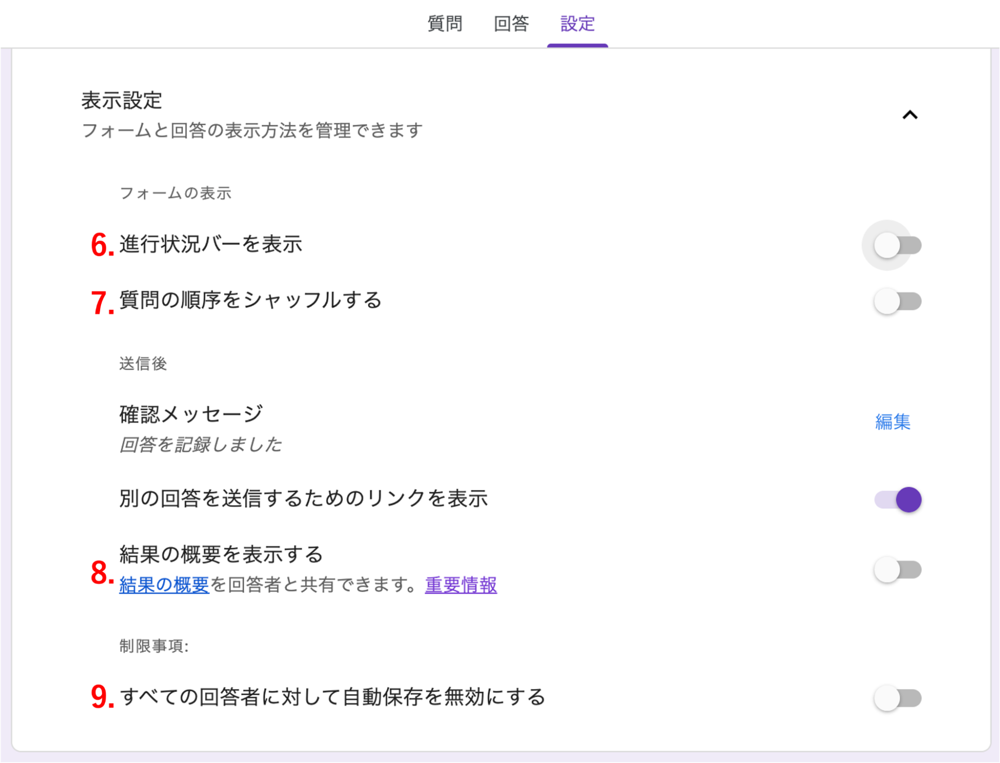

6. 進行状況バーを表示  
   * 「進行状況バーを表示」をオンにすることで，回答箇所が何セクション目なのかを視覚的に表示させることができます．  
7. 質問のシャッフル  
   * 「質問の順序をシャッフルする」をオンにすることにより，テストなどとして利用する際に，質問を回答者によって異なる順序で表示することができます．シャッフルされるのは、同一セクション内の質問に限ります．  
   * 記録された回答を編集者として確認するときには，元の順番通りとなります．  
8. 結果の概要の表示  
   * 「結果の概要を表示する」をオンにすると，すでに収集されている回答を，フォームの回答が終わった人に対して共有することができます．  
   * この機能は，組織内でのアンケート結果を共有する際などには便利ですが，個人情報を収集するようなフォームにおいて用いると情報漏洩につながる可能性があるため，注意が必要です．  
9. 回答の自動保存  
   * デフォルトでは，Googleフォームに回答する際にその下書きは30日間自動で保存されます．  
   * 「すべての回答者に対して自動保存を無効にする」をオンにすると，自動保存が無効化されます．  
   * 詳しくは，[Google フォームに入力途中の回答を自動保存する - Google ヘルプ](https://support.google.com/docs/answer/10952360?sjid=9391686295985041241-NC)もご参照ください
