## この記事のハイライト

この記事では，Google フォームを用いた小テストやアンケートの作成について紹介しています.
* こんな場面で使用できます
  * オンライン授業で小テストや授業アンケートを実施したい
  * 小テストの採点が大変なので，自動採点を導入して時間を節約したい
  * 出席やリアクションペーパー（ミニッツペーパー）として活用したい
  * オンラインでのテストの公平性を保ちたい
* こんなことはできません
  * デザインの凝ったカスタマイズ（幅の調整や見出しフォントの変更など）は難しい
  * 自由回答などの長い記述式の問題の場合，自動採点には向かない
  * 同時に大人数がアクセスすると，動作が重くなったりログインができないことがある（100人規模の講義などではフォームURLを分けるなどの対応次第で導入が可能です）

## アプリケーションについての説明

Googleフォームは，Googleが提供しているツールで，アンケートや投票，小テストを簡単に作ることができるアプリです.

- 提供元：Google
- 使用可能な環境
    - 端末・OS： Googleアカウントが使用できればPC，スマホ，タブレットなど可
    - インストールに必要なドライブ容量：0バイト（Googleアカウントがあれば，専用のアプリをインストールせずにブラウザから使用可能です）
- 運用コスト
    - 費用：ECCSクラウドメールのアカウントの場合は，100GBまで無料で使用可能です．
    - 授業を受ける学生側が準備すること：配布されたURLからアクセスするだけ（ファイルのアップロードが必要な場合にはGoogleアカウントにログインしている必要があります）

## 起動方法

Googleアカウント（ECCSクラウドメールのアカウント）にログインしていれば，ブラウザから使用可能です（以下，ECCSクラウドメールのアカウントにログインしている前提で説明します）．

※ECCSクラウドメールのアカウントの利用方法は，「[ECCSクラウドメール](/google/)」の「利用開始の手順」を確認してください．

Googleの画面から右上の赤丸のアイコンをクリックし，「Forms」をクリックすることで起動できます.

<figure>

</figure>

## 基本的な利用方法（テスト編）

ここでは小テストを作成するという想定の下，基本的な作成方法を紹介します.

### 作成ステップ

#### Google フォームを開く

「新しいフォームの作成」欄にある，1番左の「空白」をクリックします.

<figure>

</figure>

クリック後は以下のような画面になります.

<figure>
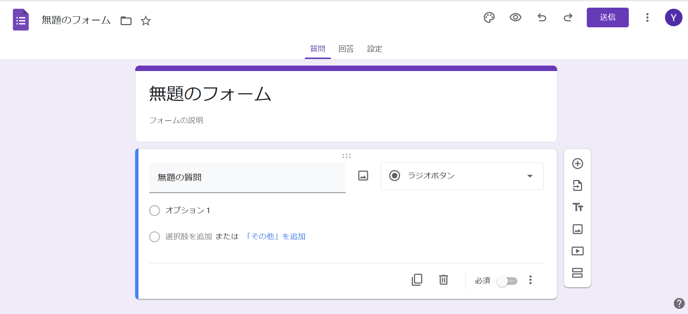
</figure>

#### テストに設定する

上部のバーの右端の「設定」をクリックし，「テストにする」の設定をONにします.「テストにする」設定にすると，自動採点（作成ステップ⑤参照）が可能です．オプション設定で成績開示の方法などを設定することも可能です． 

<figure>
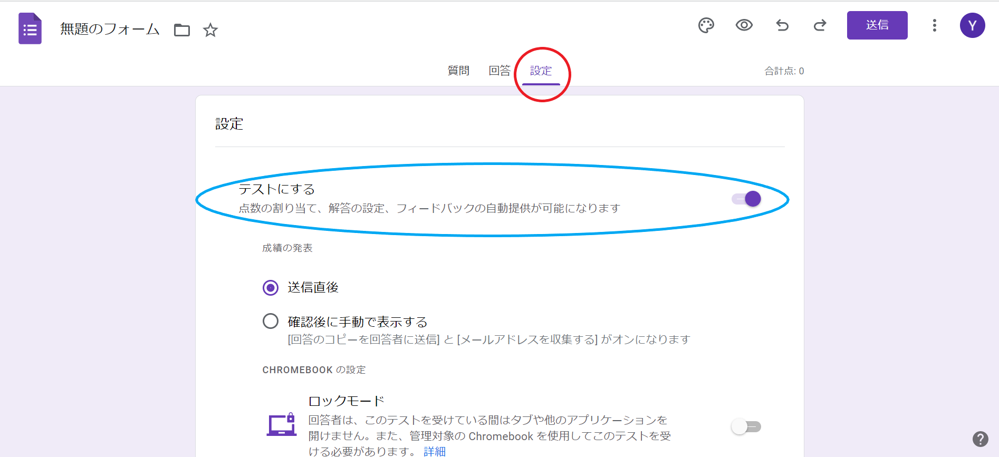
</figure>

#### 問題を作成する

##### 択一式の問題を作りたい: 「ラジオボタン」を活用する

設問フォームの右側の下⽮印のアイコン（下図赤丸）をクリックし，「ラジオボタン」を選択します．下図の緑の枠内に問題を，⽔⾊の枠の部分に解答の選択肢を⼊⼒します. 

<figure>

</figure>

下図右下の⾚丸で囲われたアイコン「︙」から，「選択肢の順序をシャッフルする」こともできます.

<figure>

</figure>

※これらは自動採点することが可能です．詳細は「[④の自動採点を適用する](#apply-automatic-scoring)」をご覧ください．

##### 複数選択可能な問題を作りたい: 「チェックボックス」を活用する

右側の下⽮印のアイコン（下図赤丸）から「チェックボックス」を選ぶと選択肢の複数選択が可能になります．

問題や解答の選択肢の入力方法はラジオボタンと同様です.

もちろん選択肢のシャッフルも可能です.

※これらは自動採点することが可能です．詳細は「[④の自動採点を適用する](#apply-automatic-scoring)」をご覧ください．

##### 短い記述の問題（計算問題，語句の問題など）を作りたい: 「記述式」を活用する

右側の下⽮印のアイコン（下図⾚丸）から「記述式」を選択します. 

下図の緑の枠内に問題を⼊⼒します

<figure>

</figure>

##### 長い記述の問題を作りたい: 「段落」を活用する

右側の下⽮印のアイコン（上図赤丸）から「段落」を選択します

途中で回答が消えてしまったなどのミスを避けるために，学生には自分のPC上のファイルなど他の場所に1度入力してからコピペをすることをすすめると良いようです（詳しくは[グッドプラクティス（四本先生）](/good-practice/interview/yotsumoto)を参照してください）．

なお，段落を用いた設問では自動採点機能（後述）を使用できません．

#### 自動採点を適用する
{:#apply-automatic-scoring}

Google フォームでは事前に模範解答を入力しておくことで自動採点ができる機能があります．段落問題（長い記述式などの問題）には使用できませんが，選択式や記述式（短い用語・計算問題）で自動採点機能を適用すると便利です.

左下の「解答集を作成」をクリックします.

<figure>

</figure>

正答を選択・記入して配点を設定します.　

<figure>
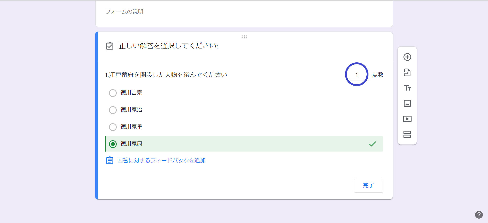
</figure>

「回答に対するフィードバックを追加」から，文章やリンク，動画にて問題の解説を加えることもできます.

<figure>
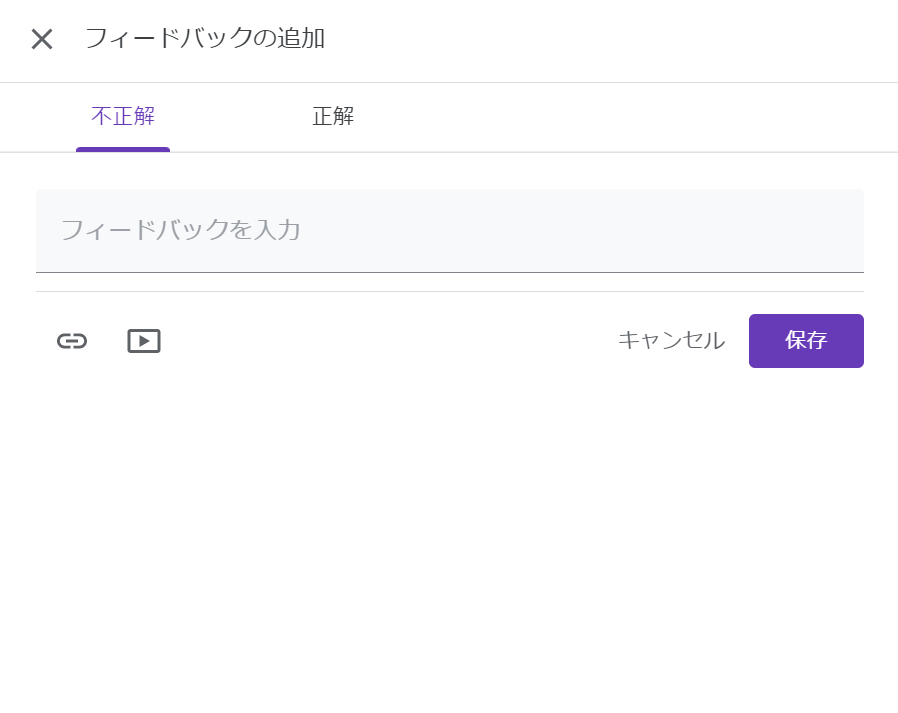
</figure>

上のバーの「設定」(下図赤丸)をクリックし，「成績の発表」のタイミングや「回答者の設定」から回答者が確認できる情報を設定することもできます．

<figure>
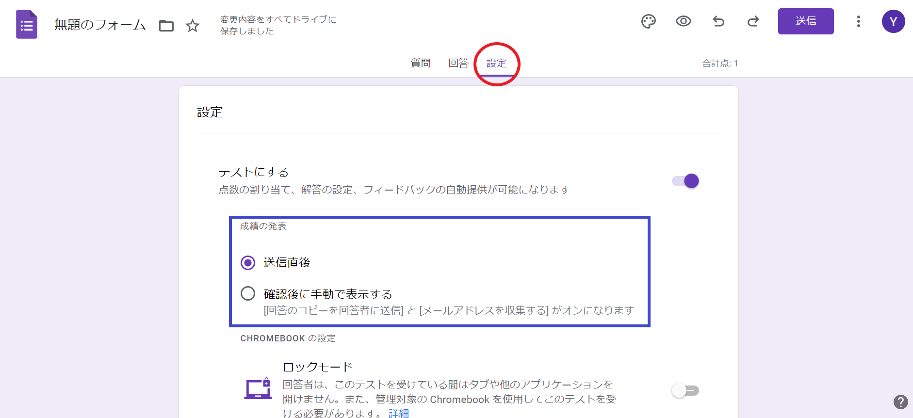
</figure>

#### 問題／セクションを追加する

設問を増やしたい時は，右の丸十字ボタンのアイコン(下図水色の丸)をクリックすると，新たに質問項目が増やせます．大問を増やしたい時は四角2つのアイコン(下図緑の丸)のボタンをクリックすると，新たにセクション追加できます．
<figure>
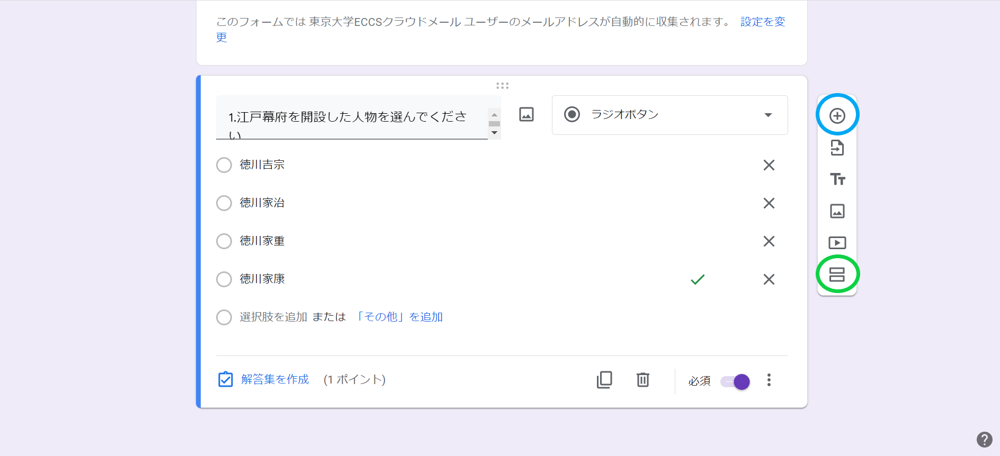
</figure>

上のバーの「設定」をクリックし，「プレゼンテーション」から「質問の順序をシャッフルする」をオンにすることで，テスト問題自体をシャッフルすることもできます（不正防止の手段として，テスト問題のシャッフルは有効です）．

<figure>
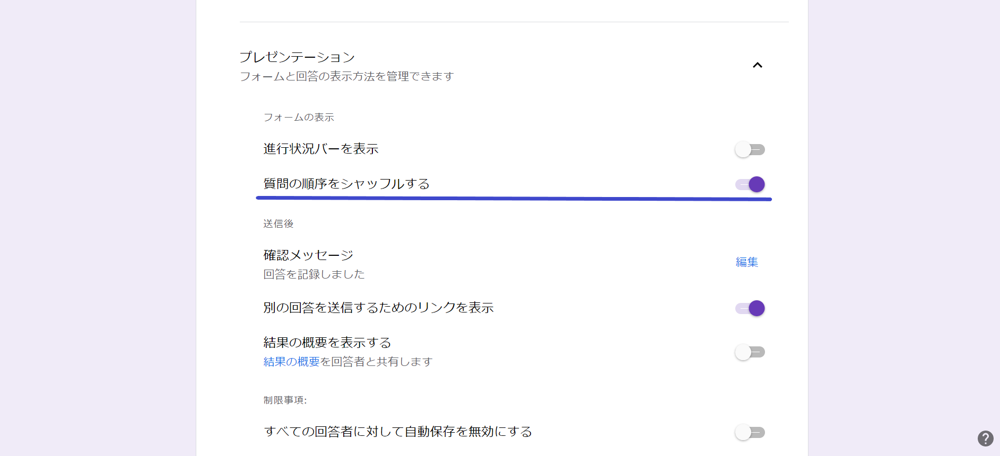
</figure>

#### 公開設定をする

公開設定をすることで，答案を提出できるユーザを学内構成員に限定したり，学生が答案提出後に自分の回答を確認できるようにすることができます．
設定を行わない場合は，この手順は飛ばして構いません．

##### フォームの回答者を学内構成員（ECCSクラウドメールのアカウント保有者）のみに制限したい場合

1. 上のバーの「設定」をクリックし，「回答」を開きます．
2. 「東京大学ECCSクラウドメールと信頼できる組織のユーザーに限定する」がオンになっていることを確認します.なお「メールアドレスを収集する」を選択しておくと，回答者のECCSメールアドレスが自動的に記録されます．

<figure>
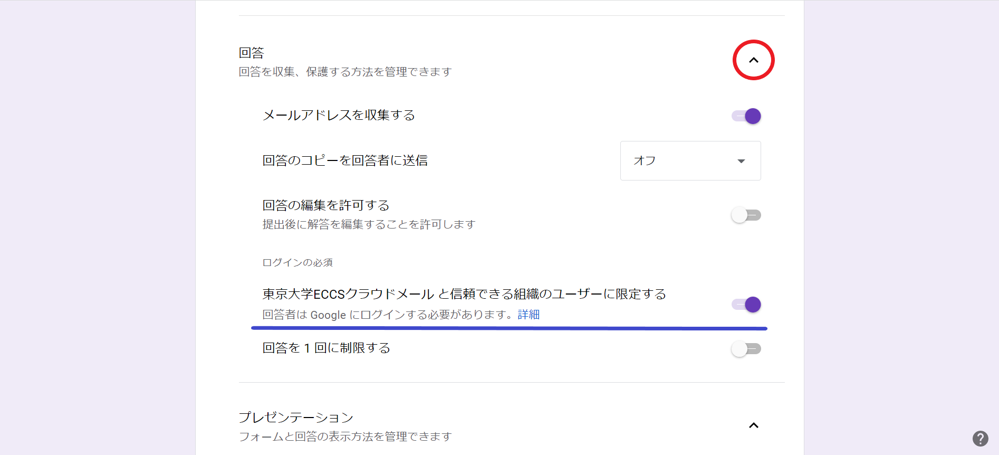
</figure>

##### 学生が答案提出後自分の回答を確認できるようにしたい場合

上のバーの「設定」をクリックし，「回答」から「メールアドレスを収集する」をオンに，「回答のコピーを回答者に送信」を「常に表示」に設定します.

<figure>
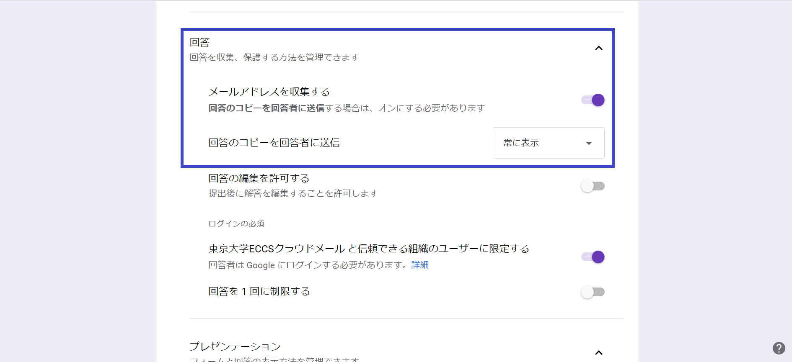
</figure>

### 実施ステップ

#### 共有前に作成した小テストを確認する

右側の⽬のマークのアイコン（下図赤丸）をクリックして，共有するテストを確認します.

<figure>

</figure>

#### 完成したGoogle フォームを共有する

右側の「送信」をクリックし，下図の⻘丸で囲まれたリンクマークをクリックするとリンクが出てきます. このリンクを「コピー」し，ITC-LMSやZoomのチャット欄にペーストして共有します.

大人数の授業の場合には1つのフォームにアクセスが集中すると動作しなくなる可能性があるため，同一のフォームを複数作成，共有して回答をばらけさせるという対策が有効です（350人参加の授業において，3つのフォームを使ってテストを実施した事例があります．詳細は[四本裕子先生のグッドプラクティス](/good-practice/interview/yotsumoto)を参照してください）．

<figure>
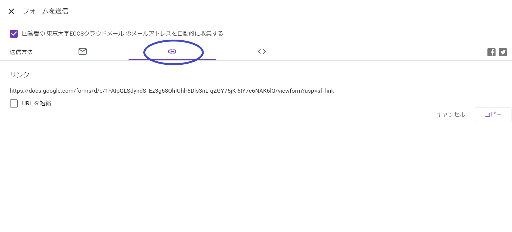
</figure>

注意：紛らわしいものとして，送信横の︙を押すと出てくる，「共同編集者を追加」という機能があります．こちらは，該当するフォームの問題作成をできる人を増やしたり，回答結果を確認できる人（つまり，フォームの作成者と同様の編集をできる人）を増やすための設定です．こちらの「リンクの取得」は，フォームの編集（回答はできない）のためのものなので注意してください．

#### テストを終了する

<figure>

</figure>

制限時間が終了したら，上図赤丸の「回答」をクリックし，「回答を受付中」をオフにすることで回答を終了することができます．

試験の終了時間ぴったりに回答を終了してしまうと，通信の混雑状況によっては試験時間内に回答を送信しても0点になってしまう学生が出てしまう可能性があるため，配慮が必要です．
（詳しくは下記の「実際の運用におけるtips」を参照）

### 確認ステップ

下図赤丸の「回答」をクリックすると，回答が表示されます.

①概要：回答が要約されて示されます.

②質問：問題ごとに詳細な回答が確認できます.

③個別：回答者ごとに回答を確認できます.

回答はスプレッドシートのマーク（下図オレンジ丸）のマークをクリックすることで対応するスプレッドシートが自動で生成sされ，表形式で確認・ダウンロードすることも可能です.

<figure>

</figure>

## 基本的な利用方法（アンケート編）

基本的な利⽤⽅法 （テスト編）の作成ステップ「テストに設定する」でテストの設定をOFFにすれば，アンケートフォームとしての使用が可能です（リアクションペーパーや出席確認としても使用可）．アンケートで使用する場合には，5段階評定が作成できるマトリックス式の設問も便利です．

マトリックス式の設問は次の手順で作成できます．

1. 右側の下⽮印のアイコン（下図⾚丸） をクリックして「選択式（グリッド）」を選びます．
2. 行に質問項目，列に選択肢を記入します.

<figure>
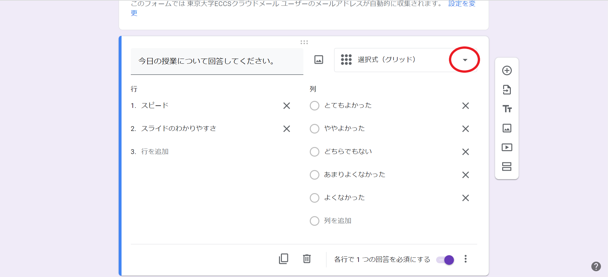
</figure>

## 基本的な利用方法（その他）

* フォームを用いて，教員の問いかけに対する学生の回答をリアルタイムで集めて，その回答が集約されたシートを共有することで，即時に学習者のコメントを全員に共有することができ，授業の双方向性を促すことができます．
* ミニッツペーパーなど，授業に関する質問・感想を書いてもらう使い方もあります．
* また，出席確認を兼ねて，授業中に行う簡単な問題の回答をGoogle フォームに提出する使い方もあります．
* 学生が行ったプレゼンテーションやグループワークの成果物などに対して，相互評価 (Peer Assessment) を行うためのツールとして用いることも可能です（出典：[オンライン授業情報交換会 第6回](/events/luncheon/2020-05-20/)）．

    その際，ルーブリックの技法を活用することをお薦めします．→ [東大FD](https://www.utokyofd.com/en/?mov=kn-40)

## 実際の運用におけるtips

・[大槻久 先生　適応行動論](/good-practice/interview/ohtsuki) ([オンライン授業情報交換会 #26](/events/luncheon/2021-01-15/))

大槻先生の授業は，600人を越える学生が受講した大人数講義でした．Google フォームを用いた小テストを，授業中に計2回実施されています．その際に共有いただいたtips（ポイント）をご紹介します．

### Tip 1：テストURLは複数に分ける

数百人のアクセスが同時に1つのフォームのURLに集中すると，フォームが動作しなくなる事が報告されています．そのため同一の問題が載った3つのURLを用意し，学生各自に回答先を選んでもらうことで，分散させて実施するという方法を取られたそうです．

### Tip 2：事前に練習も兼ねて学生とテストする

不測の事態に備えて，テストより前に，Google フォームを用いてアンケートに答えてもらうことで動作確認を行われていました．

### Tip 3：公平性は担保する

対策を講じてもアクセスできない学生が出るなどの問題は起こりえます．そこで追試に関する規則を設けるなどして，授業評価の公平性を担保されていました．
