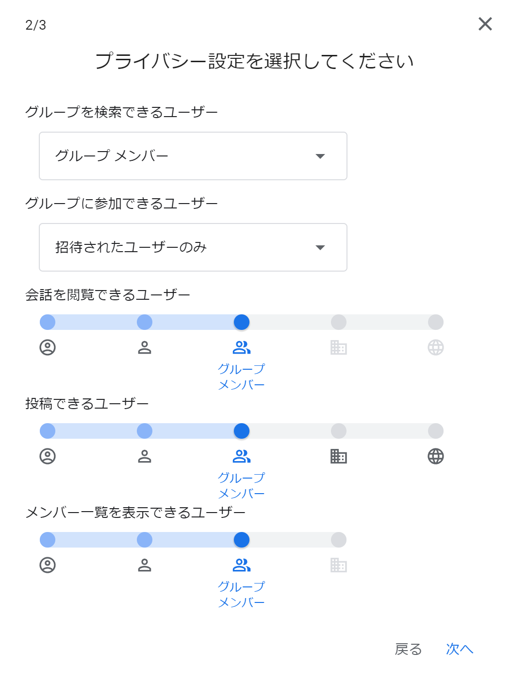

## この記事のハイライト
ここの記事では，Google グループの基本的な使い方について紹介します．

### ツールの使い所
* ゼミなどの少人数授業において
    * 資料共有を楽に行いたい.
    * 連絡をメールベースで楽に行いたい.
    * グループ単位での予定管理をしたい.
* その他
    * 例えばslackなどを使っていてメールが埋もれてしまいがちな時、重要な連絡のみメールで送ることで、メッセージを埋もれさせないようにする.

### ツールの強み
* ECCSのメールアドレスだけで使えるので，操作・管理が楽である.
* LINEグループなどに比べて，オフィシャルにも使いやすい.
* Google ドライブやGoogle カレンダーなど，他のGoogle Workspaceと連携しやすい.

## Google グループとは

### ツールについての説明
Google グループ（Google Groups）はGoogleの無料サービスの1つで，共通の話題について話し合う場を提供します．メーリングリストを作成してグループのメンバー全員に一斉にメールを送信することができるなど，グループでの活動に便利な機能を有しています．学内のメンバー同士で利用する場合は，東京大学のGoogleアカウント（ECCSクラウドメール）を使うことを推奨します．

### 東京大学のGoogle アカウント（ECCSクラウドメールアカウント）について
東京大学のGoogle アカウント（ECCSクラウドメールのアカウント）は東大が契約しているアカウントであり，一般の無料アカウントとは以下のような違いがあります．

* 一般のGoogle アカウントで作成されたGoogle グループのメールアドレスのドメイン名は **@googlegroups.com**です．
* ECCSクラウドメールアカウントで作成されたGoogle グループのメールアドレスのドメイン名は **@g.ecc.u-tokyo.ac.jp**です．
* ECCSクラウドメールアカウントで作成されたGoogle グループでは，各設定において「組織」つまり ECCS クラウドメールの利用者に限定することができます．
* グループとしての基本的な機能においては，2種類のアカウントでは違いはありません．

* 更に詳細な違いについて知りたい方は以下の記事を参考にしてください．  
[[FAQ: よくある質問] 【ECCSクラウドメール】Google グループの利用について](https://www.ecc.u-tokyo.ac.jp/announcement/2016/09/14_2311.html)

* 東大のアカウントを取得していない方は以下の記事を参考にしてください．  
[ECCSクラウドメール  (Google Workspace)](/eccs_cloud_email)

以下，本記事では東大のアカウントでのログインを想定して説明します．

### 起動方法と操作方法
Webブラウザから使う時は，Googleのページでログインします．

ログインした状態でGoogleのサイトの右上の3x3のマスが並んだアイコンをクリックして，「グループ」を見つけて選択します．すると以下の画面が表示されます．もし見つからない場合は，以下のリンクをクリックして下さい．
[Google グループ](https://groups.google.com/forum/m/)

#### マイグループ
{:#mygroup}

自身が所属しているGoogle グループが表示されます．

数字をつけたアイコンには、それぞれ以下の機能があります．  
**①グループの作成**  
**②グループの登録設定の変更**  
**③グループメンバーの追加**  
**④グループの退出**  
**⑤お気に入りグループの登録**  
**⑥グループの設定**

以下，アイコンごとの具体的な機能を説明します．

**①グループの作成**
* ここをクリックすると新規のGoogle グループを作成することができます．詳しくは[こちら](#create)をご覧ください．

**②グループの登録設定の変更**
* メール配信の仕方を以下の中から選択し，設定できます．
    * **メッセージごとにメール**：グループにメッセージが投稿されるたびに，そのメッセージがメールで配信されます．
    * **ダイジェスト**：最大 25 件のメッセージが 1 通のメールにまとめられ，毎日配信されます．
    * **要約**：最大 150 件のメッセージの要旨が 1 通のメールにまとめられ，毎日配信されます．
    * **メールなし**：グループからのメールは届きません．

詳しくはこちらのリンクをご覧ください．  
[メール配信と全体設定を管理する - Google グループ ヘルプ](https://support.google.com/groups/answer/9792489?hl=ja)

**③グループメンバーの追加**
* このアイコンが表示されていればメンバーを追加することができます．

**④グループの退出**
* 登録されているグループから自分自身を除くことができます。クリックすると一度退出するか確認されますが，退出を選択すると登録が解除されます．

**⑤お気に入りグループの登録**
* お気に入りに登録することで，画面左側の「お気に入りのグループ」リンクから探すことができるようになります．

**⑥グループの設定**
* このアイコンが表示されるのはグループのオーナーとマネージャーのみです．
* グループ名や説明の編集，プライバシー設定の変更，投稿設定の変更等が可能です．

#### すべてのグループ
自身が所属可能な組織内のすべてのグループが表示されます．ただし，アクセスするためにはそのグループのオーナーまたはマネージャーの許可が必要な場合があります．

## グループの作成方法
{:#create}
グループを作成する際の具体的な手順を説明します．

（手順1）「グループ作成」ボタンを押し、入力欄にグループの情報を入れる
* グループ名やグループメールのアドレス，グループの説明を記入します．
* グループメールとはグループメンバーのメールアドレスを統合したアドレスと考えてください．このアドレス宛てにメールを送るとグループメンバー全員にメールを送ることができます．
* グループメールのドメイン名（＠以下）は組織のもの（**@g.ecc.u-tokyo.ac.jp**）と一般のもの（**@googlegroups.com**）が選べます．

（手順2）プライバシー設定を選択する
* 「投稿できるユーザー」を「グループのマネージャー」のみにするか，「グループメンバー」全員にするか，「組織全体」にするかなど，プライバシー設定を細かく設定できます．設定にあたっては，関係者以外が不必要に内部情報にアクセスできる状態にならないよう，ご注意ください．
* 例えば，外部からの問い合わせに対応するグループを作成し，「投稿できるユーザー」を「組織全体」にした場合でも，「メンバー一覧を表示できるユーザー」は「グループメンバー」のみに限定するなど，設定範囲は必要最小限にすることを推奨します．
* こちらのリンクもご参照ください．  
    [【ECCSクラウドメール】Google グループの利用について](https://www.ecc.u-tokyo.ac.jp/announcement/2016/09/14_2311.html)

（手順3）メンバーを追加する
* グループの管理的な役割を割り当てたい人がいれば，「グループのオーナー」或いは「グループのマネージャー」の欄に，その人のメールアドレスを記入してください．
* 「登録」という項目ではメール配信の仕方を設定できます．詳しくは[こちら](#mygroup)の項目をご覧ください．

## メーリングリストの使用方法
実際にメーリングリストを使用する場合、手順は以下のようになります．

（手順1）グループを作成する、またはグループに参加する
* グループを作成する場合は，上の[グループの作成方法](#create)を参考にしてください．
* グループに参加する場合は，基本的には管理者にメールアドレスを伝え，招待してもらう形になります．自分が参加したいグループを「すべてのグループ」から検索することもできますが，設定によっては参加のリクエストができないのでご注意ください．

（手順2）会話を始める（メールを送る）
会話を始めるにあたって，Google グループのウェブページからの場合とメールアプリからの場合があります．

* ウェブぺージからの場合

「マイグループ」の中から，会話を始めたいグループを選択した後，「新しい会話」ボタンを押すと，メール作成画面が表示されます．宛先は自動でグループ宛てになっており，送信後，会話は掲示板の一覧に新しく表示されます．

* メールアプリからの場合  
パソコンからでもスマートフォンからでも，メールの宛先をグループのアドレスにすることでグループメンバー全員にメールを送ることができます．ただし，Google グループに登録されていないメールアドレスから送信することはできません．

## その他の便利な機能

### 共有トレイとしての使い方
Google グループの共有トレイ機能を使うことで，会話にラベル付けを行ったり，メンバーに会話を割り当てたりすることができます．ただし，使用するためにはオーナーまたはマネージャーが，グループの設定から共有トレイの機能を有効にする必要があります．詳しくはこちらをご覧ください．  
[グループを共同トレイとして使用する - Google Workspace ラーニング センター](https://support.google.com/a/users/answer/167430?hl=ja)

### Google ドライブとの連携
Google ドライブでの資料共有の際にグループのアドレスを用いることで，グループメンバー全員に一斉に共有することができます．共有の仕方に関しては，以下のリンクを参照して下さい．  
[Google ドライブとの連携](/articles/google-drive/)

### Google カレンダーとの連携
Google カレンダーで予定を共有したい際にグループのアドレスを用いることで，グループメンバー全員に一斉に共有することができます．共有の仕方に関しては，以下のリンクを参照して下さい．  
[他のユーザーとカレンダーを共有する - カレンダー ヘルプ (google.com)](https://support.google.com/calendar/answer/37082)

### デフォルトのアカウントの設定方法
Google グループに限りませんが，Googleのサービスを使っていると大学のECCSクラウドメールのアカウントではなく，個人のGoogle アカウントで自動ログインされることがあります．デフォルトのアカウントにはサービスに最初にログインしたアカウントが設定されるので，変更したい場合はアカウントのアイコンをクリックしてすべてのアカウントからログアウトした後，デフォルトで使用したいアカウントで最初にログインするようにしましょう．

