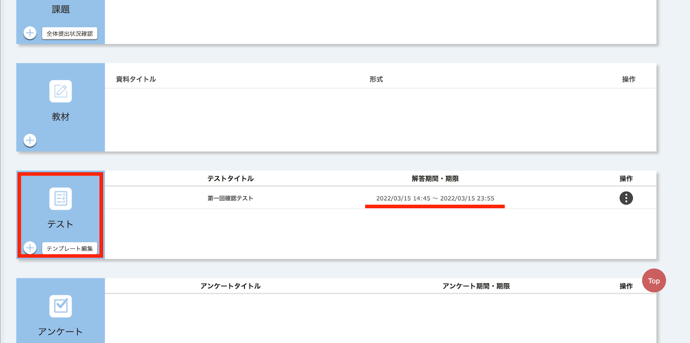
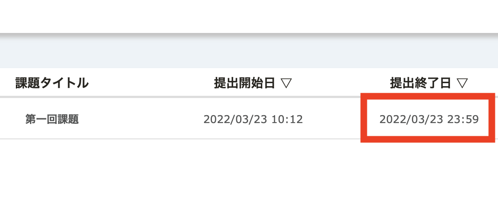

  現在，東京大学ではITC-LMSに代わって，ほぼ同等の機能を持つ学習管理システム[UTOL](/utol/)が導入されています．こちらの記事にある「ITC-LMS」は適宜「UTOL」に読み替えてご覧ください．

## この記事のハイライト
学習管理システム(LMS)とはどのようなシステムなのかを紹介します．また, 東大内で主に用いられている学習管理システムである「ITC-LMS」を事例に活用方法を提案します．

## こんな方におすすめです
そもそも学習管理システム（Learning Management System）とは何なのか, 使うと教員や学生にどんな良いことがあるのかを知りたい方におすすめです．また，学習管理システム「ITC-LMS」のより良い活用方法を模索している教員の方におすすめです． 

## 学習管理システムの概要
### 学習管理システムとは
学習管理システム(Learning Management System, LMS)とは，学校や企業での教育活動に必要な機能が搭載されたオンラインシステムです．特に大学の授業においては，オンライン授業のURLを知る，レジュメや資料をダウンロードする, テストや課題に取り組む，教員と学生が連絡を取る，受講生同士がオンライン上でディスカッションを行うといったように，様々な場面で，学習管理システムを活用することができます．誰もが利用できる学習管理システムとしては，Google Classroomやオープンソース形式のMoodleなどが知られていますが，大学によっては独自の学習管理システムを提供しているところもあります．東京大学でも，独自の学習管理システムとしてITC-LMSが提供されており，学生にもよく浸透しています ．

### 学習管理システムを使うことの意義とメリット
学習管理システムを用いることの最大のメリットは，授業を成立させるために必要なワークフローの多くを一括で管理できるということです．例えば，ITC-LMSでは小テスト，課題提出，出席送信など多くの機能をまとめて管理することができます．教員にとってはもちろん，学生も複数のサイトやツールを並行して使用する手間 が省けるため，双方に利点があります．  
例えば，学習管理システムを使ったテストや課題は，提出期限の設定や周知が容易であり，学生からも見やすいように提供できるというメリットもあります ．他にも，レジュメを無くした，または欠席した学生に資料を配り直す必要がなく事務作業の大幅低減できる，大規模授業におけるリアクションペーパーの管理が容易である，授業外学習として、学生にオンラインディスカッションを課すことができるといった様々な利点があります．

### ITC-LMSとは
ITC-LMS(Information Technology Center-Learning Management System)は東京大学の学習管理システムで，多くの東大の授業で用いられています．教員はITC-LMSを通して課題の掲示，テストの出題，出席送信フォームの提示などを行うことができ，また個別に学生との連絡を取ることができます．東京大学全体でも，授業に関連する連絡にITC-LMSを利用することを推奨しています．([東京大学のオンライン授業向けツールの利用ガイドライン](/docs/guideline))

## ITC-LMSを使う上で気をつけること
学習管理システムを使っていない，またはITC-LMSを授業で適切に使用していない場合，以下のような授業運営上のトラブルが生じる可能性があります．

* ITC-LMSを使ったテストの実施は実際の操作に慣れていないと, セッティングに手間取って時間を無駄にしてしまう．
* 出席をつける際，Zoomのチャットに氏名を書き込んでもらうと，漏れがある・手間がかかるなど，厳密な管理が非常に難しい．
* Googleドライブなどで授業教材を配布すると，ファイルのディレクトリ（場所）がわかりにくく，学生が毎回の授業に必要な教材を探すのが困難である．
* 課題の期限をわかりやすく設定しておらず、勘違いする学生が出てしまう．

以下では，ITC-LMSを効果的に活用する方法を上記の問題点に沿って提案します.

### テスト機能を用いて学生の理解度や学習状況を確認する

ITC-LMSにはテスト機能があり，日頃の学習状況を測るための小テストや，期末テストを作成することができます．設問形式を記述式あるいは記号選択式にする，再受験できるようにするなど，様々な設定が可能です．テストの詳しい作成方法は，[こちらのページ](https://utelecon.adm.u-tokyo.ac.jp/lms_lecturers/prepare_quizzes)を参考にしてください．  
重要度の高いテストの場合，明確な解答期限や制限時間を設定し，「解答期間・期限」の欄に入力しておくことが大切です．学生はこの欄を見ていつまでに課題に取り組むべきかを確認することが多いので，授業中に口頭で伝えることに加え，システム上でも学生が締切を認識できるようにしておくと確実です．

### 出席を取る
ITC-LMSには出席管理機能があり，これを用いて授業中に出席を取ることができます．出席の管理はITC-LMSの教員編集画面のコースコンテンツから編集することができます．出席管理の詳しい方法については，[こちらのページ](https://utelecon.adm.u-tokyo.ac.jp/lms_lecturers/view_attendances)を参考にしてください．  

出席確認の送信をしてもらうには，出席確認用のパスワードの設定と，出席を送信できる期限（いつからいつまで）を設定する必要があります．  
また実際に出席送信を学生に要求する際には，パスワードを提示する必要がありますが，その方法も様々です．パスワードの提示方法としては，授業スライドに掲載する方法や，授業中にZoomなどオンライン会議ツールのチャットボックスに提示する方法などが考えられます．前者の場合，パスワードが学生に配布されたスライドに載っていると，出席送信だけ行って授業に出ない学生が出る可能性があることに注意が必要です．また後者の場合，遅れてきた生徒のために授業中にパスワードを複数回提示する必要があることに注意を要します．どのような方法を取るにせよ，学生が授業に遅刻する場合や何回かにわたってパスワードを示すことを考え，出席を送信できる期限を授業開始から1時間程度を目安に設定することをおすすめします．

### わかりやすく授業教材を配布する

ITC-LMSではスライドなどの授業資料を「教材」の欄に置くことができます．教材の置き方に関して，詳しくは[こちらのページ](https://utelecon.adm.u-tokyo.ac.jp/lms_lecturers/course_materials)を参考にしてください．

ここで注意することは，教材のタイトルの付け方です．日付だけでなく，その教材が第何回のものかを明記したり，授業でのキーワードを載せたりすると，学生が教材を見つけやすくなります．また，学生に授業前に教材をダウンロードしてほしいなどの要望は，コメントに記しておくと授業が円滑に進行しやすくなります．

### 課題の期限を見やすく設定する

ITC-LMSでは「課題」の欄に教員が作成した課題を載せることができます．課題の作成方法や置き方に関して，詳しくは[こちらのページ](https://utelecon.adm.u-tokyo.ac.jp/lms_lecturers/assignments)を参考にしてください．  

課題を置く際に工夫すべきポイントは，提出期限の日時設定です．例えば提出期限を3月24日0:00に設定してしまうと，（実際は3月23日までに提出しなければならないにもかかわらず）3月24日までに提出すればよい，と学生が勘違いするおそれがあります．実際に，学生からも「課題提出期限が分かりにくい」という声が多く聞かれます．それを避けるため，提出期限を23:59や16:00など，提出すべき日付が明らかに分かるような時間に設定しておくことをおすすめします．

### その他の活用方法
今回紹介した活用方法以外にも，掲示板機能や「担当教員へのメッセージ」機能など，ITC-LMSには様々な機能があります．目的に合った機能を見つけ，活用することが重要です．  
また，授業に出席できない学生がいる場合などに，授業の録画を残して後日ITC-LMSに掲載するという活用方法もあります．例えば，法学政治学研究科の樋口亮介先生の授業では，資料共有のほか授業の録画配信のためにITC-LMSが活用されていました．詳しくは[こちらのページ](https://utelecon.adm.u-tokyo.ac.jp/good-practice/interview/higuchi#%E5%AD%A6%E7%94%9F%E3%81%AE%E3%82%B3%E3%83%A1%E3%83%B3%E3%83%88-%E3%81%93%E3%81%AE%E6%8E%88%E6%A5%AD%E3%81%8C%E8%89%AF%E3%81%8B%E3%81%A3%E3%81%9F%E7%90%86%E7%94%B1)を参照してください．

