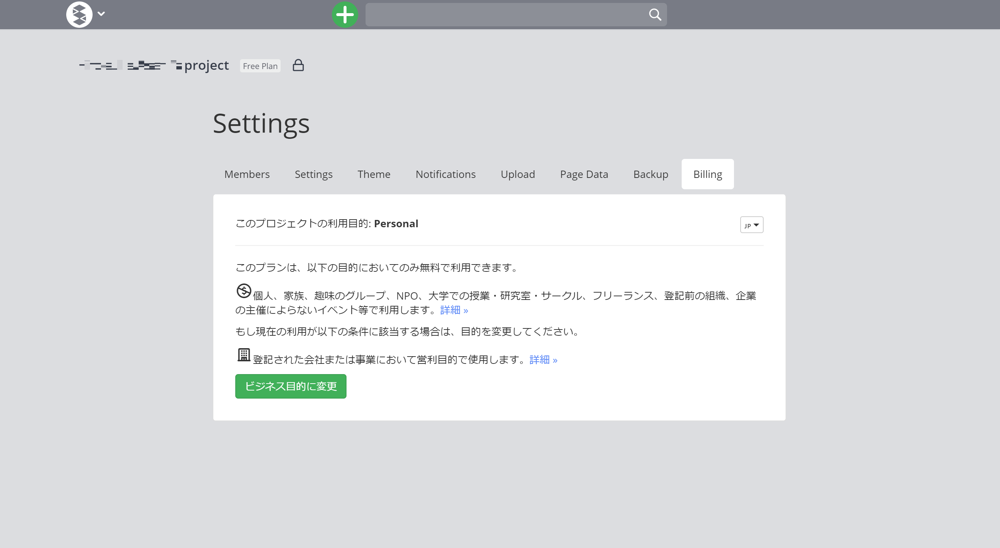
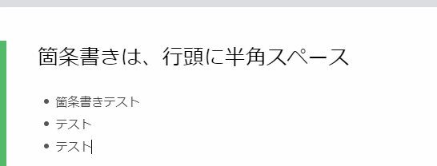
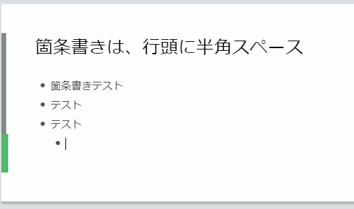
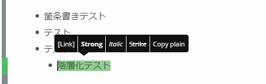
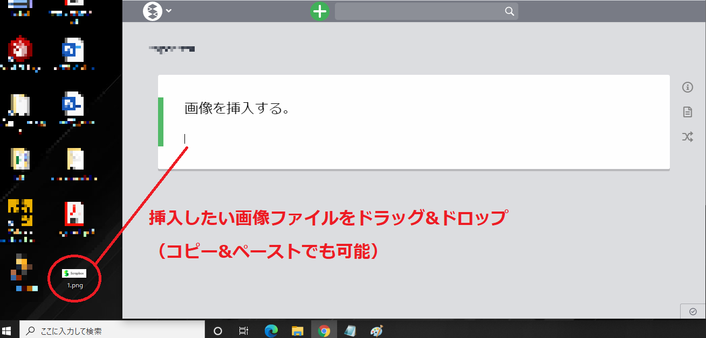
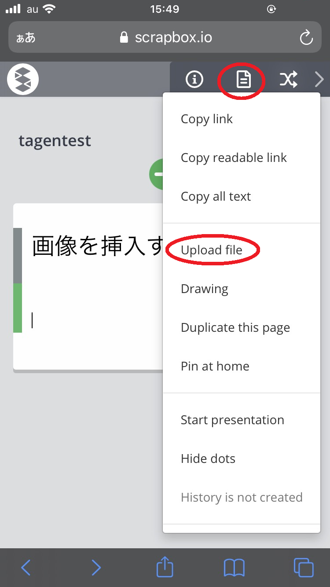

## この記事のハイライト

この記事では，Scrapboxの基本的な使い方を説明します．

### 以下のような場面で使用できます

* 学習しやすいように授業内容をまとめたページを用意したい
* 授業資料を複数人で書き込みながらまとめたい
* 作成した資料を手軽に，即時的に共有したい
* 質問と回答を書き込んでいくような，双方向的なコミュニケーションの場を作りたい
* 学習者が簡単に目的の資料を見つけられるようにしたい

### 以下のようなことはできません

* 学習者に向けて編集と閲覧の権限を独立して与えることができない
* プロジェクト単位での情報共有となり，一つずつのページごとの共有はできない
* デフォルトではページは特に整理されず，作成順などで一覧として並び，自動では資料を構造化できない

## Scrapboxとは

Scrapboxは，Nota Inc.が提供する，オンラインで多数のメモ書きやノートを保存して整理するためのツールです．複数人が共同で同時編集をしたり，URLを使って内容を共有したりすることができます．「リンク」や「タグ」などを使って多数のページを簡単に繋げることができるのが特徴で，これを活用して，オンライン授業で資料をまとめたポータルサイトのように使うことができます．

Scrapboxを利用することで，下図のような資料を簡単に作成することができます．

<figure>

</figure>

### 料金プランについて
(2021年10月現在)  
誰でも閲覧できる公開プロジェクトの場合は，使用用途・ページ数に関わらず全ての機能を無料利用することができます．閲覧者を限定できるプライベートプロジェクトの場合でも，個人利用・教育利用の範囲であれば，全ての機能を無料で利用することができます．   
なお，無料版の利用にはGoogle アカウントが必要です．

ビジネス用途では有料になる場合があります．詳細はScrapboxの「[料金プラン](https://scrapbox.io/pricing)」ページを確認してください．

## アカウントを作成する
ここではGoogle アカウントでログインするアカウントを作成する手順を説明します．

ブラウザからScrapboxのウェブサイト（[https://scrapbox.io/product](https://scrapbox.io/product)）にアクセスし，「いますぐお試し」のボタンをクリックします．

<figure>

<figcaption>赤丸で囲んだ部分をクリック（右上の「いますぐお試し」文字列でも良いです）．</figcaption>
</figure>

Scrapboxで使用するGoogle アカウントのメールアドレスもしくは紐付いている電話番号を入力し，続いてパスワードを入力します．

<figure class="gallery">

</figure>

場合によっては複数のアカウントの候補が提示されますが（右図），その場合はScrapboxで使用したいアカウントを選択します．

Google アカウントと連携されると，Scrapboxのアカウント設定画面に切り替わります．「Name」と「Username」をそれぞれ入力してください．

<figure>

</figure>

* 「Name」にはGoogle アカウントの名前がそのまま反映されますが，もし変えたい場合は入力し直してください．
* 「Username」は個人ページのページタイトルとして利用されるもので，半角英数字で入力しなければなりません．分かりやすくするために自分の名前にしておくのが良いでしょう．

「Looks Good」を選択すると，アカウントの作成が完了します．以下の画面が表示されたら，緑の「Create new project」ボタンをクリックして，プロジェクトの作成を行ってください．

<figure>

</figure>

プロジェクトの作成方法は，「[プロジェクトを作成する](#create_project)」を確認してください．

## プロジェクトを作成する
{:#create_project}

Scrapboxにおけるプロジェクトとは，情報をまとめるためのスペースの単位のことを言います．利用者は，プロジェクトごとに目的とする情報を検索することができます．また，情報共有の単位でもあり，プロジェクトごとに共有の設定を行うことができます．

以下では，プロジェクトの作成方法を説明します．

1. 画面左上の「S」ボタンを押してから，「Create new project」を選択してください．アカウントを作成した直後には，画面上に「Create new project」ボタンが表示されている場合もあります．
2. 「Project name」の部分に，任意の半角英数字を打ち込みます．この部分がURLとなり，学生に共有することでプロジェクト内の記事を閲覧してもらうことが可能です．
3. プロジェクトの詳細項目を設定します．
   * **プロジェクトの公開設定**：「パブリックプロジェクト」と「プライベートプロジェクト」から選択することができます．それぞれのプロジェクトには，以下のような特徴があります．
     * 公開プロジェクト (public)
       * プロジェクトの公開URLを知っていれば，認証なしで誰でもプロジェクトを閲覧することができる設定です．
       * 公開URLとは異なる「インバイトリンク」を共有することで，ページの書き込み権限を与えることもできます．
       * Googleなどの検索結果にも表示されます．
     * プライベートプロジェクト (private)
       * 非公開のプロジェクトです．プロジェクトのURLを知っていても，アクセス権限のないユーザーはプロジェクトを閲覧できません．
       * プロジェクトにアクセスするためには，管理者から配られた招待用のリンク「インバイトリンク」にアクセスする必要があります．
   * **「Upload image to」**：画像のアップロード先を選択します．通常は「scrapbox.io」を選択すれば問題ありません．アップロードした画像がScrapbox上に保存されます．
4. 入力し終えたら，緑の「Create」ボタンをクリックします．

<figure>

</figure>
<!--  -->

## プロジェクトを共有する

プロジェクトを作成したら，他の人がプロジェクトにアクセスできるように，プロジェクトの共有を行う必要があります．

画面左上の「S」ボタンを押してから，「Project settings」を選択して，設定画面を開きます．

公開プロジェクトの場合は，設定画面上部の「Settings」を選択すると表示される「Project url」を共有することで，このURLを知っている人は誰でもプロジェクトを閲覧できるようになります．

公開プロジェクトで相手に編集権限を与えたい場合，あるいはプライベートプロジェクトで閲覧・編集権限を与えたい場合は，設定画面上部の「Members」を選択すると表示される「Invite new members」から，招待用のリンク「インバイトリンク」を確認してください．このリンクにアクセスすることで，権限が付与されます．

一度権限が付与されたら，「Project url」でアクセスできるようになります．

## プロジェクトを開く

「Project url」からプロジェクトにアクセスをすると，以下のような画面が表示されます．

カードのように表示されているものが，プロジェクトに存在しているページ（記事）です．

また，プロジェクトの編集権限がある場合は，以下のような操作を行うことができます．

* **①ページ作成**：画面上部中央の「+」ボタンを押すと，プロジェクト内で新しいページが作成されます．ページでは，文字を打ち込むと自動で保存されます．

* **②メニューボタン**：画面左上の「S」ボタンを押すことで，プロジェクトの設定などに関するメニューが表示されます．
  * **Create new project**：新しいプロジェクトを作成可能
  * **Project settings**：プロジェクトについての様々な設定が可能
    * **Members**：ここに表示されているリンクを相手に共有することでプロジェクトメンバーへの追加が可能
    * **Settings**：プロジェクトのリンクの変更や公開非公開の変更などのプロジェクトの詳細な設定が可能
    * **Theme**：背景の色などが変更可能
    * **Notifications**：他アプリ（SlackやDiscordなどのチャットアプリ）との連携設定が可能
    * **Upload**：プロジェクトページや画像のアップロード設定が可能
    * **Page Data**：ブックマーク設定やページのエクスポート・インポートが可能
    * **Backup**：ページの内容が編集された際の履歴のバックアップ設定が可能
    * **Billing**：無料の個人使用か有料のビジネス使用か，プロジェクトの目的の変更が可能

## ページを作成して編集する

Scrapboxにおけるページとは，プロジェクト内に蓄積される，情報のまとまりの単位です．授業で活用する場合は，授業ごとにページを作成すると良いでしょう．

ページには以下のような特徴があります．

* 入力した文字は表示画面・検索結果に即時的に反映されます．（更新などは不要です．）
* 書き込みは自動で保存され，同時に時系列に沿ってバックアップされていきます．（過去のバージョンにさかのぼることが可能です．）
* 文字だけでなく，画像，動画の埋め込みをすることができます．
* ページ内やプロジェクトの他のページへのリンクをつくることができます．

ページを作成したいプロジェクトの画面に移動してから，画面上部の{:.logo}ボタンをクリックすることでページを作成することができます．

以下では，ページの書式と編集方法を説明します．

### 文章を入力する

一行目はタイトル，二行目からが本文となります．タイトル行は空行のままでも問題ありませんが，ページ一覧画面での見出しになるので，何か書いておくと後から見つけやすくなります．

<figure>

</figure>

行頭に半角スペースを打ち込むことで，箇条書きができます．Enterキーを押すと自動的に次の箇条書きに移ります．箇条書きをやめたい時はEnterキーを2回押します．

<figure>

</figure>

箇条書き状態で行頭に更に半角スペースを打ち込むことで，階層化が可能です．半角スペースの回数によって，階層の深度を自由に調整できます．

<!-- <figure>

</figure> -->

<figure>

</figure>

文字列を選択することで，太字・斜体・取り消し線などの装飾を追加することも可能です．  
例えば，文字列を選択して出てきたウィンドウから「strong」を選択すると，文字を太字にすることができます．
<figure>

</figure>

<figure>

</figure>

### ページから別のページにジャンプする

ページを構造化したい(ページ同士を関連付けたい)場合は，リンク機能やハッシュタグ機能を使います．
リンクを付けたい文字列を`[ ]`で囲むとリンクが，ハッシュタグを付けたい文字列の頭に`#`を付けるとハッシュタグが，それぞれ自動生成されます．

<figure>

</figure>

リンクやハッシュタグが付けられた文字列をクリックすると，それぞれの文字列がタイトルとなったページに移動できます（ハッシュタグの場合は先頭の`#`を除いたものがタイトルとなります）．

リンクやハッシュタグが付けられた文字列は，移動先のページが存在する場合は青色で，存在しない場合はオレンジ色で表示されます．
ただし，同じページに移動するようなリンク・ハッシュタグが複数のページにある場合，移動先のページが存在しなくても青色で表示されます．

先の画像の「リンク」という文字列をクリックした場合，タイトルが「リンク」となった新たなページに移動します．ここから本文を打ち込み，新たなページが作成できます．

<figure>

</figure>

また，同一のハッシュタグを打ち込んだページ群は，画面下部にまとめて表示されます．関連したページには同一のハッシュタグを記載しておくと繋がりが分かりやすくなるでしょう．

<figure>

</figure>

左上部にあるプロジェクト名をクリックすると，ページ一覧画面（プロジェクトのトップページ）に移ることができます．

<figure>

</figure>

<figure>

</figure>

### 画像を挿入する

#### PCで操作する場合

PCに保存されている画像をページに挿入する場合は，ドラッグ＆ドロップもしくはコピー&ペーストで行います．

<figure>

</figure>

<!-- <figure>

<figcaption>画像がページに挿入されます．</figcaption>
</figure> -->

画面右の{:.logo}アイコンから「Upload file」を選び（下の画像赤丸部分），挿入したいファイルを選択することもできます．

<figure>

</figure>

#### スマホで操作する場合

モバイル版の場合，右上部の{:.logo}アイコンから「Upload file」を選び（画像赤丸部分），携帯電話に保存されている画像を選択して挿入できます．

<figure>

</figure>

### 手書きの図を挿入する

#### PCで操作する場合

Scrapboxのドローイング機能を使い，手書きの図をページに挿入することが可能です．

画面右の{:.logo}アイコンから「Drawing」を選び（画像赤丸部分），ドローイング画面を表示します．

ドローイング画面ではマウスやペンタブを使って自由に描くことが可能です．

<figure>

</figure>

挿入する画像を作成出来たら，右上の緑の「Upload」ボタンをクリックします．

<figure>

</figure>

作成した画像がページに挿入されます．

<figure>

<figcaption></figcaption>
</figure>

#### スマホで操作する場合

モバイル版の場合，右上部の{:.logo}アイコンから「drawing」を選び（画像赤丸部分），同様の操作が可能です．

<figure>

</figure>

## Tips：Slackなどのチャットツールに更新を通知する
Slackと連携させることによって，Scrapboxの更新をSlackで確認できるようになります．
Slackの基本的な使い方は，「[Slackで学生とコミュニケーションを取る方法](/articles/slack-communication/)」も参考にしてください．

1. 画面左上「S」ボタンの中のメニューから，Project settings画面のNotificationsタブを開きます．
2. 設定画面の「Slack Notification」のリンクを開き，Slack Integrationで「Incoming Webhook」を作成します．（[Slack での Incoming Webhook の利用](https://slack.com/intl/ja-jp/help/articles/115005265063-Slack-%E3%81%A7%E3%81%AE-Incoming-Webhook-%E3%81%AE%E5%88%A9%E7%94%A8) を参照して下さい．）
3. 「Incoming Webhook」のURL (`https://hooks.slack.com~~`) を貼り付け，Addを押して下さい．

* 通知タイミング
  *  Scrapboxへ最後に書き込んだ後，90秒経過すると通知されます．
  *  連続して書き続けている間は通知されません．
* 他のチャットツールへ通知する
  * Slack以外のURLにも，通知は送信可能です．
  * データフォーマットはSlackと同じものになります．

## （＋α）グッドプラクティス・応用例の紹介

* [白石忠志 先生　法Ⅰ](/good-practice/interview/shiraishi.html)
  * Scrapboxを活用した授業が紹介されています．
  * 授業で実際に用いられたScrapboxのページは，[https://scrapbox.io/jcomp/](https://scrapbox.io/jcomp/)からアクセスできます．
* [東京都立大学オンライン授業サポートページ（教員用） (scrapbox.io)](https://scrapbox.io/tmu-online-tips/)

