<div class="box">
  これまでMicrosoft Teamsの会議では，ZoomやWebexと異なり，会議参加時に参加者が自分の表示名を変更できませんでした．しかし2025年1月の機能向上により，表示名を変更できる機能が提供されました．UTokyo Microsoft Licenseのアカウントで開催される会議では，2026年2月よりこの機能を有効化しています．ただし，実際に表示名を変更するには，それに加えて会議の開催者等が事前に変更を許可しておく必要があるため注意してください．
</div>

[UTokyo Microsoft License](/microsoft/)のアカウントで開催されるMicrosoft Teams会議では，会議の開催者または共同開催者(ホスト)が会議前に変更を許可する設定をしていれば，出席者が会議中の表示名を変更できます．これは，そのような機能を，[UTokyo Microsoft License全体の管理設定の中で有効にしている](#admin-setting)ためです．

ただし，表示名を変更した場合，会議中に表示されている名前の横に，その表示名が編集済みのものであることが表示されます．また**議事録など，一部の機能では変更前のデフォルトの表示名のままになることがあります**．加えて，他の機関が開催する会議の場合は，UTokyo Microsoft Licenseのアカウントで参加しているかに関わらず，表示名の変更可否は相手先組織の設定によって異なります．

このページではTeams会議の表示名の変更方法を，[開催者による事前の設定方法](#host-setting)と，[参加者による表示名の変更方法](#participant-change)に分けて説明します．また参加者向けに，表示名変更ができない会議の場合や，表示名を変更する機能では変更できない部分でも名前を変更したい場合の[ワークアラウンド](#work-around)も示します．

## (開催者向け)会議前に表示名変更を許可する設定を行う
{:#host-setting}

会議参加時の表示名の変更を可能にするには，開催者または共同開催者が，会議開始前に許可設定をする必要があります．なお許可設定は会議ごとに行う必要があります(ただし「定期的なイベント」は一括で設定できます)．設定手順は以下の通りです．

1. Teamsで予定表(カレンダー)を開いてください．
2. 以下のいずれかの方法で，会議のオプションにアクセスしてください．
    - **会議の作成時に設定する場合**
        1. イベントを作成したい時間帯をドラッグするか，「新規」ボタンないし「新規」ボタンの右側の「チャネル会議」ボタンから新しいイベントまたは会議を選択してください．
            - 新しいイベントとして作成する場合「Teams会議」のトグルがオフであればオンにしてください．
        2. 「オプション」または「その他のオプション」を選択してください．
            <figure class="gallery">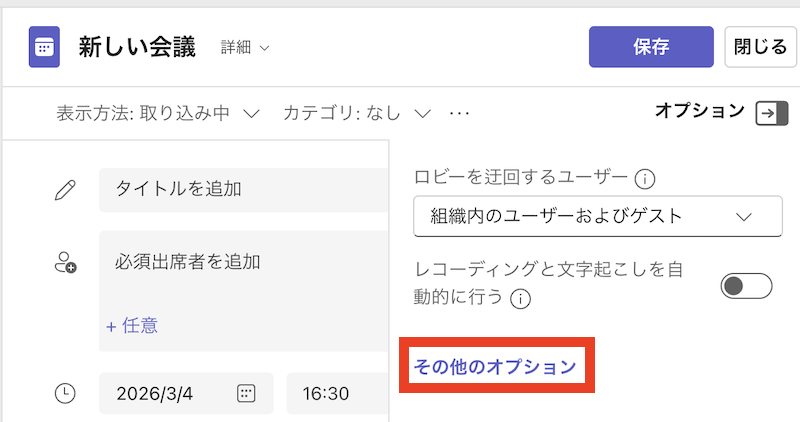{:.small .border} 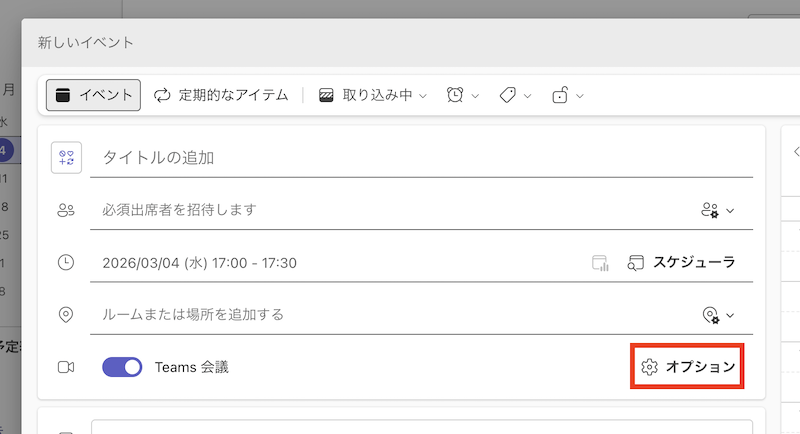{:.small .border}</figure>
    - **すでに作成済みの会議で設定する場合**
        1. Teams予定表を開いてください．
        2. イベントをダブルクリックするか，{:.icon}アイコンまたは「編集」ボタンをクリックしてください．
            - 「このイベント」「今回とこれ以降のすべてのイベント」「この定期的なイベントのすべて」のオプションが出てきた場合は，設定したい範囲を選択してください．
        3. 「オプション」または「会議オプション」を選択してください．
            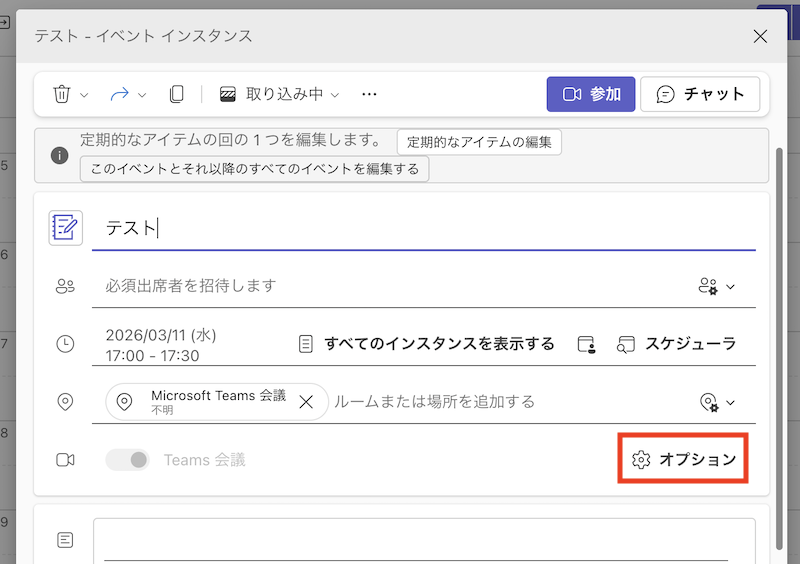{:.small .border}
3. 「参加状況」の項目から「ユーザーが表示名を編集できるようにする」のトグルをオンにしてください．
   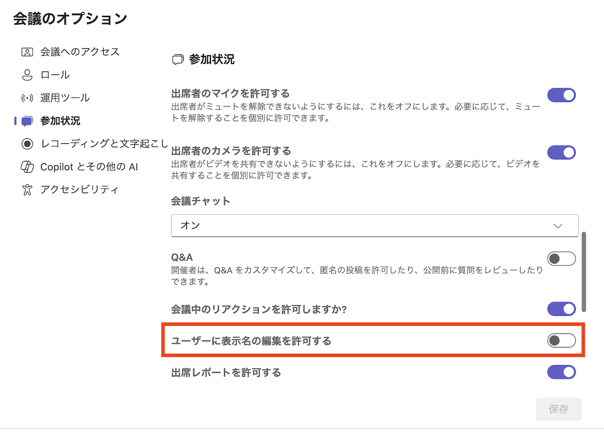{:.medium .border}
4. 「保存」または「適用」ボタンを押してください．

なお会議のオプションの詳細は「[Microsoft Teamsの会議オプション](https://support.microsoft.com/ja-jp/office/microsoft-teams%E3%81%AE%E4%BC%9A%E8%AD%B0%E3%82%AA%E3%83%97%E3%82%B7%E3%83%A7%E3%83%B3-53261366-dbd5-45f9-aae9-a70e6354f88e)」をご覧ください．

## (参加者向け)表示名の変更方法
{:#participant-change}

表示名の変更は，会議の開始後に行うことができます．変更すると，その会議の間は，変更後の表示名が表示されます．

なお変更の手順は以下の通りです．

1. 「参加者」パネルを開いてください．
    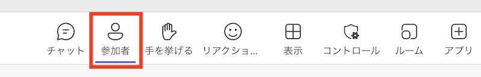{:.medium .border}
2. 自分の名前の横にある「…」ボタンを押してください．
3. 「表示名の編集」を選択してください．
    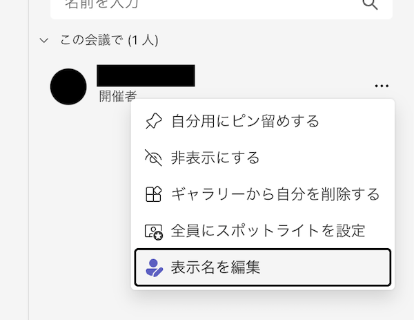{:.small .border}
4. 表示名の欄に，変更後に表示したい名前を入力してください．
    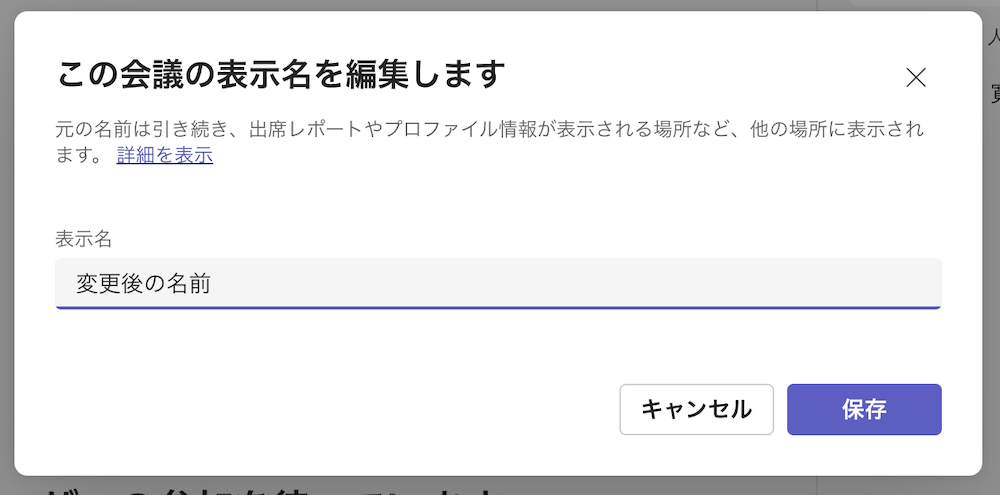{:.medium .border}
5. 「保存」ボタンを押してください．以降，以下の画像のように，表示名が「変更後の表示名(編集済み)」と表示されるようになります．
    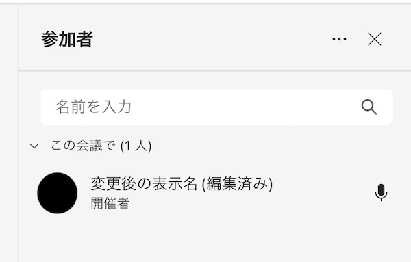{:.small .border}

### ワークアラウンド
{:#work-around}

もし，表示名変更ができない会議の場合や，上記の方法では変更されない部分でも表示名を変更したい場合も，サインインせずにプライベートブラウザ(UTokyo Accountでサインインしていない状態のブラウザ)から参加することで表示名を変更することができます．

1. 参加URLをプライベートブラウザ(あるいは，UTokyo Accountでサインインしていない状態のブラウザ)で開いてください．
    - 以下のようなポップアップが出た場合は「キャンセル」を選択してください．
      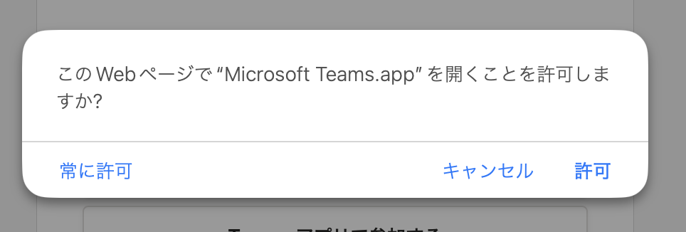{:.small}
2. 「このブラウザで続ける」を選択してください．
    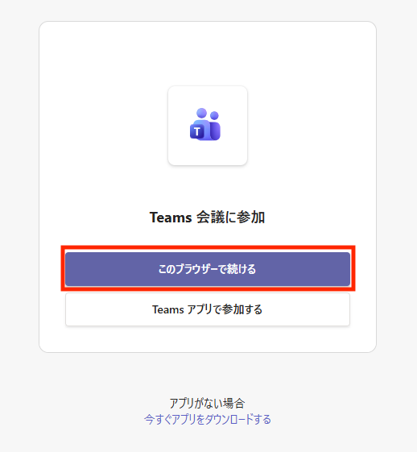{:.small .border}
    - カメラ・マイクなどのアクセス許可に関するポップアップが出た場合は，必要に応じて許可してください．
3. 名前の入力が求められますので名前を設定してください．
    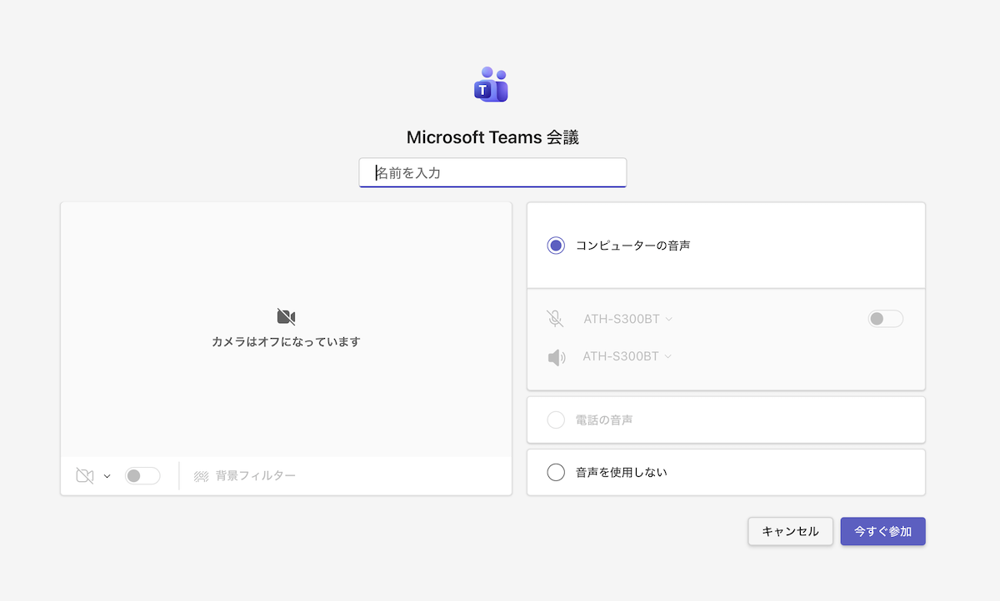{:.medium .border}

## (参考)Microsoft Teams 管理者による表示名変更機能の有効化方法
{:#admin-setting}

UTokyo Microsoft Licenseのアカウント(東京大学における全学のテナント)では，会議の中で自分で表示名を変更できる機能を，組織全体として有効化しているため，主催者が許可設定していればワークアラウンドを用いずとも表示名を変更できます．しかし，他の機関(テナント)のアカウントで開催するTeams会議の場合，その機関での管理設定の内容によっては表示名を変更できないことがあります．

他の機関の管理者の方で，ご自身の機関で同様の機能を有効化したいという方は，以下のPowerShellコマンドを実行するとよいようです．(2026年3月時点では，Teams管理センターGUIから設定できません．)

```
Set-CsTeamsMeetingPolicy -Identity Global -ParticipantNameChange Enabled
```

- 参考: [Microsoft Teams > New-CsTeamsMeetingPolicy](https://learn.microsoft.com/en-us/powershell/module/microsoftteams/new-csteamsmeetingpolicy?view=teams-ps#-participantnamechange)


## （参考）デフォルトの表示名について
{:#default-displayname}

このページで紹介する以外の場面（チャット機能や，表示名変更許可設定がなされていない会議など）では，デフォルトの表示名しか利用できません．

UTokyo Microsoft Licenseのもとで教職員が利用できるTeamsでは，デフォルトの表示名は利用者自身では変更できません．この表示名が，人事情報システム上に登録されている氏名と自動的に連携して設定される仕組みで管理されているためです．

なお，万一表示名に誤りがあるのであれば，所属先の人事担当に相談してください．

## 参考情報

- [Microsoft 365 Insider Blog: Edit your display name in Teams meetings](https://techcommunity.microsoft.com/blog/microsoft365insiderblog/edit-your-display-name-in-teams-meetings/4389359)
- [Microsoft Teamsで会議に参加する > 表示名を編集する](https://support.microsoft.com/ja-jp/office/microsoft-teams%E3%81%A7%E4%BC%9A%E8%AD%B0%E3%81%AB%E5%8F%82%E5%8A%A0%E3%81%99%E3%82%8B-1613bb53-f3fa-431e-85a9-d6a91e3468c9#bkmk_edit_display_name)
