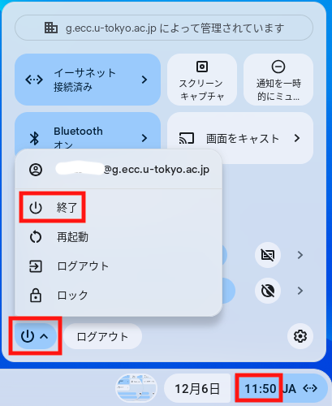

Chromebox端末は,駒場情報教育棟1階自習室，浅野情報基盤センター1階自習室,総合図書館,駒場図書館,柏図書館に設置しております.最新の設置場所および設置台数は,[ECCS端末配置場所の開室・閉室状況](https://www.ecc.u-tokyo.ac.jp/announcement/2020/10/02_3224.html)を参照してください.

## 利用方法

### 事前作業
ECCSクラウドメールの有効なアカウントが必要です．ECCSクラウドメールの利用開始をしていない方は，[ECCSクラウドメール利用方法](https://www.ecc.u-tokyo.ac.jp/announcement/2016/04/01_2159.html)に従って，準備してください．

### 電源の入れ方
Chromebox端末の利用に当たっては，27インチディスプレイとChromebox本体の両方の電源を入れる必要があります.Chromeboxは27インチディスプレイの裏にマウントされていて，そこの電源を入れる必要があります．

{:.medium}

電源投入後,しばらくすると，自動的にネットワークに接続してログイン画面が表示されます．

### ログイン
「ECCSクラウドメールのユーザ名(`g.ecc.u-tokyo.ac.jp`の前の部分)」を入力後に，ECCSクラウドメールのパスワードを入力してください．2段階認証をおこなう設定にしている場合は， その認証も求められるはずです．

### 利用方法
Google Chromeとそのextensionとして実現されているアプリケーションが利用可能です．

* ファイル：ECCSクラウドメールのアカウントに対応するGoogle Driveのファイルが利用可能です．Webブラウザで，OneDrive 等も使うことができます．
* メール：Gmailが利用可能です．
* Secure Shell：ssh クライアントを使ってECCSのsshサーバ(`ssh0{1,2,3}`)等に接続することができます．ただし，あらかじめ作成した秘密鍵を Google Drive上に置くことが必要です．

### 終了
ログアウトするには、画面右下の時刻部分を選択すると,電源ボタンが表示されるので、その電源ボタンを選択すると別窓が開きその中の”終了”を選択すると,終了します.

### 注意

* 27インチディスプレイからはHDMIケーブルが延びていますが，Chromebook, Chromeboxを使う代わりに，自分の持ち込みPCを接続してディスプレイだけを使うこともできます．ディスプレイ前面のボタンで入力を切り替えてください．　
* 設定等は予告なく変更することがあります．
* [Chromebox端末:よくある質問](https://www.ecc.u-tokyo.ac.jp/chromeos/faq.html)も御覧ください．