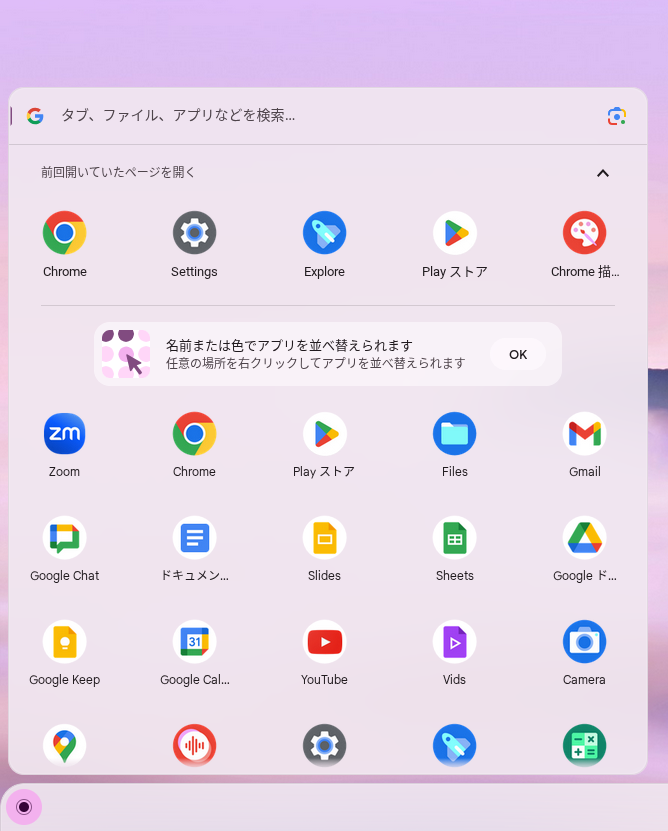

## 利用可能なアプリケーションについて

ChromeOSデバイスでは，Google Chromeとそのextensionとして実現されているアプリケーション，個別に許可された一部のAndroidアプリが利用可能です．なおAndroidアプリは一定の条件のもと[追加申請](#android-apps)が可能です．

また，一定の制約の元で[Linux環境](../linux/)を使うこともできます．

### プリインストールされているアプリケーションの一覧
{:#preinstalled-apps}

- ファイル：ECCSクラウドメールのアカウントに対応するGoogleドライブや，UTokyo AccountのOneDriveのファイルが利用可能です．詳しくは[ストレージに関するページ](../storage/)を参照してください．
- Calculator
- Chrome: ブラウザとしてGoogle Chromeが利用可能です．
- Chrome 描画キャンバス
- Cursive
- Gmail
- Google Calendar
- Google Chat
- Google Keep
- Google Maps
- Google ドライブ：詳しくは[ストレージに関するページ](../storage/)を参照してください．
- Play ストア：[許可されたAndroidアプリ](#android-apps)のインストールが可能です．
- Sheets
- Slides
- Text
- Vids
- YouTube
- Zoom (PWA版)
- ウェブストア
- ドキュメント
- スキャン：なお[駒場の情報教育棟に実験的に設置しているScansnap](../../#ieb)での利用はできません．
- ウェブストア
- カメラ
- 設定
- 印刷ジョブ
- キーショートカット
- 使い方・ヒント
- ギャラリー
- スクリーンキャスト
- Terminal

## アプリの利用方法

### 開始

1. 左下のメニューを開いてください．
2. 起動したいアプリを選択してください．(上部の検索バーにアプリ名を入力して検索することもできます．)
    

### 終了

アプリ右上の❎印を押してください．

## Androidアプリの追加申請
{:#android-apps}

Google Playストアで提供されている，教育や研究に必要な無料のAndroidアプリに関しては，以下の申請フォーム（ECCSクラウドメールでのログインが必要です）からリクエストしていただくと，許可リストに追加し，ChromeOSデバイスから利用できるようにすることがあります．

<b class="box center">[ChromeOS用のGoogle Play Storeアプリ](https://docs.google.com/forms/d/e/1FAIpQLSdZ7vt6-Tahig8CMhwE0Uipjqk1PeY_FRh4RnVpXox_ycyvGg/viewform?usp=sf_link)</b>
