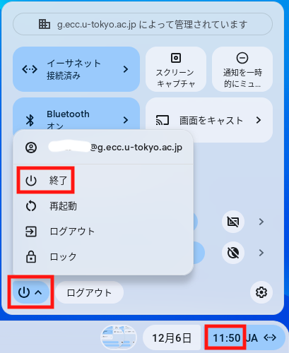

Chromebox端末は，駒場情報教育棟1階自習室，浅野情報基盤センター1階自習室，総合図書館，駒場図書館，柏図書館に設置しております．最新の設置場所および設置台数は，[ECCS端末配置場所の開室・閉室状況](https://www.ecc.u-tokyo.ac.jp/announcement/2020/10/02_3224.html)を参照してください．

## 利用可能なアプリケーション
Chromebox端末では，Google Chromeとそのextensionとして実現されているアプリケーションが利用可能です．

* **ファイル**：ECCSクラウドメールのアカウントに対応するGoogleドライブのファイルが利用可能です．Webブラウザで，OneDrive等を使うこともできます．
* **メール**：Gmailが利用可能です．
* **Secure Shell**：SSHクライアントを使って，ECCSのSSHサーバ（ `ssh01.ecc.u-tokyo.ac.jp`、`ssh02.ecc.u-tokyo.ac.jp`、`ssh03.ecc.u-tokyo.ac.jp` ）等に接続することができます．ただし，あらかじめ作成した秘密鍵をGoogleドライブに置くことが必要です．

## 利用方法

### 事前作業
ECCSクラウドメールの有効なアカウントが必要です．ECCSクラウドメールの利用開始をしていない方は，ECCSクラウドメールの「[利用開始の手順](/google/#initial-setup)」に従って，準備してください．

### 電源の入れ方
Chromebox端末の利用に当たっては，27インチディスプレイとChromebox本体の両方の電源を入れる必要があります．Chromebox本体は27インチディスプレイの裏にマウントされています．
{:.medium}

電源投入後，しばらくすると，自動的にネットワークに接続され，ログイン画面が表示されます．

### ログインの手順

1. メールアドレスとして，「ECCSクラウドメールのユーザ名」(`@g.ecc.u-tokyo.ac.jp`の前の部分のみ)を入力してください．
2. UTokyo Accountのサインイン画面が表示されるので，サインインしてください．この際，ユーザ名として「10桁の共通ID＋`@utac.u-tokyo.ac.jp`」を入力してください．

### 終了
画面右下の時刻部分を選択すると表示される電源ボタンを選択すると，メニューボックスが開きます．その中の「終了」を選択してください．

## 注意・補足

* 27インチディスプレイにはHDMIケーブルが取り付けられており，Chromebook，Chromeboxを使う代わりに，自分の持ち込みPCを接続してディスプレイだけを使うこともできます．この場合は，ディスプレイ前面のボタンで入力を切り替えてください．　
* 設定等は予告なく変更することがあります．
* [Chromebox端末:よくある質問](https://www.ecc.u-tokyo.ac.jp/chromeos/faq.html)もご覧ください．